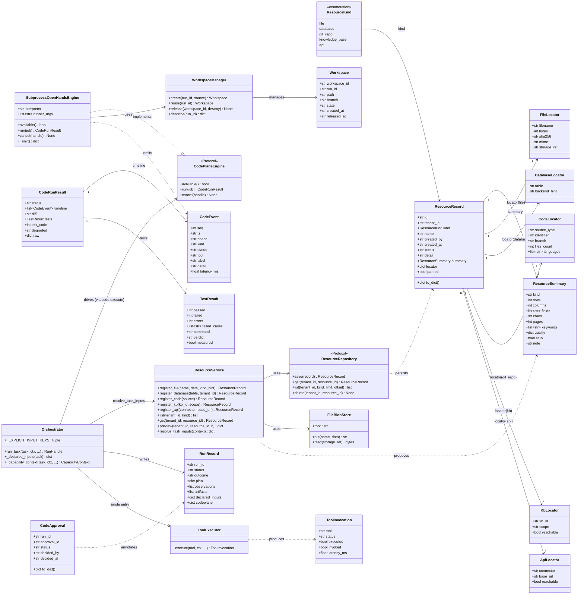
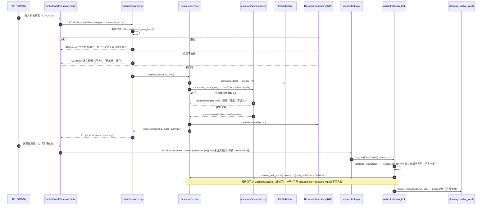
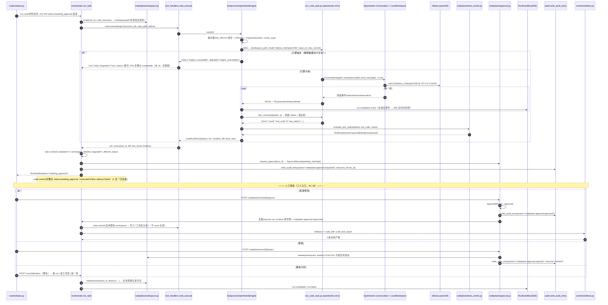
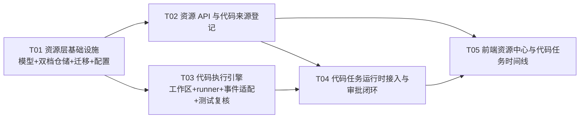

# INC25 增量架构设计 — 任务资源中心（Resource Center）+ 代码执行面（Code Execution Plane）

> 文档类型：增量架构设计 + 任务分解（**只做设计，不含实现代码**）
> 上游输入：`docs/sop/INC25-PRD.md`（P0×15 / P1×7 / P2×6，AC-1~AC-24）
> 工程基线：`ForgeFlow-main`（FastAPI `forgeflow/` + React 手写 CSS `frontend/src/`）
> 主理人已裁决 Q1~Q5（见 PRD §5），本设计**据此为定**，不再重开
> 本文件位于 `docs/`（本仓不提交的红线区），仅作草稿与评审用
>
> **锚点纪律**：涉及既有代码一律 `文件名::符号名`；本文断言存在的既有符号**均已用 Read/Grep 核实**（清单见 §0）。

---

## 0. 基线锚点（核实过的既有符号，作为设计不可违背的地基）

### 0.1 资源层必须沿用的双档抽象
- `forgeflow/repositories/factory.py::_construct` / `::_get` / `::get_experience_repository` / `::reset_repositories` —— `kind → 构造函数` 的 `mapping` 字典 + 延迟导入 + 进程内 `_CACHE`（键 `f"{backend}:{kind}"`）。
- `forgeflow/repositories/base.py::TenantScopedRepository` / `::new_id` / `::utcnow` / `::scope_key` —— 租户作用域基类与 id/时钟工具。
- `forgeflow/repositories/memory/`（`experience_repo` / `skill_repo` / `policy_repo` / `cost_repo`）与 `forgeflow/repositories/postgres/`（同名）—— 双实现的落点目录。

### 0.2 运行时四层契约与既有纪律
- `forgeflow/runtime/orchestrator.py::TaskCreate` / `::RequestContext` / `::run_task` / `::RunRecord` / `::MemoryRunStore` / `::get_run_store` / `::reset_run_store`。
- `forgeflow/runtime/orchestrator.py::_EXPLICIT_INPUT_KEYS` / `::_declared_inputs` / `::_capability_context` / `::_build_task_plan` / `::_execution_args` / `::_record_invocation` / `::_llm_executor` / `::_default_executor` / `::resolve_agent_runtime_mode`。
- `forgeflow/runtime/planning.py::TOOL_INPUT_CONTRACT` / `::resolve_inputs` / `::applicability` / `::blocked_reason` / `::build_plan` / `::plan_from_records` / `::CapabilityContext` / `::TaskPlan` / `::REPORT_TOOL` / `::TOOL_ORDER` / `::normalize_status` / `::observations_from_records`。
- `forgeflow/runtime/tool_executor.py::ToolExecutor.execute` / `::ToolInvocation` / `::ToolCallContext` / `::MAX_PAYLOAD_CHARS`（`payload` 上界 4000）。
- `forgeflow/runtime/tool_registry.py::ToolBinding` / `::register` / `::resolve` / `::load_default_bindings` / `::UNBOUND_TOOLS`。
- `forgeflow/runtime/tool_handlers.py::HANDLERS` / `::code_run`（**永久**只做 `ast.parse`+`compile` 校验，绝不执行任意代码）/ `::data_query` / `::report_render`。
- `forgeflow/runtime/gate.py::TOOL_PERMISSION_MAP` / `::PLATFORM_TOOLS` / `::PLATFORM_TOOL_CATALOGUE` / `::PLATFORM_PLAN_TOOLS` / `::required_permission` / `::check_tool_permission`（未登记工具 fail-closed）。
- `forgeflow/runtime/artifacts.py::artifacts_from_invocations` / `::ARTIFACT_TOOL`（`report.render`）/ `::ARTIFACT_KIND_MARKDOWN`（`report_markdown`）。
- `forgeflow/runtime/react_executor.py::ReactExecutor` / `::react_executor` / `::MAX_REACT_ITERATIONS`（codeplane **不改** ReAct 主路径）。
- `forgeflow/validation/validator.py::validate` —— `_UNRUN_STATUSES` **已含** `awaiting_approval` / `pending_approval` / `paused`（本增量的「待审批」正好落在既有口径内，**无需扩充词表**）。
- `forgeflow/middleware/audit.py::write_audit_entry` —— 九字段统一审计通道（HTTP + 领域生产者共用）。
- `forgeflow/mcp/server/tools/data_tools.py::query_db` —— **永久** development stub。

### 0.3 既有 API / schema / 装配
- `forgeflow/api/routers/tasks.py::create_task` / `::TaskCreateRequestWithAttachments`（`attachments` 增量声明在路由侧）。
- `forgeflow/api/routers/runs.py::get_run` / `::list_runs` / `::replan_run` / `::_load_run`。
- `forgeflow/api/routers/approvals_hub.py::list_approvals` / `::decide_approval`（`POST /approvals/{approval_id}/decision`，走 `get_policy_repository()`）。
- `forgeflow/api/hub_schemas.py::RunDetailResponse` / `::TaskCreateRequest` / `::ApprovalDecisionRequest` / `::ApprovalResponse`。
- `forgeflow/api/main.py` 的 `app.include_router(...)` 装配块。
- `forgeflow/rbac/policies.py::ROUTE_PERMISSION_MAP`（**未登记路由默认拒绝**）。
- `forgeflow/middleware/auth.py`（`ROUTE_PERMISSION_MAP` 的消费者）。
- `forgeflow/config.py::Settings` / `::get_settings`；`Settings.multimodal_max_bytes`（5 MB）/ `::allows_development_tools` / `::environment`。
- `forgeflow/runtime/attachments.py::AttachmentInput` / `::SUPPORTED_KINDS`=`("pdf","image")` / `::prepare_attachments` / `::AttachmentTooLargeError` / `::PreparedTask`。
- `forgeflow/multimodal/pdf.py::extract_pdf_text`（返回带 `page_count` / `text`）。
- `requirements.txt:25` 已含 `python-multipart>=0.0.12` ⇒ 上传可用 multipart，**无需新增依赖**。

### 0.4 前端既有渲染契约（W2 时间线的落点，全部复用、不新增词表）
- `frontend/src/views/runs/RunListPanel.tsx::RunListPanel` / `::submit`（空输入不传键；`data-testid` `run-declare-table` / `run-declare-paths`）。
- `frontend/src/views/runs/realRun.ts::stepStatusToStageStatus`（`ok→done` / `running→running` / `awaiting_approval|pending_approval|paused→paused` / `error|unavailable|refused→failed` / `blocked|skipped→blocked` / `not_applicable→na`）/ `::measuredMs`（未测量即 `null`）/ `::deliveryState`（`needsApproval` 读步骤状态）/ `::deriveDegradeNotice`（读 `llm.degraded`，业务文案 + `title` 诊断）/ `::detailToStages` / `::deriveEvidence` / `::deriveMissingInputs`。
- `frontend/src/views/runs/ExecutionSection.tsx::ExecutionSection`（`aria-expanded`/`aria-controls`/`hidden` 契约；布局只写在 `.exec-body:not([hidden])`）。
- `frontend/src/views/LiveRunsView.tsx::LiveRunsView`、`frontend/src/api/client.ts::RunDetail` / `::RunArtifact` / `::hubApi.createTask`、`frontend/src/api/hooks.ts::useCreateTask`、`frontend/src/styles/tokens.css`（`[hidden]{display:none!important}`）、`frontend/src/styles/runs.css`。

### 0.5 迁移与测试
- `alembic/versions/014_run_id_text.py` 为当前 **head** ⇒ 新增迁移编号 **`015`**。
- `tests/conftest.py::force_memory_backend`（依赖存储的用例须显式声明档位）。

---

## 第一部分：增量架构设计

### 1. 职责边界图

**ForgeFlow 控制平面**（本仓进程，`agentflow` venv）与 **OpenHands 代码执行面**（独立进程，`openhands` venv）以**进程边界**分隔；两者**只**通过「一进（stdin JSON 作业）一出（stdout JSONL 事件）」通信。控制平面**不 import** 任何 `openhands.*`。

```
┌──────────────────────────── ForgeFlow 控制平面（agentflow venv, 端口 8010）───────────────────────────┐
│                                                                                                        │
│  ┌── 资源中心 Resource Center ─────────────────┐   ┌── 任务编排 Orchestrator（既有四层契约）──────┐   │
│  │ forgeflow/resources/*                        │   │ forgeflow/runtime/orchestrator.py            │   │
│  │  · 五类资源登记 + 真实上传 + 真实摘要        │   │  L1 plan / L2 tool_invocations（唯一事实源） │   │
│  │  · 双档仓储 repositories/factory.py::_construct│  │  L3 observations / L4 artifacts             │   │
│  │  · resources 表（迁移 015）                  │   │  RBAC(gate) + HITL(PolicyEngine) + 审计      │   │
│  └──────────────────────────────────────────────┘   └──────────────────────────────────────────────┘   │
│                              ▲                                        ▲                                 │
│                              │ context["resources"]                   │ code.execute / code.commit      │
│                              │ （声明 → 解析 seam → 计划）            │ （新工具，登记进 gate/registry） │
│  ┌───────────────────────────┴────────────────────────────────────────┴─────────────────────────────┐  │
│  │ 代码执行面适配层 Code Plane Adapter（forgeflow/codeplane/*）                                       │  │
│  │  · workspace.py  任务级隔离工作区生命周期（创建→使用→产出→回收/销毁）                              │  │
│  │  · engine.py     SubprocessOpenHandsEngine：摘代理 + 起子进程 + 读 JSONL + 超时/可中断 + 降级判定    │  │
│  │  · events.py     OpenHands 原始事件 → ForgeFlow 标准事件（复用前端既有状态词表）                    │  │
│  │  · tests_verdict.py  测试通过判定权在 ForgeFlow 侧（Q4）：复核原始输出，无法解析即「未测量」        │  │
│  │  · approval.py   代码任务审批状态机（复用 PolicyRepository 的 ApprovalRecord + 审计通道）           │  │
│  └───────────────────────────────────────────┬──────────────────────────────────────────────────────┘  │
│                                              │ 子进程 + stdin(JSON 作业) / stdout(JSONL 事件)           │
└──────────────────────────────────────────────┼──────────────────────────────────────────────────────────┘
                                               │  环境变量已摘代理（NO_PROXY=127.0.0.1,localhost,::1）
                                               ▼
┌──────────────────── OpenHands 代码执行面（独立 venv openhands，无端口、无 Docker）──────────────────────┐
│  envs\openhands\Scripts\python.exe  forgeflow/codeplane/runner/run_code_task.py                         │
│    · import openhands.sdk：LLM / Agent / Conversation / Tool / LocalWorkspace（宿主 FS，无 Docker）    │
│    · 模型：ollama_chat/qwen3:8b @ http://127.0.0.1:11434（LiteLLM 走本机，不穿代理）                     │
│    · 只**上报原始输出**：stdout / 退出码 / 结构化用例结果；**不做**「通过与否」的最终判定（Q4）           │
│    · 绝不写目标仓库：只改隔离工作区目录                                                                   │
└──────────────────────────────────────────────────────────────────────────────────────────────────────┘
```

> **不 vendor、不 Docker、不 agent-server 集群**（PRD §6 非目标 1/2）：`software-agent-sdk-main.zip` 仅供阅读，不进仓。

---

### 2. 选型结论 + 论证

#### 2.1 结论
**代码执行引擎的接入形态 = 「受管子进程 runner」**：ForgeFlow 后端以 `subprocess` 方式用 **OpenHands venv 的解释器**启动 `run_code_task.py`，作业以 JSON 经 stdin 传入，runner 以 **JSONL 逐行**写 stdout，ForgeFlow 侧逐行解析为**标准事件**。

#### 2.2 三候选对照（逐条论证）

| 维度 | **(A) 子进程 runner ✅ 选定** | (B) 独立本地 HTTP Agent Server | (C) 进程内 SDK |
|---|---|---|---|
| **依赖隔离** | 天然隔离：OpenHands 只在 `openhands` venv 跑；agentflow venv 的 `openai==3.19.0` / 无 `litellm` 不受影响 | 隔离成立（agent-server 独立 venv） | **不可行**：`openhands-agent-server` 要求 `openai>=2.33,<3`，与 agentflow 的 `openai==3.19.0` 直接冲突；`litellm` 未装 ⇒ **禁止** |
| **可观测（步骤级）** | 最优：runner 的 JSONL 是**我们自己的契约**，可逐事件带 `phase`/`tool`/`status`，天然是步骤级；可另发心跳 | 可行但需学习 agent-server 的 wire 格式，事件语义不在我们手里 | 进程内可调用回调，但一旦与平台同进程，步骤级与平台级事件会互相污染 |
| **可中断** | 最优：`Popen.terminate()` / Windows `taskkill /T /F` 直接杀子树；辅以「取消哨兵」（stdin `{"op":"cancel"}` 或取消文件）让 runner 走 `conversation.stop()` 优雅退出 | 需 agent-server 暴露 cancel 端点并保证其语义 | 可 `asyncio.Task.cancel()`，但阻塞调用（同步 SDK）难以真正中断 |
| **可降级** | 最优：「引擎缺失」= 启动期 `FileNotFoundError`（**在任何副作用前**可判定）；超时 / 非零退出 / runner 崩溃 / Ollama 不可达 均为**可枚举**的失败点，逐条写 `codeplane.degraded` | 需健康探测 + 连接超时，失败点更多 | 最差：import 失败可能拖垮整个平台进程，**违反 P0-14「引擎挂掉不能带走平台」** |
| **可追溯** | 最优：原始 stdout/退出码留在 ForgeFlow 的日志与存储里（我们拥有两端）；原始转录可作为 evidence 逐字留存 | 依赖 agent-server 的日志，边界在外部 | 同进程，转录与平台日志混杂 |
| **与 PRD 非目标契合** | 契合：单进程、无端口、无编排 | 需一个长期驻留服务（端口/健康/生命周期/鉴权），逼近「不做 agent-server 集群化」的边界 | — |

#### 2.3 为什么「不选 (B)」
(B) 唯一优于 (A) 的点是「把 SDK 依赖彻底关在一个 HTTP 边界后」。但 (A) 的子进程边界**已经**实现了同样的依赖隔离，且额外给出三件 (B) 给不了的东西：**启动即判定引擎可用性**（进程能否起来）、**树级可杀**（可中断）、**事件契约归我们所有**（可观测/可追溯）。同时 (B) 要引入一个长期驻留服务，与 PRD §6 非目标 2 的精神相悖。故选 (A)。

#### 2.4 runner 契约（一进一出，最小面）
- **入**（stdin 单行 JSON）：`{run_id, task_intent, workspace_path, model, base_url, api_key, max_rounds, wall_timeout_s, test_command, language_hint}`。
- **出**（stdout JSONL，每行一个事件）：`{"seq","ts","phase","kind","status","tool?","label","detail?","data?"}`；`phase ∈ {engine_ready, workspace, plan, action, observation, test, diff, done, error}`。
- **终态**：最后一行恒为 `{"kind":"result","exit_code":…,"summary":…}`；进程退出码 `0`=正常结束 / 非 0=异常（供 ForgeFlow 交叉判定，**不与 stdout 冲突**）。
- **禁止**：runner **绝不** import `forgeflow.*`；ForgeFlow **绝不** import `openhands.*`（由一条 drift 测试钉住，见 §10）。

---

### 3. 模块划分（新增 / 修改 文件清单，相对路径）

> 记法：**N**=新增，**M**=修改。根 = `ForgeFlow-main/`。

#### 3.1 资源层（W1）
| # | 文件 | N/M | 职责 |
|---|---|---|---|
| 1 | `forgeflow/resources/__init__.py` | N | 包入口，导出 `ResourceService` / 模型 |
| 2 | `forgeflow/resources/models.py` | N | 五类资源模型 `ResourceRecord` / `ResourceKind` / `ResourceSummary` / `FileLocator` / `DatabaseLocator` / `CodeLocator` / `KbLocator` / `ApiLocator` |
| 3 | `forgeflow/resources/summaries.py` | N | **纯函数**摘要：表格（行/列/字段/数据质量）/ 文本（字符数）/ PDF（页数）；无真实来源不产生关键词字段 |
| 4 | `forgeflow/resources/storage.py` | N | 文件字节落盘 `FileBlobStore`（根 = 新 `Settings.resource_store_root`，**不在项目目录内**）；单文件上限校验 |
| 5 | `forgeflow/resources/service.py` | N | `ResourceService`：登记 / 上传 / 列表 / 详情 / 预览 / 失败语义（超限·类型不支持·解析降级）/ `resolve_task_inputs`（声明 → 计划输入 seam） |
| 6 | `forgeflow/resources/code_sources.py` | N | 代码来源登记：GitHub/GitLab 仓库 / 本地路径 / ZIP（+ 分支）；真实语言与文件数统计 |
| 7 | `forgeflow/repositories/base.py` | M | 新增 `ResourceRepository` Protocol（`save`/`get`/`list`/`delete`，签名同既有协议） |
| 8 | `forgeflow/repositories/factory.py` | M | `_construct` 的 `mapping` 增 `"resource"`；新增 `get_resource_repository()`；沿用 `_get`/`_CACHE`/`reset_repositories` |
| 9 | `forgeflow/repositories/memory/__init__.py` | M | 导出 `MemoryResourceRepository` |
| 10 | `forgeflow/repositories/memory/resource_repo.py` | N | memory 档实现（进程内 dict） |
| 11 | `forgeflow/repositories/postgres/__init__.py` | M | 导出 `PgResourceRepository` |
| 12 | `forgeflow/repositories/postgres/resource_repo.py` | N | PG 档实现（asyncpg，`tenant_id` 首参） |
| 13 | `alembic/versions/015_resources.py` | N | `resources` 表（head `014` 之后；`upgrade head` 幂等） |
| 14 | `forgeflow/api/resource_schemas.py` | N | 资源 API 的请求/响应模型（**不动** `hub_schemas`） |
| 15 | `forgeflow/api/routers/resources.py` | N | `POST /resources/files`(multipart) · `POST /resources/database` · `POST /resources/code` · `POST /resources/knowledge_base` · `POST /resources/api` · `GET /resources` · `GET /resources/{id}` · `GET /resources/{id}/preview` |
| 16 | `forgeflow/api/main.py` | M | `include_router(resources.router, prefix="/resources")` |
| 17 | `forgeflow/rbac/policies.py` | M | `ROUTE_PERMISSION_MAP` 增 `/resources*` 条目（未登记即拒绝） |
| 18 | `forgeflow/config.py` | M | 新增 `Settings`：`resource_store_root` / `codeplane_*`（见 §9） |

#### 3.2 代码执行面（W2）
| # | 文件 | N/M | 职责 |
|---|---|---|---|
| 19 | `forgeflow/codeplane/__init__.py` | N | 包入口 |
| 20 | `forgeflow/codeplane/protocol.py` | N | runner↔ForgeFlow JSONL 契约常量（phase / kind / 状态词表 / 键名） |
| 21 | `forgeflow/codeplane/workspace.py` | N | `WorkspaceManager`：创建/使用/回收/销毁，路径**在项目目录之外**，生命周期记录 |
| 22 | `forgeflow/codeplane/events.py` | N | `CodeEvent` 标准事件 + `adapt_openhands_event`（原始 → 标准） |
| 23 | `forgeflow/codeplane/engine.py` | N | `CodeExecutionEngine` 协议 + `SubprocessOpenHandsEngine`（摘代理、起子进程、读 JSONL、超时、可中断、降级判定） |
| 24 | `forgeflow/codeplane/tests_verdict.py` | N | `evaluate_test_output`：从原始 stdout + 退出码 + 结构化用例复核「通过/失败/错误/未测量」（Q4） |
| 25 | `forgeflow/codeplane/approval.py` | N | 代码任务审批状态机（复用 `PolicyRepository` 的 `ApprovalRecord` + `write_audit_entry`） |
| 26 | `forgeflow/codeplane/runner/__init__.py` | N | 空包（**不得**被 `forgeflow.*` 导入） |
| 27 | `forgeflow/codeplane/runner/run_code_task.py` | N | 单文件 runner（`openhands` venv 执行；唯一 `import openhands` 处） |
| 28 | `forgeflow/codeplane/runner/README.md` | N | runner 契约说明（供运维/QA） |

#### 3.3 运行时接入（W2）
| # | 文件 | N/M | 职责 |
|---|---|---|---|
| 29 | `forgeflow/runtime/tool_handlers.py` | M | 新增 `code_execute` / `code_commit`；登记进 `HANDLERS` |
| 30 | `forgeflow/runtime/tool_registry.py` | M | `load_default_bindings` 增两条 `ToolBinding` |
| 31 | `forgeflow/runtime/gate.py` | M | `TOOL_PERMISSION_MAP` 增 `code.commit`；`PLATFORM_TOOL_CATALOGUE` 增 `code.execute` / `code.commit` |
| 32 | `forgeflow/runtime/planning.py` | M | `TOOL_INPUT_CONTRACT` 增两工具；`TOOL_ORDER` 插入（`code.execute` 在 `code.run` 前、`code.commit` 紧邻其后、`report.render` 恒末） |
| 33 | `forgeflow/runtime/tool_executor.py` | M | 新增 `awaiting_approval` 状态映射（handler `{"ok":False,"awaiting_approval":True}` ⇒ `executed=False, invoked=True, latency_ms=None`） |
| 34 | `forgeflow/runtime/artifacts.py` | M | 新增 `ARTIFACT_KIND_CODE_DIFF` / `ARTIFACT_KIND_CODE_TEST` + 增量投影；**不碰** `report_markdown` 既有分支 |
| 35 | `forgeflow/runtime/orchestrator.py` | M | `_EXPLICIT_INPUT_KEYS` 增 `"resources"`；`_capability_context` 增资源解析 seam；codeplane 分支（写 `task.context["codeplane"]`）；`RunRecord` 增 `codeplane` 字段；待审批时 `status="awaiting_approval"` |
| 36 | `forgeflow/api/hub_schemas.py` | M | `RunDetailResponse` 增 `codeplane: dict`（**additive，默认 `{}`**） |
| 37 | `forgeflow/api/routers/runs.py` | M | `get_run` 透传 `codeplane`（`getattr(..., {})`，老记录降级 `{}`） |
| 38 | `forgeflow/api/routers/codeplane.py` | N | `POST /codeplane/runs/{run_id}/approve` · `POST /codeplane/runs/{run_id}/reject`（第三动作「重新分析」复用既有 `POST /runs/{run_id}/replan`） |
| 39 | `forgeflow/api/main.py` | M | `include_router(codeplane.router, prefix="/codeplane")` |
| 40 | `forgeflow/rbac/policies.py` | M | `ROUTE_PERMISSION_MAP` 增 `/codeplane*` 条目 |

#### 3.4 前端（W1 UI + W2 时间线）
| # | 文件 | N/M | 职责 |
|---|---|---|---|
| 41 | `frontend/src/api/client.ts` | M | 资源类型 + `hubApi` 资源方法 + `RunDetail.codeplane` + `hubApi.codeApprove/codeReject` |
| 42 | `frontend/src/api/hooks.ts` | M | `useResources` / `useRegisterResource` / `useCodeDecision` |
| 43 | `frontend/src/views/runs/RunListPanel.tsx` | M | 加「+ 添加资源」与资源清单；**保留** `run-declare-table`/`run-declare-paths`（Q1） |
| 44 | `frontend/src/views/runs/ResourcePicker.tsx` | N | 资源选择器（五类入口 + 摘要卡 + 空态诚实文案） |
| 45 | `frontend/src/views/runs/CodeTaskTimeline.tsx` | N | 任务时间线（默认折叠原始 Trace，`<details data-testid="code-trace">`） |
| 46 | `frontend/src/views/runs/CodeApproval.tsx` | N | Diff / 测试结果 / 三动作审批块 |
| 47 | `frontend/src/views/runs/realRun.ts` | M | 新增 `deriveCodeTimeline` / `deriveCodeDiff` / `deriveTestResult` / `deriveCodeApproval`；`deriveDegradeNotice` 扩为可读 `codeplane.degraded` |
| 48 | `frontend/src/views/runs/ResultPanel.tsx` | M | 挂载时间线 / Diff / 测试 / 审批区块 |
| 49 | `frontend/src/views/runs/types.ts` | M | 新增时间线 / Diff / 测试 / 审批类型 |
| 50 | `frontend/src/styles/runs.css` | M | 仅用既有 oklch token；`<details>` wrapper **不写 `display`** |

#### 3.5 测试（由 S4 落实，本设计只规定落点）
| # | 文件 | N/M | 职责 |
|---|---|---|---|
| 51 | `tests/test_inc25_resources.py` | N | AC-2/3/4/5/6/7/8 双档（签名显式声明 `force_memory_backend`） |
| 52 | `tests/test_inc25_codeplane.py` | N | AC-9/10/11/12/15/16/17/20/21/22（引擎以**假 runner**注入，无真 Ollama） |
| 53 | `tests/test_inc25_contracts.py` | N | AC-20 不回归 / AC-24 testid 不回归 / drift（`forgeflow.*` 不 import `openhands.*`；`runner` 不 import `forgeflow.*`） |

**文件总数：新增 40 / 修改 13（共 53 个文件条目）**

---

### 4. 数据结构与接口（类图）

> 只列**关键**成员；`...` 表示沿用既有字段。



**关键接口签名（供实现逐字对齐）**

```python
# forgeflow/resources/service.py
class ResourceService:
    def __init__(self, repo: ResourceRepository | None = None, blobs: FileBlobStore | None = None) -> None: ...
    async def register_file(self, tenant_id, *, name: str, data: bytes, created_by: str) -> ResourceRecord: ...
    async def register_database(self, tenant_id, *, table: str, created_by: str) -> ResourceRecord: ...
    async def register_code(self, tenant_id, *, source: dict, created_by: str) -> ResourceRecord: ...
    async def register_knowledge_base(self, tenant_id, *, kb_id: str, scope: str, created_by: str) -> ResourceRecord: ...
    async def register_api(self, tenant_id, *, connector: str, base_url: str, created_by: str) -> ResourceRecord: ...
    async def list(self, tenant_id, *, kind: str | None = None, limit: int = 50, offset: int = 0) -> list[ResourceRecord]: ...
    async def get(self, tenant_id, resource_id: str) -> ResourceRecord | None: ...
    async def preview(self, tenant_id, resource_id: str, n: int = 20) -> dict: ...
    def resolve_task_inputs(self, context: dict) -> dict:   # 声明 → 计划输入（纯 dereference，不推断）

# forgeflow/codeplane/engine.py
class CodePlaneEngine(Protocol):
    def available(self) -> bool: ...
    async def run(self, job: "CodeJob") -> "CodeRunResult": ...
    async def cancel(self, handle: Any) -> None: ...

# forgeflow/runtime/tool_handlers.py（新增，签名同既有 handler）
async def code_execute(args: dict, ctx) -> dict: ...   # {"ok":..., "workspace_id":..., "diff":..., "test_result":..., "timeline":...}
async def code_commit(args: dict, ctx) -> dict: ...    # 无批准 ⇒ {"ok":False,"awaiting_approval":True,...}；有批准 ⇒ commit + 产出
```

---

### 5. 程序调用流程（时序图）

#### 5.1 流程①：上传 / 登记资源 → 随任务声明 → 进入 context



#### 5.2 流程②：代码任务 —— 工作区 → 引擎 → 事件流 → Diff/测试 → 待审批 → 批准 → Artifact → 回收



---

### 6. 事件适配映射表（OpenHands 事件 → ForgeFlow 标准事件）

**状态词表复用既有口径**：本节 `status` 取值**只**用既有集合 `{ok, running, blocked, error, unavailable, refused, not_applicable, awaiting_approval, pending_approval, paused}` —— 与 `frontend/src/views/runs/realRun.ts::stepStatusToStageStatus` 及后端 `forgeflow/validation/validator.py` 的词表**同源**，**不新增第二套词汇**（PRD P0-9 / AC-14）。

| OpenHands 原始（namespace `openhands.sdk.event` / runner 输出） | ForgeFlow `phase` | ForgeFlow `kind` | `status` | 业务 `label`（可见行） | 原始详情去处 |
|---|---|---|---|---|---|
| runner 启动成功（`engine_ready`） | `engine_ready` | `engine` | `ok` | 「代码执行引擎已就绪」 | — |
| `ConversationStateUpdateEvent`（executing） | `action` | `state` | `running` | 「正在执行」 | Trace |
| `ActionEvent`（`llm_convertible/action.py`，工具调用） | `action` | `action` | `running` | 由 `tool` 映射（如「正在运行测试」） | `tool` / args 原文进 Trace |
| `ObservationEvent`（`llm_convertible/observation.py`） | `observation` | `observation` | `ok` | 该步真实产出摘要（逐字） | 原文进 Trace |
| `MessageEvent`（assistant 文本） | `plan` | `message` | `ok` | 业务化文案（如「生成修改方案」） | `model_text` 进 Trace |
| `HookExecutionEvent` / 其它 | `observation` | `hook` | `ok` | 中性说明 | Trace |
| runner 测试阶段（`test`） | `test` | `test` | `ok`/`error` | 「N 通过 / M 未通过 / X 错误」 | `pytest -q` 原文进 Trace |
| runner 结束（`result`, `exit_code==0`） | `done` | `result` | `ok` | 「执行完成」 | 退出码 |
| runner 结束（`exit_code!=0`） | `done` | `result` | `error` | 「执行异常退出」 | 退出码 + stderr 进 Trace |
| 引擎缺失 / 解释器不存在 | `engine_ready` | `engine` | `unavailable` | 「代码执行引擎不可用」 | 逐字原因进 `title` |
| Ollama 不可达 / 模型未就绪 | `engine_ready` | `engine` | `unavailable` | 「本机模型不可用」 | 逐字原因进 `title` |
| 超时（wall_timeout） | `done` | `timeout` | `error` | 「执行超时已中止」 | 超时值进 Trace |
| 人工拒绝（审批） | `done` | `approval` | `refused` | 「已拒绝本次代码变更」 | 审批原文 |
| 待人工审批（未决） | `done` | `approval` | `awaiting_approval` | 「等待人工审批」 | — |
| 无改动 | `diff` | `diff` | `not_applicable` | 「本次无代码变更」 | — |

**适配规则（`codeplane/events.py::adapt_openhands_event`）**
1. **白名单映射**：只映射上表已登记的类型；未登记类型归一为 `{phase:"observation", kind:"other", status:"ok", label:"（未登记的引擎事件）"}` —— **只做中性说明，不编造原因**（对标 AC-22 尾部）。
2. **原文边界**：原始 Tool / Action / Observation / model_text **只**进 `detail` 与 Trace 区块（`frontend` 默认折叠，`<details data-testid="code-trace">`），**绝不**出现在可见行（AC-13）。
3. **`latency_ms`**：只在 runner 真的给出该步实测耗时（如 `pytest` 墙钟）时写入；否则 `None` ⇒ 前端渲染「—」、**绝不** 0（AC-14）。
4. **状态词表**：`status` 一律经 `planning.normalize_status` 落库（读侧 `skipped→blocked` 别名亦生效）。

---

### 7. 降级判据表（写哪个字段、前端如何消费）

**字段落点（additive）**：`RunRecord.codeplane`（`dict`），经 `GET /runs/{id}` → `RunDetailResponse.codeplane` 透传；前端由 `realRun.ts::deriveDegradeNotice` 扩展读取（与既有 `llm.degraded` **同一函数、同一纪律**：可见行只出业务表述，工程原文只进 `title`）。

```jsonc
"codeplane": {
  "engine": {"available": false, "interpreter": "...", "reason": "<逐字>"},
  "degraded": "engine_unavailable" | "model_unavailable" | "timeout" | "runner_crashed" | "parse_failed" | null,
  "affected_steps": ["定位登录逻辑", "生成修改方案", "运行测试"],
  "completed_steps": ["分析仓库结构"],
  "workspace": {"workspace_id": "...", "path": "...", "state": "released", "created_at": "...", "released_at": "..."},
  "timeline": [ /* CodeEvent[] */ ],
  "approval": {"status": "pending"|"approved"|"rejected", "approval_id": "...", "decided_by": null, "decided_at": null}
}
```

| 判据（触发条件） | 判「什么不可用」 | `codeplane.degraded` | 受影响步骤 | 步骤/运行状态 | 前端消费 |
|---|---|---|---|---|---|
| 引擎解释器路径不存在 / runner 模块缺失 | 引擎不可用 | `engine_unavailable` | 未执行的计划步骤**逐一点名** | 步骤 `unavailable`；运行 **非**「已完成」 | `deriveDegradeNotice` → 「代码执行引擎当前不可用，本次未执行任何代码改动」+ 受影响步骤清单 |
| Ollama 进程/模型不可达（runner 内 LiteLLM 连接失败） | 模型不可用 | `model_unavailable` | 依赖模型推理的步骤 | 步骤 `unavailable`；运行非「已完成」 | 「本机模型当前不可用」+ 已完成的确定性部分照实呈现 |
| 引擎进程在 `wall_timeout_s` 内未结束 | 运行超时 | `timeout` | 未完成步骤 | 步骤 `error`；运行非「已完成」 | 「执行超时已中止」；受影响步骤点名 |
| 引擎进程非零退出 | 引擎异常 | `runner_crashed` | 未完成步骤 | 步骤 `error`；运行失败 | 「代码执行引擎异常退出」；退出码进 `title` |
| stdout 存疑（JSONL 无法解析 / 测试输出不可解析） | 结果未测量 | `parse_failed` | 对应步骤 | **`tests=未测量`**（`measured=false`） | 「测试结果无法解析，记为未测量」——**绝不**默认判「通过」（AC-16） |
| 未登记 `degraded` 值 | 中性 | 原值透传（不识别） | 不点名 | 运行非「已完成」 | 只做中性说明「本次运行已降级执行」，原始值进 `title`（**不编造原因**） |

**纪律**：
- `degraded` 非空 ⇒ **运行状态不得为「已完成」**（AC-21 / AC-22）。
- 模型不可用时，**确定性执行结果不得被包装成模型产出**：`codeplane.degraded="model_unavailable"` 与 `llm.degraded` 独立字段并存，各自如实。
- `blocked` 步骤**不计** failed、**不进** `errors`（既有纪律，本增量不破）。

---

### 8. 任务列表（有序，含依赖，按实现顺序）

> 遵循硬上限：**5 个任务**；每个任务 ≥3 个相关文件；按功能层次分组；T01 = 项目基础设施（配置 + 双档仓储 + 迁移 + 资源核心模型）。

#### T01 — 资源层基础设施（数据模型 + 双档仓储 + 迁移 + 配置）
- **涉及文件**：`forgeflow/config.py`(M)、`forgeflow/repositories/base.py`(M)、`forgeflow/repositories/factory.py`(M)、`forgeflow/repositories/memory/__init__.py`(M)、`forgeflow/repositories/memory/resource_repo.py`(N)、`forgeflow/repositories/postgres/__init__.py`(M)、`forgeflow/repositories/postgres/resource_repo.py`(N)、`alembic/versions/015_resources.py`(N)、`forgeflow/resources/__init__.py`(N)、`forgeflow/resources/models.py`(N)、`forgeflow/resources/summaries.py`(N)、`forgeflow/resources/storage.py`(N)、`forgeflow/resources/service.py`(N)
- **依赖**：无
- **优先级**：P0
- **完成判据**：
  1. `get_resource_repository()` 在 `storage_backend=memory|postgres` 下字段与语义一致；`reset_repositories()` 可清缓存（沿用 `_CACHE` 范式）。
  2. `alembic upgrade head` **连跑两次幂等**（编号 `015`，接在 head `014` 之后）。
  3. `resources/summaries.py` 为**纯函数**：对固定夹具 CSV，`rows/columns/fields` **逐项相等**；「空值列及占比」「重复主键」来自真实统计（夹具可证伪）。
  4. 文本类 `chars == len(text)`；PDF `pages == extract_pdf_text(...).page_count`；**无真实关键词来源时不产生 `keywords` 字段**。
  5. A 档数据库资源只登记 + 摘要标注「离线档无真实数仓（development stub）」，**不新增任何合成数据能力**。

#### T02 — 资源 API 与代码来源登记
- **涉及文件**：`forgeflow/api/resource_schemas.py`(N)、`forgeflow/api/routers/resources.py`(N)、`forgeflow/api/main.py`(M)、`forgeflow/rbac/policies.py`(M)、`forgeflow/resources/code_sources.py`(N)、`forgeflow/resources/service.py`(M)
- **依赖**：T01
- **优先级**：P0
- **完成判据**：
  1. 五类资源各有**独立可寻址**的登记入口；登记后资源列表可见且带类型标识（AC-1）。
  2. 上传夹具 CSV → 资源详情携带**真实字节数**，与磁盘文件**逐字节相等**，状态为「已解析」（AC-2）。
  3. 超限 → HTTP **413**，`detail` **同时**含实际字节数与上限值（AC-6）；类型不支持 → 拒绝且**不产生**「已解析」条目（AC-7）；解析依赖缺失 → 降级态 + 原因，HTTP **非 5xx**（AC-8）。
  4. 代码来源三型（GitHub/GitLab 仓库 / 本地路径 / ZIP，可选分支）可登记；摘要给出 `source_type/identifier/branch/languages/files_count`（真实统计）；不可达/凭据缺失给出**逐字**原因（P0-7）。
  5. `/resources*` 已登记进 `ROUTE_PERMISSION_MAP`（未登记即拒绝）。

#### T03 — 代码执行引擎（隔离工作区 + 子进程 runner + 事件适配 + 测试复核）
- **涉及文件**：`forgeflow/codeplane/__init__.py`(N)、`forgeflow/codeplane/protocol.py`(N)、`forgeflow/codeplane/workspace.py`(N)、`forgeflow/codeplane/events.py`(N)、`forgeflow/codeplane/engine.py`(N)、`forgeflow/codeplane/tests_verdict.py`(N)、`forgeflow/codeplane/runner/__init__.py`(N)、`forgeflow/codeplane/runner/run_code_task.py`(N)、`forgeflow/codeplane/runner/README.md`(N)
- **依赖**：T01（读 `Settings.codeplane_*` / `resource_store_root`）
- **优先级**：P0
- **完成判据**：
  1. 工作区路径**不在** ForgeFlow 项目目录内；创建/回收/销毁有记录（AC-12）；回收后目标仓库 `git status` 不变（AC-11）。
  2. 引擎缺失 ⇒ `available()==False` + 结构化降级（**非** 5xx、**非**假装成功）；超时/非零退出/不可解析 ⇒ 对应 `degraded` 值（§7）。
  3. 引擎环境**已摘代理**：子进程环境 `NO_PROXY=127.0.0.1,localhost,::1` 且清空 `HTTP_PROXY/HTTPS_PROXY/ALL_PROXY`（写入 `engine.py::_env`，由测试断言）。
  4. 对固定夹具 runner 输出（JSONL），`adapt_openhands_event` 产出的事件 `status` **∈ 既有词表**；`tests_verdict.evaluate_test_output` 对「不可解析输出」返回 `measured=False`（**不判通过**）。

#### T04 — 代码任务运行时接入与审批闭环
- **涉及文件**：`forgeflow/runtime/tool_handlers.py`(M)、`forgeflow/runtime/tool_registry.py`(M)、`forgeflow/runtime/gate.py`(M)、`forgeflow/runtime/planning.py`(M)、`forgeflow/runtime/tool_executor.py`(M)、`forgeflow/runtime/artifacts.py`(M)、`forgeflow/runtime/orchestrator.py`(M)、`forgeflow/api/hub_schemas.py`(M)、`forgeflow/api/routers/runs.py`(M)、`forgeflow/api/routers/codeplane.py`(N)、`forgeflow/codeplane/approval.py`(N)、`forgeflow/api/main.py`(M)、`forgeflow/rbac/policies.py`(M)
- **依赖**：T02、T03
- **优先级**：P0
- **完成判据**：
  1. 未声明资源 ⇒ payload **不含**资源键、`declared_inputs == {}`（AC-9）；声明代码资源 ⇒ `declared_inputs` **逐字等于**所声明（`{"resources":[...]}`，无多余键），且 `paths`/`repo_path` 依赖步骤不再受阻（AC-10）。
  2. `code.execute` / `code.commit` 登记进 `HANDLERS` + `tool_registry` + `gate`（未登记工具 fail-closed 依旧）。
  3. 产出 Diff 后 `code.commit` 步骤 `status=awaiting_approval`；运行 `status="awaiting_approval"`（**非「已完成」**）；目标分支在工作区外**未被写入**（AC-17）。
  4. 批准 → 工作区分支 commit + `artifacts` ≥1 条代码产物（`code_diff` / `code_test_report`，含 Diff 内容与测试结论）；**既有报告类 run 的 artifacts 数量与内容不回归**（AC-20）；拒绝 → 工作区销毁、不留改动；重新分析 → 新 run（AC-18）。三动作均写 `write_audit_entry`（AC-19）。
  5. 引擎/模型不可用 ⇒ `codeplane.degraded` 落盘 + 受影响步骤逐一点名 + 运行非「已完成」（AC-21 / AC-22）。
  6. `RunDetailResponse.codeplane` **additive**（默认 `{}`）；老记录 `GET /runs/{id}` 不 500。

#### T05 — 前端资源中心与代码任务时间线
- **涉及文件**：`frontend/src/api/client.ts`(M)、`frontend/src/api/hooks.ts`(M)、`frontend/src/views/runs/RunListPanel.tsx`(M)、`frontend/src/views/runs/ResourcePicker.tsx`(N)、`frontend/src/views/runs/CodeTaskTimeline.tsx`(N)、`frontend/src/views/runs/CodeApproval.tsx`(N)、`frontend/src/views/runs/realRun.ts`(M)、`frontend/src/views/runs/ResultPanel.tsx`(M)、`frontend/src/views/runs/types.ts`(M)、`frontend/src/styles/runs.css`(M)
- **依赖**：T02、T04
- **优先级**：P0
- **完成判据**：
  1. 新建任务页有可见「+ 添加资源」入口；展开后**五类**资源各有独立可寻址 `data-testid`，点击进入各自登记流程（AC-1）；空态诚实文案「未添加资源时，Agent 不会读取任何文件、仓库或数据库」。
  2. **`run-declare-table` / `run-declare-paths` 仍可寻址且行为逐字不变**；本次新增 `data-testid` **不覆盖**既有同名项（AC-24 / Q1）。
  3. 代码任务执行区存在「任务时间线」：每项含状态图标 + 业务文案（默认**不**出现原始工具名/Action/Observation）；`<details data-testid="code-trace">` 展开后可见（AC-13）。
  4. 时间线状态图标经 `stepStatusToStageStatus`；未测量耗时渲染「—」**不存在** `0 ms`/`0 秒`；`blocked`/受阻显示为「受阻」（AC-14）。
  5. 审批块**仅**三个动作入口：批准修改 / 拒绝 / 重新分析（AC-18）。
  6. 仅手写 CSS + oklch token，**无** MUI/Tailwind；`<details>` 折叠 wrapper **不写 `display`**；**不新建 vitest**。

#### 任务依赖图



---

### 9. 依赖包清单（新增依赖及其安装目标 venv）

| 依赖 | 版本 | 安装目标 | 说明 |
|---|---|---|---|
| （后端 Python 依赖） | — | **无新增** | `fastapi` / `pydantic` / `asyncpg` **已存在**；`python-multipart>=0.0.12` **已在** `requirements.txt`（上传可用 multipart）；表格/PDF 摘要优先用**标准库**（`csv` / `zipfile` 与既有 `forgeflow/multimodal/pdf.py`），**不**强依赖 `pandas`/`openpyxl`（可选依赖缺失时按 P0-5「降级不抛错」记 `metadata_only`） |
| （前端依赖） | — | **无新增** | 手写 React + CSS；`@tanstack/react-query` 已存在；**禁止**引入 MUI/Tailwind/vitest |
| `openhands-sdk>=1.49.6` | 1.49.6 | **仅** `envs\openhands\Scripts\python.exe`（= `D:\workbuddy-cn\profile\binaries\python\envs\openhands`） | 由 team-lead 预置；**严禁**装进 `agentflow` venv（`openai==3.19.0` 冲突 + `litellm` 缺失） |
| `openhands-tools>=1.49.6` | 1.49.6 | **仅** `openhands` venv | 提供 `FileEditorTool` / `TerminalTool` / `TaskTrackerTool`；`preset.default::get_default_agent(cli_mode=True)` 可关浏览器类工具、减轻依赖 |
| `litellm` / `fastmcp` / `tree-sitter` 等 | 随 SDK | **仅** `openhands` venv | 传递依赖，不进 agentflow |

**安装纪律**：**安装阶段保留代理**（pip 需外网）；**运行阶段摘代理**（子进程环境清空 `*_PROXY`、设 `NO_PROXY`）。两者不可混。

---

### 10. 共享知识（跨文件约定）

**命名**
- 资源 id：`res_<uuid4>`（`repositories/base.py::new_id` 同源 uuid4；前缀仅为可读性）。
- 工作区 id：`ws_<run_id 前 8 位>_<uuid4 前 8 位>`；目录 `<resource_store_root>/codeplane/<tenant>/<workspace_id>`。
- 审批 id：复用 `PolicyRepository` 的 `ApprovalRecord.id`（uuid）；`ApprovalRecord.run_id` 即被审批的 run。
- 新 `data-testid` 一律**新增**：`resource-add` / `resource-kind-file|database|git_repo|knowledge_base|api` / `resource-list` / `resource-card` / `resource-empty-note` / `code-timeline` / `code-trace` / `code-diff` / `code-tests` / `code-approval` / `code-approve` / `code-reject` / `code-reanalyze`。

**状态值（唯一词表，跨三处同源）**
- 步骤状态：`ok` / `error` / `unavailable` / `refused` / `blocked` / `not_applicable` / `running` / `awaiting_approval` / `pending_approval` / `paused`（`blocked` **不计** failed、**不进** `errors`）。
- 运行状态：`completed` / `failed` / `aborted` / **`awaiting_approval`**（新，落在 `validator.py::_UNRUN_STATUSES` 既有口径内 ⇒ `partial` 而非 `success`）。
- 资源状态：`registered` / `parsed` / `metadata_only` / `ignored` / `unavailable`（`metadata_only` / `ignored` = 降级，**非**成功）。

**错误语义**
- 超限 = 客户端错误 → HTTP **413**，`detail` 逐字含「实际字节数 + 上限值」两个数字。
- 类型不支持 = 客户端错误 → HTTP **400**，逐字原因，**不产生**成功条目。
- 解析失败 = 服务端能力降级 → HTTP **非 5xx**，资源状态 `metadata_only`/`ignored` + 原因。
- 引擎/模型不可用 = **显式降级** → `codeplane.degraded` 非空 + 运行非「已完成」；**绝不**静默 `completed/success/errors=[]`。

**诚实口径（逐条复述，不得回归）**
- `latency_ms: float | None`，未测量即 `None`（UI 渲染「—」），**绝不**写 0；run/HTTP 级墙钟**不属**此口径。
- `intent` 只作 `query`/`text` 取值，**绝不**做工具模糊匹配。
- `table` / `paths` / `repo_path` 只能来自**显式声明**（含经 `resources` 声明后 **dereference 出的资源已登记属性**，这属**解引用**而非推断）。
- 引文锚点一律 `文件名::符号名`，**禁止** `文件:行号`。
- 既有 `data-testid` **只增不改不删**；`<details>` 折叠 wrapper **禁写 `display`**；显隐**禁**用「基础 display + `hidden`」组合。
- **不得**新增前端单测设施（无 vitest/jsdom）。

**测试 fixture 约定**
- 依赖存储后端的用例**签名显式声明** `force_memory_backend`（`tests/conftest.py::force_memory_backend`）；双档（memory / PG5433）行为一致。
- 代码引擎测试一律**注入假 runner**（伪 JSONL stdout），**不**依赖真 Ollama / 真 OpenHands 安装 ⇒ A 档可跑。
- 夹具文件（CSV / 文本 / 小 PDF / 小 ZIP / 迷你 git 仓）放 `tests/fixtures/inc25/`，字节数写死以便逐字节比对。
- drift 测试：① `forgeflow/**`（除 `codeplane/runner/**`）不得出现 `import openhands`；② `codeplane/runner/**` 不得出现 `import forgeflow`；③ `code.execute`/`code.commit` 必须同时在 `HANDLERS` 与 `PLATFORM_PLAN_TOOLS`。

---

### 11. 待明确事项（最多 5 条）

| # | 事项 | 我的默认假设（未澄清前按此执行） | 影响 |
|---|---|---|---|
| **U1** | **`resources` 键进 `_EXPLICIT_INPUT_KEYS` 是否被接受**：AC-10 要求 `declared_inputs`「逐字等于所声明资源，无多余键」。若不新增 `resources` 键，则客户端只能提交**解引用后的** `paths`/`repo_path`/`table`（与 Q3「任务体只引用 ID」相悖）。 | 采纳本文方案：`_EXPLICIT_INPUT_KEYS` **增量新增** `"resources"`（additive，不改既有键语义），`declared_inputs == {"resources":[id...]}`；解引用结果**只进 `CapabilityContext`，不回写 `task.context`**。既有 `run-declare-*` 通路仍提交 `table`/`paths`，故两入口**同一 context 契约**（键名与取值语义一致）。 | 若不采纳，AC-10 与 Q3 无法同时满足 |
| **U2** | **代码任务审批的「待审批」承载**：既有 `PolicyEngine.requires_approval` 是**执行前** HITL（命中即 `run.error` 硬停、**无 resume**），与 PRD 的**执行后**审批不同。 | 采用：新工具 `code.commit` 的 handler 在**无批准**时返回 `{"ok":false,"awaiting_approval":true}` → `ToolExecutor` 记 `awaiting_approval`（非终态、非失败，`validator` 已支持）⇒ 运行 `status="awaiting_approval"`、`outcome="partial"`。批准 = 走**复跑（resume run）**执行 commit + 产出 Artifact。 | 决定 AC-17/18/20 的实现路径 |
| **U3** | **代码任务是否必须同步阻塞 `POST /tasks`**：既有 `POST /tasks` 跑到终态才返回，代码任务可能数分钟。 | 本期**接受同步阻塞**（与既有语义一致），以 `Settings.codeplane_timeout_seconds`（默认 180，复用 `workflow_run_timeout_seconds` 量级）封顶；**异步化/会话续跑列为 P2**（PRD P2-4 非目标内）。 | 影响超时值设定与 UX 说明 |
| **U4** | **`codeplane.degraded` 与 `llm.degraded` 是否合并**：P0-14 说「对标 `_llm_executor` 写 `runtime_meta['degraded']`」。 | 采用**并行字段** `RunRecord.codeplane`，并**扩展同一函数** `realRun.ts::deriveDegradeNotice` 同时消费两源（业务文案/title 纪律不变）。理由：`llm` 语义是「模型来源证明」，被引擎语义污染会让既有断言失锚。 | 影响 AC-21/22 前端消费与既有 `llm` 断言不回归 |
| **U5** | **审批动作落点**：批准/拒绝走**新** `/codeplane/runs/{id}/approve|reject`，还是复用既有 `POST /approvals/{id}/decision`？ | 采用**新端点**（更能承载「commit + 产出 Artifact」副作用），但**同时**把 `ApprovalRecord` 状态翻转写入 `PolicyRepository`（既有 `ApprovalRecord.run_id` 关联），使 `/approvals` 列表与既有审计一致可查（AC-19）。「重新分析」复用既有 `POST /runs/{id}/replan`。 | 影响 AC-18/19 与审批列表一致性 |

---

### 附：AC-1 ~ AC-24 → 承接设计对照表

| AC | 承接模块 / 接口 | 承接测试 | 备注 |
|---|---|---|---|
| **AC-1** | `api/routers/resources.py`（五入口）+ `ResourcePicker.tsx`（五 `data-testid`） | `test_inc25_resources.py` | 五类各自可寻址 |
| **AC-2** | `ResourceService.register_file` + `FileBlobStore.put`（真实字节数）+ `resource_schemas` | `test_inc25_resources.py`（夹具逐字节比对） | 状态=已解析 |
| **AC-3** | `resources/summaries.py::summarize_table`（行/列/字段） | `test_inc25_resources.py` | 机械比对 |
| **AC-4** | `resources/summaries.py`（空值占比 / 重复主键，真实统计） | `test_inc25_resources.py` | 夹具可证伪 |
| **AC-5** | `resources/summaries.py`（chars / pages）+ `multimodal/pdf.py::extract_pdf_text` | `test_inc25_resources.py` | 无来源⇒无 `keywords` |
| **AC-6** | `api/routers/resources.py`（413）+ `Settings.multimodal_max_bytes` | `test_inc25_resources.py` | detail 含两数字 |
| **AC-7** | `api/routers/resources.py`（400，不产成功条目） | `test_inc25_resources.py` | 逐字原因 |
| **AC-8** | `ResourceService`（`metadata_only`/`ignored` 降级，非 5xx） | `test_inc25_resources.py` | 复用 P0-5 纪律 |
| **AC-9** | `RunListPanel.tsx::submit`（空不传键）+ `orchestrator.py::_declared_inputs` | `test_inc25_codeplane.py` | `declared_inputs=={}` |
| **AC-10** | `orchestrator.py::_capability_context`（资源解析 seam）+ `ResourceService.resolve_task_inputs` + `planning.py::resolve_inputs` | `test_inc25_codeplane.py` | 「不多一键」 |
| **AC-11** | `codeplane/workspace.py::WorkspaceManager`（项目外工作区） | `test_inc25_codeplane.py`（`git status` 前后一致） | M2 |
| **AC-12** | `workspace.py`（创建/回收记录）+ `codeplane.workspace` 透传 | `test_inc25_codeplane.py` | 与 P1-6 同源 |
| **AC-13** | `codeplane/events.py` + `CodeTaskTimeline.tsx` + `<details data-testid="code-trace">` | `test_inc25_codeplane.py`（+ 前端 S4 探针） | 默认不露原文 |
| **AC-14** | `realRun.ts::stepStatusToStageStatus`/`::measuredMs` + `CodeEvent.latency_ms` | `test_inc25_codeplane.py` | `blocked`⇒受阻、不计 failed |
| **AC-15** | `codeplane/engine.py`（diff 来自工作区）+ `CodeApproval.tsx`（按文件分组） | `test_inc25_codeplane.py` | 无改动⇒诚实空态 |
| **AC-16** | `codeplane/tests_verdict.py::evaluate_test_output`（Q4 复核；不可解析⇒未测量） | `test_inc25_codeplane.py` | 失败⇒结论非「已完成」 |
| **AC-17** | `tool_handlers.code_commit`（无批准⇒`awaiting_approval`）+ `orchestrator`（`status="awaiting_approval"`） | `test_inc25_codeplane.py` | 目标分支未写入 |
| **AC-18** | `api/routers/codeplane.py`（approve/reject）+ 既有 `POST /runs/{id}/replan`（重新分析）+ `CodeApproval.tsx` | `test_inc25_codeplane.py` | 仅三入口 |
| **AC-19** | `codeplane/approval.py` → `middleware/audit.py::write_audit_entry`（按 run 可检索） | `test_inc25_codeplane.py` | 既有审计通道 |
| **AC-20** | `runtime/artifacts.py`（新增 `code_diff`/`code_test_report`；不动 `report_markdown`） | `test_inc25_contracts.py`（回归） | 既有报告 artifacts 不回归 |
| **AC-21** | `codeplane/engine.py`（`engine_unavailable`）+ `RunRecord.codeplane.degraded` + `deriveDegradeNotice` | `test_inc25_codeplane.py` | 运行非「已完成」 |
| **AC-22** | `codeplane/engine.py`（`model_unavailable`）+ 未登记 degraded 中性说明 | `test_inc25_codeplane.py` | 不把确定性结果包装成模型产出 |
| **AC-23** | 双档：`ResourceRepository`（memory/postgres）+ 引擎注入假 runner | `test_inc25_resources.py`/`test_inc25_codeplane.py`（`force_memory_backend` + PG5433 双跑） | A 档不 5xx |
| **AC-24** | `RunListPanel.tsx`（保留旧 testid）+ `CodeTaskTimeline.tsx`/`ResourcePicker.tsx`（仅新增） | `test_inc25_contracts.py`（testid 快照） | Q1 逐字不变 |

> **AC 覆盖自评**：承接**最强** = AC-2/3/6/9/17/20（机械可判、夹具明确）。
> 承接**最弱**三条：**AC-4**（「重复主键」判定依赖「哪一列是主键」的来源——若无显式主键列，只能报「未指定主键」而非编造，夹具须自带主键列）；**AC-16**（「与真实测试输出一致」依赖夹具能产生**确定性**的 pytest 汇总行；对非 pytest 命令的输出解析口径需在 S3 固化）；**AC-18** 的「重新分析 → 产生新的一轮执行」在同步 run 语义下是**新 run**，与「同一 run 新轮次」的读法可能不同（本文将按「新 run」实现并在 UI 明确）。

---

## 第二部分：交付与落盘

- 主设计文档：`docs/sop/INC25-DESIGN.md`（本文件）
- 类图：`docs/class-diagram.mermaid`
- 时序图：`docs/sequence-diagram.mermaid`

### 对 PRD 的异议（不沉默绕过）
1. **`code.run` 不改名**：PRD P0-8 命名「代码执行」易与既有 `code.run`（**永久**只做 `ast` 校验、**绝不**执行）混淆。本设计**新增** `code.execute` 承载真实执行，`code.run` 语义**一字不改**（其 `tool_handlers.py::code_run` docstring 已明确「never executes arbitrary code」），并建议 PRD 后续措辞统一为「执行面 / code.execute」。
2. **Q2 的 A 档数据库资源**：`data.query` 走既有 dev-stub 会返回**带 `development_stub=True` 标注**的合成行；PRD「不得产出任何看起来真实的数据行」按**资源摘要层**执行（资源摘要**绝不**为数据库资源给出行数/字段），既有 `data.query` 行为不新增、不改。
3. **P0-13 / AC-20 与 P0-12 的先后**：AC-20（批准后有产物）与 AC-17（批准前待审批）在**同步 run** 语义下必然分属**两次** run（原始 run 停在待审批；批准触发 resume run 产出 Artifact）。前端需按 `codeplane.approval.status` 区分呈现，而非按单一 run 的状态推断。
