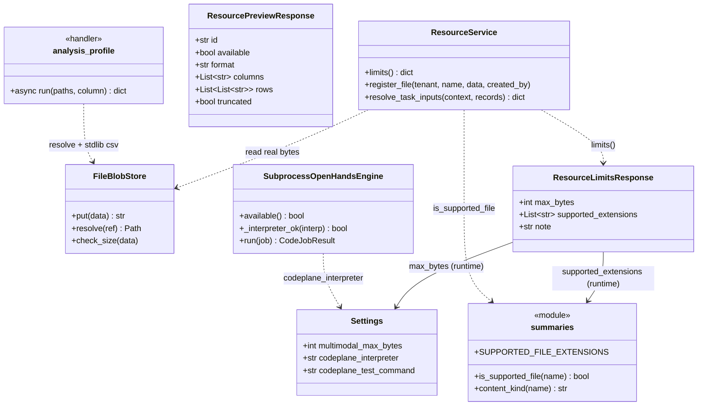
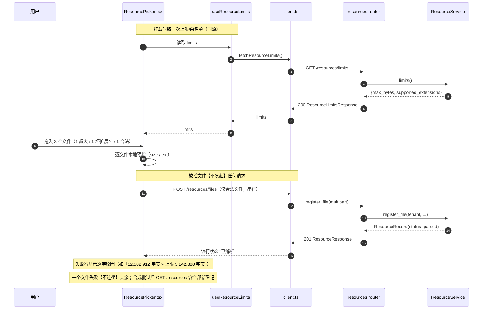
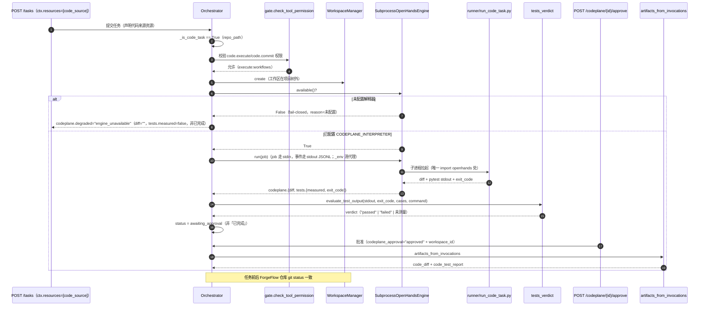
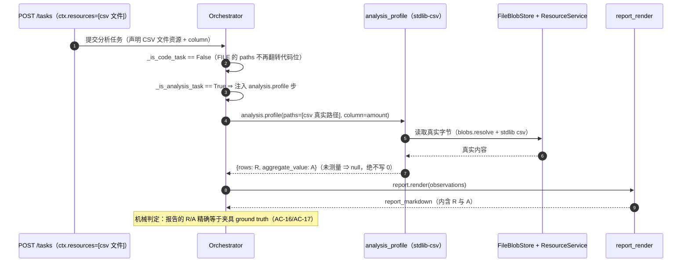

# INC26 增量设计 — 上传体验（U）+ 代码执行面打通（C）+ 企业级双能力验收（V）

> 文档类型：**增量设计**（只描述相对 INC25 的变更，含实现方案 + 任务分解）
> 上游输入：`docs/sop/INC26-RECON.md`（侦察基线，含缺口 A/B/C 与 §4 的 27 条纪律）、`docs/sop/INC26-PRD.md`（P0-1~P0-10 / AC-1~AC-21 / Q1~Q5）、`docs/sop/INC25-DESIGN.md`（同构对象：**沿用其抽象，不新增抽象**）
> 工程基线：`ForgeFlow-main`（FastAPI `forgeflow/` + React 手写 CSS `frontend/src/`）
> 运行档位：A 离线（`storage_backend=memory` + `llm_provider=mock`）/ B 真实（PG5433 + 本机 Ollama `qwen3:8b`）
> 本文件位于 `docs/`（本仓不提交的红线区），仅作草稿与评审用；**不要 git add**。
> 引文纪律：一律 `文件名::符号名` 锚定；**严禁** `file.py:行号`（被引文件插行即静默失真）。

---

## 0. 主理人复核纠正（**最高优先级，必须写进代码**）

本节内容覆盖 PRD 原文中的两处**会导致静默失败**的描述。工程师按本设计执行，**不要**按 PRD 字面执行。

### 0.1 纠正 A —— PRD P0-5 的 `FORGEFLOW_CODEPLANE_PYTHON` 是**错的**（高危静默降级）

PRD `P0-5` 写「经 `FORGEFLOW_CODEPLANE_PYTHON` 或 `Settings.codeplane_interpreter` 接上」。**实测证明这两条不是等价通道**：

- `forgeflow/config.py::Settings.model_config` = `SettingsConfigDict(env_file=".env", case_sensitive=False, extra="ignore")`，**没有 `env_prefix`** ⇒ Settings **只认字段名大写**的 env：`codeplane_interpreter` ← `CODEPLANE_INTERPRETER`。
- `FORGEFLOW_CODEPLANE_PYTHON` **只**是 `forgeflow/codeplane/engine.py::SubprocessOpenHandsEngine.__init__` 里 `os.environ.get(...)` 的**进程环境兜底**（解析链第 3 顺位）。
- **pydantic-settings 读 `.env` 是填 Settings 对象，不会把值注入 `os.environ`**（RECON §5.5 实测 `ENV FORGEFLOW_CODEPLANE_PYTHON = None` 即铁证）。
- ⇒ **只在 `.env` 里写 `FORGEFLOW_CODEPLANE_PYTHON=...`，两条通道都不命中**，引擎继续 `engine_unavailable`，**且没有任何报错**。

**本设计的强制规定**：

| 项 | 规定 |
|---|---|
| `.env`（B 档真实配置，**不提交**） | 必须写 `CODEPLANE_INTERPRETER=C:\Users\18769\.workbuddy\binaries\python\envs\openhands\Scripts\python.exe`（走 **Settings 字段**通道） |
| `.env.example` 第 201-203 行 | 现在把 `FORGEFLOW_CODEPLANE_PYTHON` 写成 "also accepted as an alias" —— **错误**，必须改成明确警告：`.env` 里写 `FORGEFLOW_CODEPLANE_PYTHON` **不生效**（pydantic-settings 不注入 os.environ），只认 `CODEPLANE_INTERPRETER` |
| 解释器解析链 | `engine.py::SubprocessOpenHandsEngine` 的 `显式参数 → Settings.codeplane_interpreter → os.environ["FORGEFLOW_CODEPLANE_PYTHON"]` **顺序不改**；`_interpreter_ok` / `available()` 的 **fail-closed 语义不改**（未配置 ⇒ `False` + 显式 `reason`；**不得添加内置默认解释器**） |

### 0.2 纠正 B —— `CODEPLANE_TEST_COMMAND` 裸 `python` 陷阱（B2）必须同批修

- 当前 `forgeflow/config.py::Settings.codeplane_test_command` 默认 = `"python -m pytest -q"`（RECON §5.5 实测）。Windows 上裸 `python` 常是 **WindowsApps 存根**（静默 `exit 1`）⇒ 即使 0.1 修好、引擎真跑起来，测试证据仍会**假失败**，把「改对了」判成「测试未通过」。
- **修 B1 必须同批修 B2**（只修 B1 会得到「引擎可用但测试判定恒失败」的新假象）。修法：`CODEPLANE_TEST_COMMAND` 的解释器改为**绝对路径**（见 §7 配置键；被测夹具是纯 stdlib Python 工程，解释器须真实存在且装有 `pytest`）。
- **加钉子断言**：`Settings.codeplane_test_command` 的**首个 token 不得是裸 `python`**（须为绝对路径或非裸解释器）。反事实见 §7.3。

---

## 1. 实现方案与技术选型

### 1.1 核心难点

| 缺口 | 难点 | 本设计的应对 |
|---|---|---|
| A 上传体验 | 前端**无**上限/白名单的同源入口；预览后端已就绪但前端**从未接** | 新增只读端点 `GET /resources/limits`，值**运行时**取自 `Settings.multimodal_max_bytes` 与 `resources/summaries.py::SUPPORTED_FILE_EXTENSIONS` 两处单一事实源；前端取回后驱动预检 + 接既有 `preview` |
| B 代码真闭环 | `.env` 配置陷阱（0.1）+ 裸 python 测试命令（0.2） | 强制 `CODEPLANE_INTERPRETER`；同批修 `CODEPLANE_TEST_COMMAND`；**保持 fail-closed 不动** |
| C 双能力验收 | 分析能力「真实执行机制」归谁（PRD Q5），且**数字必须精确等于夹具真实统计量** | **见 §1.3**（本题核心决策） |

### 1.2 架构模式（沿用 INC25，不新增抽象）

- 后端：FastAPI 分层（`routers/` → `service/` → `repositories/`）**不变**；`api/resource_schemas.py` 继续作为资源域的**独立** schema 模块（增量加模型，不动既有 Hub schema）。
- 前端：React + 手写 CSS + oklch token，面板沿用 `panel / panel-head / panel-body`，按钮沿用 `.btn.primary`，注意条沿用 `.af-note`（警告 `.af-note.warn`）。**禁** MUI / Tailwind / vitest。
- 代码执行面：`engine.py`（门面）→ 子进程 `codeplane/runner/run_code_task.py`（**唯一** `import openhands` 处），**不变**。
- 任务plan：沿用 `orchestrator.py` 的「候选步注入」范式（`_candidates_for` 为代码任务注入 `code.execute`/`code.commit`），分析能力**对称地**注入分析步（§1.3）。

### 1.3 【决策】PRD Q5 —— 分析能力真实执行机制 = **方案 (b)「react 工具链真实读文件」**

**选项评估：**

| 选项 | 描述 | 判定 |
|---|---|---|
| (a) 复用 codeplane 跑分析脚本 | 让分析任务走代码执行面（`_is_code_task` 为真），由 `qwen3:8b` 写脚本、引擎跑出 R/A | ❌ **弃**。数字由 8B 现场写代码算出，`temperature=0.0` 下仍抖动 ⇒ 无法保证「精确等于 ground truth」，AC-16 会**假失败**；单次 40~90s，重型且不确定 |
| (b) react 工具链真实读文件 | 分析任务走平台工具链，由一个**真实、确定性**的 stdlib 处理函数读取夹具**真实字节**并算出 R/A；模型只做编排（选工具、给列名）与报告 | ✅ **选**（见下） |
| (c) 其他（如新数仓/RAG） | —— | ❌ 违反非目标 §6.9（不新增向量检索/数仓连接器）；`data_tools.py::query_db` 是**永久 dev stub**，禁止使用 |

**选定方案 (b) 的理由：**

1. **数字精确可复现**：R/A 由**确定性 stdlib 计算**（读真实 CSV 字节），不依赖模型算术 ⇒ AC-16/AC-17 稳定通过，符合「企业级 = 可复现」。
2. **红线安全**：新增处理函数是纯 stdlib（`csv` + 既有存储），**不 `import openhands`** ⇒ 满足 RECON §4.6-27「`forgeflow/**`（除 `codeplane/runner/**`）禁 import openhands」。
3. **零新存储抽象**：复用 `resources/service.py::ResourceService` + `resources/storage.py::FileBlobStore` 读字节，`resources/summaries.py` 取已测量的行/列；**不造第二套存储**。
4. **不碰 `query_db`**：`mcp/server/tools/data_tools.py::query_db` 全程不调用。
5. **同构既有范式**：新增工具绑定 = 在 `runtime/tool_registry.py::load_default_bindings` 增一条（与 `analysis.score` 同形），无新抽象。

**机制落点（具体符号）：**

- 新增真实处理函数 `forgeflow/runtime/tool_handlers.py::analysis_profile`（拟名，`provider="stdlib-csv"`）：
  - 入参 `args["paths"]`（已由资源解引用得到真实文件路径）与 `args["column"]`（目标聚合列，来自任务显式输入）。
  - 用 `csv` 读真实字节；`rows = 数据行数 R`；`aggregate = sum(该列数值)`（或任务指定的聚合）。
  - **诚实纪律**：未测量 ⇒ `rows/aggregate = None`（**绝不写 0**）；读不到文件 ⇒ `not_executed=True`（→ `blocked`，不计 failed）。
- `runtime/tool_registry.py`：新增 `ToolBinding(tool_id="analysis.profile", handler=analysis_profile, kind="real", provider="stdlib-csv", ...)`。
- `runtime/gate.py`：把 `"analysis.profile"` 加入 `PLATFORM_TOOL_CATALOGUE`（进而进 `PLATFORM_PLAN_TOOLS`），使其继承 `execute:workflows` 粗粒度授权（与 `analysis.score` 同处理），**不进** `TOOL_PERMISSION_MAP`。
- `runtime/orchestrator.py`：新增对称的 `_is_analysis_task`，为分析任务注入 `analysis.profile` 候选步（镜像 `_candidates_for` 的代码步注入）。

### 1.4 【决策】Q5 派生冲突 —— 解耦「声明了数据文件」与「是代码任务」

**实测冲突**：`orchestrator.py::_is_code_task` 判定为真的第三个条件 = 「声明的 `resources` 解引用出 `repo_path` **或** `paths`」。而 `resources/service.py::resolve_task_inputs` 对 **FILE** 类资源也会把文件路径 append 进 `paths`（`service.py::ResourceService.resolve_task_inputs` 的 FILE 分支）。⇒ **今天只要声明一个 CSV 文件资源，`_is_code_task` 就返回 `True`**，代码执行面被注入，数据分析任务被误路由到 codeplane。

**本设计的解决（最小、可测）：**

- 把代码信号**收紧到 `repo_path`**（代码来源资源，`ResourceKind.GIT_REPO`）：
  `_is_code_task` = 审批复跑（`codeplane_approval` / `codeplane_workspace_id`）**或** 显式声明 `code.execute`/`code.commit`**或** 解引用出**非空 `repo_path`**。**不再**因泛化的 `paths` 而为真。
- `resources/service.py::resolve_task_inputs` 的**输出键不变**（仍产出 `table`/`paths`/`repo_path`）⇒ 四层数据契约（L1~L4）**不变**；仅让 FILE 派生的 `paths` 不再翻转「代码任务」位。
- 分析任务据 `paths`/`table` 注入 `analysis.profile`（§1.3），与代码任务互斥。

> ⚠️ 工程风险：本改动会触碰 INC25 既有代码任务判定。**必须**加回归：`tests/unit/test_inc26_analysis_route.py` 断言「FILE 资源不翻转 code 位」「代码来源（repo_path）仍翻转」，并全量跑 INC25 代码面既有用例。见 §5 的 T03。

---

## 2. 文件级变更清单

> 全部相对 `ForgeFlow-main/`。标记 `(新)` = 新增文件，其余为**修改**。每条附需求 ID。

### 2.1 后端

| 文件 | 变更 | 需求 |
|---|---|---|
| `forgeflow/api/routers/resources.py` (改) | 新增 `GET /resources/limits`（函数 `get_resource_limits`）。**必须声明在 `get_resource`（`/{resource_id}`）之前**，否则 `/limits` 会被 `{resource_id}` 吞掉 | P0-2 |
| `forgeflow/api/resource_schemas.py` (改) | 新增 `ResourceLimitsResponse` | P0-2 |
| `forgeflow/resources/service.py` (改) | 新增 `ResourceService.limits()`，**运行时**读取 `get_settings().multimodal_max_bytes` 与 `summaries.SUPPORTED_FILE_EXTENSIONS` | P0-2 |
| `forgeflow/runtime/tool_handlers.py` (改) | 新增 `analysis_profile`（真实、确定性 stdlib 处理） | Q5 / P0-9 |
| `forgeflow/runtime/tool_registry.py` (改) | 绑定 `analysis.profile` | Q5 / P0-9 |
| `forgeflow/runtime/gate.py` (改) | `PLATFORM_TOOL_CATALOGUE` 增 `"analysis.profile"` | Q5 / P0-9 |
| `forgeflow/runtime/orchestrator.py` (改) | 收紧 `_is_code_task`（§1.4）；新增 `_is_analysis_task` + 分析步注入 | Q5 / P0-9 |
| `.env.example` (改) | 更正第 201-203 行别名错误 → 明确警告；`CODEPLANE_TEST_COMMAND` 用绝对路径示例 | P0-5 / B2 |
| `.env`（**不提交**，B 档真实配置） | 写 `CODEPLANE_INTERPRETER=<绝对路径>`；修 `CODEPLANE_TEST_COMMAND` 解释器为绝对路径 | P0-5 / B2 |

### 2.2 前端

| 文件 | 变更 | 需求 |
|---|---|---|
| `frontend/src/views/runs/ResourcePicker.tsx` (改) | 拖拽区 + `<input type="file" multiple>`；逐文件独立上传项与状态；上传前预检；预览入口；类型筛选；历史复用。**保留**既有 testid | P0-1/P0-2/P0-3/P0-4 |
| `frontend/src/api/client.ts` (改) | 新增 `fetchResourceLimits()`、`previewResource(id,n)` 与 TS 类型 `ResourceLimitsResponse`/`ResourcePreviewResponse`；`hubApi.resources` 传 `kind` | P0-2/P0-3/P0-4 |
| `frontend/src/api/hooks.ts` (改) | 新增 `useResourceLimits`、`useResourcePreview` | P0-2/P0-3 |
| `frontend/src/styles/runs.css` (改) | 新增 `.resource-dropzone` / `.resource-upload-row` / `.resource-preview-*` 等（**前缀 `resource-`，oklch token**） | P0-1/P0-3 |

### 2.3 测试与夹具

| 文件 | 变更 | 需求 |
|---|---|---|
| `tests/unit/test_inc26_resource_limits_nail.py` (新) | **跨层防漂移钉子** + 反事实注入（§7.3） | AC-4 |
| `tests/unit/test_inc26_codeplane_config.py` (新) | fail-closed 保持 + `.env` 陷阱守卫 + 测试命令非裸 python 钉子 | P0-5 / AC-9 |
| `tests/unit/test_inc26_analysis_route.py` (新) | `_is_code_task` 收紧回归 | Q5 |
| `tests/unit/test_inc26_analysis_tool.py` (新) | `analysis.profile` 真实读到夹具 R/A | P0-9 |
| `tests/fixtures/inc26/` (新) | 代码夹具（小包 + 种子缺陷 + 必败测试）+ CSV 夹具 + ground truth | P0-8 / P0-9 |
| `tests/integration/test_inc26_capability_acceptance.py` (新) | 企业级双能力验收（B 档真实；A 档可跳过真实外设） | P0-8 / P0-9 / P0-10 |
| `frontend/e2e/inc26_upload.spec.ts` (新) | 拖拽/预检不发送请求/预览/筛选 e2e | AC-1~AC-8 / AC-20 |
| `tests/integration/test_inc26_upload_a_profile.py` (新) | A 档（memory+mock）上传/预检/预览/筛选四交互 | AC-20 |

> `forgeflow/api/main.py` **无需改动**：`resources.router` 已以 `prefix="/resources"` 挂载，新路由随既有 router 生效。

---

## 3. 数据结构与接口

### 3.1 新增只读端点 `GET /resources/limits`（P0-2 / Q1）

**请求**：无参数（`tenant` 由 `Depends(resolve_tenant)` 注入，用于审计，不参与取值）。

**响应**（`ResourceLimitsResponse`，新增于 `forgeflow/api/resource_schemas.py`）：

```jsonc
{
  "max_bytes": 5242880,                                   // == Settings.multimodal_max_bytes（运行时）
  "supported_extensions": [".csv", ".tsv", ".tab", ".xlsx", ".xlsm", ".pdf",
                           ".txt", ".md", ".markdown", ".rst", ".json", ".jsonl",
                           ".ndjson", ".yaml", ...],      // == summaries.SUPPORTED_FILE_EXTENSIONS（运行时）
  "note": "上限与类型白名单来自后端单一事实源，前端不得写死"   // 诚实说明
}
```

**Pydantic 模型**（新增）：

```python
class ResourceLimitsResponse(BaseModel):
    """Read-only limits + whitelist, sourced live from the single source of truth."""
    max_bytes: int
    supported_extensions: list[str] = Field(default_factory=list)
    note: str = ""
```

**服务方法**（`resources/service.py`）：

```python
def limits(self) -> dict[str, Any]:
    """Runtime limit + whitelist values (never a frozen literal)."""
    from forgeflow.config import get_settings
    from forgeflow.resources import summaries
    return {
        "max_bytes": get_settings().multimodal_max_bytes,
        "supported_extensions": list(summaries.SUPPORTED_FILE_EXTENSIONS),
        "note": "上限与类型白名单来自后端单一事实源，前端不得写死",
    }
```

**路由**（`resources.py`，**放在 `get_resource` 之前**）：

```python
@router.get("/limits", response_model=ResourceLimitsResponse)
async def get_resource_limits(tenant: str = Depends(resolve_tenant)):
    """Upload limits + supported extensions, from the single source of truth."""
    return ResourceLimitsResponse(**_service().limits())
```

**权限覆盖（无需新增任何权限条目）**：`forgeflow/rbac/policies.py::ROUTE_PERMISSION_MAP` 已有 `("GET", "/resources"): ("read", "skills")`，并显式注明「Longest-prefix match covers /resources/{id} and /resources/{id}/preview.」⇒ `/resources/limits` 自动命中同一 `read:skills`。`tests/unit/test_route_permissions.py::test_every_route_is_mapped_or_intentionally_open` 会**自动**把新路由纳入校验并**直接通过**（因为它解析到既有权限）。**严禁**为本端点新增权限条目。

### 3.2 前端 TS 类型（`frontend/src/api/client.ts`，增量）

```ts
export interface ResourceLimitsResponse {
  max_bytes: number;
  supported_extensions: string[];
  note?: string;
}
export interface ResourcePreviewResponse {
  id: string;
  kind?: string;
  available: boolean;
  format: "table" | "text" | "none" | string;
  columns: string[];
  rows: string[][];
  content: string;
  truncated: boolean;
  note: string;
}

export async function fetchResourceLimits(): Promise<ResourceLimitsResponse> { /* GET /resources/limits */ }
export async function previewResource(id: string, n = 20): Promise<ResourcePreviewResponse> { /* GET /resources/{id}/preview?n= */ }
```

> `ResourcePreviewResponse` 与后端 `api/resource_schemas.py::ResourcePreviewResponse` **逐字段对齐**；`truncated` 驱动截断提示，`available=false`/`format="none"` 驱动诚实空态。

### 3.3 分析工具输出契约（`analysis_profile` 返回 dict）

```jsonc
{
  "ok": true,
  "provider": "stdlib-csv",
  "rows": 1284,              // R：真实数据行数；未测量 ⇒ null（绝不写 0）
  "columns": ["lead_id","company","amount", ...],
  "aggregate_column": "amount",
  "aggregate_value": 5400000.0,  // A：真实聚合；未测量 ⇒ null
  "note": ""                 // 读不到文件时给逐字原因
}
```

### 3.4 类图



---

## 4. 程序调用流程

### 4.1 流程一：拖拽多文件上传 + 上传前预检拦截（P0-1/P0-2/P0-3）



### 4.2 流程二：真实档代码任务端到端（P0-5/P0-6/P0-7/P0-8）



### 4.3 流程三：分析能力真实执行（Q5 = 方案 b，P0-9）



---

## 5. 任务分解（按依赖排序，逐条独立可交付）

> 粒度：每条 **1~4 个文件**，可独立提交与验收。为「独立可交付」共 6 条；若须压到里程碑，可合并为 4 个（M1=T01+T02 上传 / M2=T03+T04 引擎 / M3=T05 验收 / M4=T06 收口）。

### T01 — 资源上限单一事实源端点（后端） — **P0-2**
- **目标**：新增 `GET /resources/limits`，值**运行时**取自 `Settings.multimodal_max_bytes` 与 `summary.SUPPORTED_FILE_EXTENSIONS`；不新增权限条目。
- **文件**：`forgeflow/api/routers/resources.py`、`forgeflow/api/resource_schemas.py`、`forgeflow/resources/service.py`
- **依赖**：无
- **完成判据**：`GET /resources/limits` 返回 `{max_bytes, supported_extensions}`；`max_bytes == Settings.multimodal_max_bytes`、`supported_extensions == list(SUPPORTED_FILE_EXTENSIONS)`；路由声明在 `/resources/{resource_id}` **之前**；`tests/unit/test_route_permissions.py` 通过（自动覆盖）；**无**新增 `ROUTE_PERMISSION_MAP` 条目。

### T02 — 上传体验前端（拖拽/多文件/预检/预览/筛选复用） — **P0-1/P0-2/P0-3/P0-4**
- **目标**：把 `ResourcePicker` 文件分支升级为拖拽区 + 多选；逐文件独立上传项；用 T01 的 limits 做上传前预检（**不写死**）；接既有 preview；`kind` 筛选 + 历史复用。
- **文件**：`frontend/src/views/runs/ResourcePicker.tsx`、`frontend/src/api/client.ts`、`frontend/src/api/hooks.ts`、`frontend/src/styles/runs.css`
- **依赖**：T01
- **完成判据**：拖入 N≥2 合法文件出现 N 行独立状态；混合批「合法仍登记成功」；超限/坏扩展名**不发起**请求（请求计数判定）；表格/文本预览逐字一致，`truncated` 显示截断提示，非文件类诚实空态；`kind` 筛选后 items.kind 全等于所选；既有 testid（`resource-add`/`resource-kind-*`/`resource-list`/`resource-card`/`resource-empty-note`）保留、行为不变；**无** MUI/Tailwind/vitest。

### T03 — 分析能力真实执行机制 + 代码任务判定解耦（**Q5**） — **P0-9 机制**
- **目标**：新增真实确定性 `analysis.profile`（读真实字节算 R/A）；绑定/白名单/权限；收紧 `_is_code_task`，新增 `_is_analysis_task` 注入。
- **文件**：`forgeflow/runtime/tool_handlers.py`、`forgeflow/runtime/tool_registry.py`、`forgeflow/runtime/gate.py`、`forgeflow/runtime/orchestrator.py`
- **依赖**：无（T05 依赖它）
- **完成判据**：`analysis.profile` 读到夹具真实 R/A；未测量 ⇒ `null` 不写 0；`_is_code_task` 对 FILE 资源返回 `False`、对代码来源（`repo_path`）返回 `True`（`test_inc26_analysis_route.py`）；INC25 代码面既有用例**无回归**；`analysis.profile` 被 `required_permission` 解析为 `execute:workflows`（非 fail-closed 缺口）。

### T04 — 代码执行面配置打通 + 陷阱防护（**P0-5 / B1 / B2**）
- **目标**：`.env` 用 `CODEPLANE_INTERPRETER`（**不是** `FORGEFLOW_CODEPLANE_PYTHON`）；`.env.example` 更正注释；测试命令解释器改绝对路径；加钉子。
- **文件**：`.env.example`、`tests/unit/test_inc26_codeplane_config.py`（`.env` 本身**不提交**）
- **依赖**：无
- **完成判据**：`.env.example` 明确警告 `FORGEFLOW_CODEPLANE_PYTHON` 在 `.env` 里**不生效**；测试断言：未配置 ⇒ `engine.available()==False` 且 `degraded=="engine_unavailable"`（fail-closed **不回归**）、配置存在路径 ⇒ `True`、`codeplane_test_command` 首 token **非**裸 `python`；`_interpreter_ok`/`available()` 语义**未改**。

### T05 — 企业级双能力验收夹具 + 验收测试（含防漂移钉子/反事实） — **P0-8/P0-9/P0-10**
- **目标**：代码夹具（种子缺陷 + 必败测试）+ CSV 夹具 + ground truth；机械判定双能力；跨层防漂移钉子 + 反事实注入；双档回归 + 迁移幂等。
- **文件**：`tests/fixtures/inc26/`、`tests/unit/test_inc26_resource_limits_nail.py`、`tests/unit/test_inc26_analysis_tool.py`、`tests/integration/test_inc26_capability_acceptance.py`
- **依赖**：T01、T03、T04
- **完成判据**：见 §7.3 钉子/反事实；分析报告 R/A 精确等于 ground truth；代码能力 3 次中 ≥2 次机械通过（<2 即判失败，不上调阈值）；A/B 两档 junit **0 failures/0 errors**、集合差 0；`alembic upgrade head` 连跑两次无 schema diff。

### T06 — 前端 e2e + 双档收口 — **AC-1~AC-8/AC-19/AC-20/AC-21**
- **目标**：前端交互 e2e（拖拽/预检不发送请求/预览/筛选）；A 档四交互；既有 testid 保留回归。
- **文件**：`frontend/e2e/inc26_upload.spec.ts`、`tests/integration/test_inc26_upload_a_profile.py`
- **依赖**：T02、T05
- **完成判据**：e2e 全绿（**不新建 vitest**，走 `frontend/e2e/`）；A 档（memory+mock）四交互判定与 B 档一致（除真实内容差异）、不返回 5xx；AC-19/AC-21 回归。

---

## 6. 依赖（第三方包）

- **预期新增依赖：零。**
- 后端 `analysis_profile` 仅用 stdlib `csv`（无新依赖）。前端仅用既有 React/DOM（`<input multiple>` + 原生 `dragstart/drop` 事件），不引入拖拽库。测试用既有 pytest + playwright。
- 若 T05 代码夹具需要 `pytest` 在被测工作区解释器内：**属既有环境能力**，不新增包（在 T04 核实所选绝对解释器已装 `pytest`；`openhands` venv 若无则改用 `agentflow` venv 解释器作 `CODEPLANE_TEST_COMMAND`，不改变「绝对路径」要求）。

---

## 7. 共享知识（跨切面约定，工程师必读）

### 7.1 命名与契约

- **新增 testid（只增）**：`resource-dropzone`、`resource-upload-row`、`resource-upload-status`、`resource-preview`、`resource-preview-truncated`、`resource-kind-filter`、`resource-limits-note`。
  **绝不修改/删除**既有：`run-declare-table`、`run-declare-paths`、`resource-add`、`resource-kind-*`、`resource-list`、`resource-card`、`resource-empty-note`。
- **CSS 类前缀**：新样式一律 `resource-` 前缀，放 `frontend/src/styles/runs.css`，颜色用 `frontend/src/styles/tokens.css` 的 oklch token。`<details>` 折叠区 wrapper **禁写 `display`**；显隐**禁**「基础 display + `hidden` 属性」混用。
- **状态词表复用**：`ok`/`error`/`unavailable`/`refused` + `blocked`/`not_applicable`；**`blocked` 不计 failed、不进 errors**；`skipped` 已退役（映射 `blocked`）。上传行状态用「待上传/上传中/已解析/失败」；`metadata_only`/`ignored` 是降级**不是成功**。
- **配置键（**准确名，勿写错**）**：
  - `.env` 解释器：**`CODEPLANE_INTERPRETER`**（Settings 字段通道，**唯一有效**）；`FORGEFLOW_CODEPLANE_PYTHON` 仅进程环境兜底，**在 `.env` 里无效**。
  - 测试命令：**`CODEPLANE_TEST_COMMAND`**，首 token 必须绝对路径。
  - 上限：**`MULTIMODAL_MAX_BYTES`**（`.env.example` 现有值 `5242880`）；前端**不得**写死。
- **API 诚实语义**：超限 → **413**（含实际字节 + 上限）；不支持类型 → **400**（逐字原因，无「已解析」）；解析能力缺口 → **2xx** 且 `metadata_only`/`ignored`（**非 5xx**）。
- **四层契约（L1 plan / L2 tool_invocations / L3 observations / L4 artifacts）不改**；`latency_ms: float|None`，`None`=未测量，**绝不写 0**。

### 7.2 代码面硬约束（沿用 RECON §4.6）

- `forgeflow/**`（除 `codeplane/runner/**`）**禁 import openhands**；`codeplane/runner/**` **禁 import forgeflow**；两 venv 绝不合并。
- `engine.py::_interpreter_ok` / `available()` 的 **fail-closed 语义不改**（未配置 ⇒ `False` + reason；**不得内置默认解释器**）。
- 代码任务触发只认 `_is_code_task` 的显式信号，**不做 intent 关键词匹配**（`intent` 只作 `query`/`text`）。

### 7.3 防漂移设计（**必须实现**）

**(1) 跨层防漂移钉子（≥1）** —— `tests/unit/test_inc26_resource_limits_nail.py`：

- `test_limits_matches_runtime_sources`：TestClient `GET /resources/limits` ⇒ 断言 `body["max_bytes"] == get_settings().multimodal_max_bytes` **且** `set(body["supported_extensions"]) == set(summaries.SUPPORTED_FILE_EXTENSIONS)` **且** 对每个扩展名 `summaries.is_supported_file("x"+ext) is True`（用 `summaries` 的**运行时真实值**，不是常量）。
- `test_frontend_has_no_hardcoded_limit`：静态扫描 `frontend/src/**`，断言**不含**字面量 `5242880` / `5*1024*1024` / `5 * 1024 * 1024`（跨层同源钉子）。

**(2) 反事实注入（**改坏靶 ⇒ 钉子必须变红**）**：

- C1（改上限）：`monkeypatch.setenv("MULTIMODAL_MAX_BYTES","1024")` + `get_settings.cache_clear()` ⇒ 重取 `/resources/limits` **必须**返回 `1024`，并断言上传 1.5KB 文件被 `register_file` 以 **413** 拒。若端点写死了 5MB，此测试变红。
- C2（改白名单）：monkeypatch `summaries.SUPPORTED_FILE_EXTENSIONS` 去掉 `.csv` ⇒ 端点 `supported_extensions` **必须**同步缺 `.csv`。若白名单被前端/端点点写死，此测试变红。
- C3（测试命令）：`monkeypatch.setenv("CODEPLANE_TEST_COMMAND","python -m pytest -q")` + `cache_clear()` ⇒ 「首 token 非裸 python」钉子**必须**变红（用于证明钉子有效）。
- C4（路由）：把 FILE 资源塞进 `_is_code_task` ⇒ 断言 `False` 的用例**必须**在回退版实现下变红（防回归）。

**(3) fail-closed 不回归钉子** —— `tests/unit/test_inc26_codeplane_config.py`：空解释器 ⇒ `available() is False`；仅在 `.env` 写 `FORGEFLOW_CODEPLANE_PYTHON` ⇒ 仍 `False`（陷阱守卫）。

---

## 8. 待确认问题与开放项

| 编号 | 事项 | 本设计的默认处置 |
|---|---|---|
| O1 | `analysis_profile` 的聚合口径（sum/mean/count）与列名从何而来 | 由任务显式输入 `column`（默认 sum）；夹具 ground truth 预计算同口径；`args` 缺失 ⇒ `not_executed`（blocked），不猜 |
| O2 | 分析任务是否强制走 react（模型编排）还是可走确定性计划 | 本设计走**平台计划注入**（`_is_analysis_task` 注入 `analysis.profile`），模型在 react 档负责编排与报告；数字恒由确定性处理函数产生 |
| O3 | `code` 来源（github/gitlab/local_path/zip）是否都产 `repo_path` | 依 `service.py::resolve_task_inputs` 仅 `ResourceKind.GIT_REPO` 分支产 `repo_path`；T03 须实测确认 `register_code` 落 `git_repo` kind，否则 `_is_code_task` 收紧会误伤 |
| O4 | `openhands` venv 是否装有 `pytest`（供 `CODEPLANE_TEST_COMMAND`） | T04 核实；若无则把测试命令指向装有 pytest 的绝对解释器（`agentflow` venv），仍满足「绝对路径」 |
| O5 | `alembic upgrade head` 幂等是否存在既有漂移 | 本增量**不改** alembic 版本；若 T05 发现既有漂移，如实记录，不在本增量修 |

---

## 9. 与 PRD 验收标准的对齐

| AC | 落点 |
|---|---|
| AC-1/AC-2 | T02（拖拽/多选/逐文件独立成败） |
| AC-3/AC-4 | T01+T02（预检不发请求；同源钉子 §7.3） |
| AC-5/AC-6 | T02（预览接 `preview_resource`） |
| AC-7/AC-8 | T02（复用 + kind 筛选） |
| AC-9 | T04（fail-closed + 配置存在路径） |
| AC-10/AC-11/AC-12/AC-13 | T05（真实档 e2e + 降级不回归） |
| AC-14/AC-15 | T05（代码能力 3 中 ≥2） |
| AC-16/AC-17 | T03+T05（真实 R/A 精确比对） |
| AC-18 | T05（双档 junit 0 + 迁移幂等） |
| AC-19 | T02+T06（testid 只增不改不删） |
| AC-20 | T06（A 档四交互） |
| AC-21 | T05/T06（审批三动作真实档回归） |

---

*本设计严守 RECON §4 的 27 条纪律；不新增 MUI/Tailwind/vitest；不造第二套存储抽象；不改四层数据契约；不动 `engine.py::_interpreter_ok`/`available()` 的 fail-closed 语义。*
