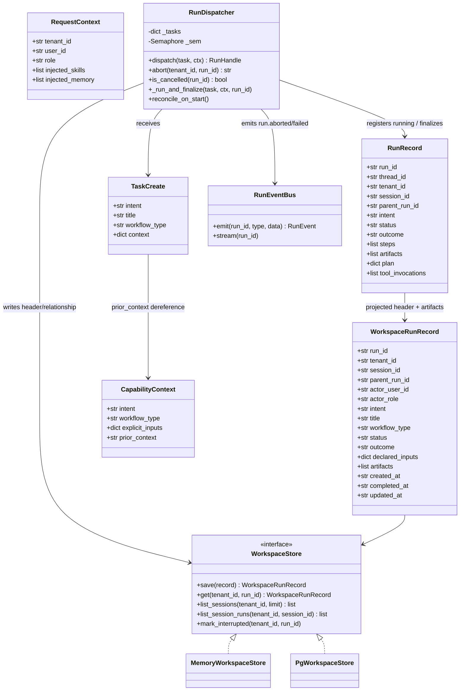
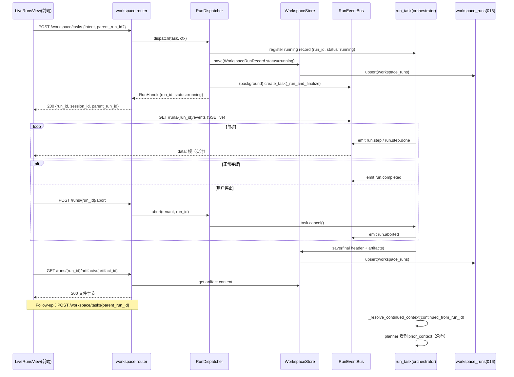
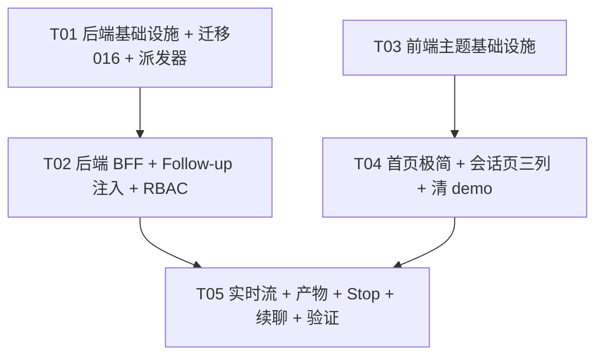

# INC32 增量系统设计 — 从「Agent 控制台」演进为「AI 工作空间」

> 文档类型：**系统设计 + 任务分解**（架构师产出）
> 增量编号：**INC32**（承 INC25/26/27 系列）
> 作者：**高见远**（software-architect）
> 上游输入：`docs/sop/INC32-PRD.md`（产品经理；479 行）
> 工程基线：`ForgeFlow-main`（FastAPI `forgeflow/` + 手写 CSS 的 React `frontend/src/`）
> 引文纪律：一律 `文件名::符号名` 锚定；**严禁** `file.py:行号`
> 状态：**待产品/主理人评审 → 进入实现**
> 本文件**不覆盖** `docs/sop/` 下任何历史文档

---

## 0. 设计总览（一页速览）

本轮把「实时执行 + 可停止 + 可续聊 + 诚实空态 + 浅色默认」这套产品体验，**落在既有代码的增量扩展上**，不动编排内核、不新增框架、不推倒四 Tab。

核心事实（主理人已复核，本设计以此为准）：平台**没有「运行中的 run」这个概念**——`POST /tasks` 同步跑完才返回（`routers/tasks.py::create_task` 内 `handle = await run_task(task, ctx)`），于是 SSE 只能回放（`runtime/events.py::RunEventBus.subscribe` 先灌 history），Follow-up 的 `continued_from_run_id` 是死信（不在 `orchestrator.py::_EXPLICIT_INPUT_KEYS` 白名单），stop/abort 只有词表没有 emit 点。**这三件事同源**：都源于「run 不是一个可寻址、可取消、有后台生命周期的实体」。本设计把三者一起解决。

九条裁决速览：

| # | 裁决 | 一句话结论 |
|---|---|---|
| 1 | 异步派发 | **保持 `POST /tasks` 同步语义完全不变**，**新增** `POST /workspace/tasks` 异步派发端点（后台 asyncio 任务 + 立即返回句柄） |
| 2 | session 模型 | 新增**单张** `workspace_runs` 表（迁移 `016`）：只落 session/父 run 关系 + run 头 + 产物行；run 正文继续留内存 |
| 3 | Follow-up 注入 | `continued_from_run_id` **进白名单并解引用**（复用 `resources` 解引用模式），内容进 planner 的 `prior_context`，**不进** `declared_inputs` |
| 4 | Stop/Abort | 新增 `POST /runs/{run_id}/abort`，emit `run.aborted`，取消 asyncio 任务，`status/outcome = aborted`；RBAC 复用既有 `/runs` POST 映射 |
| 5 | Artifact | 新增只读 `GET /runs/{run_id}/artifacts/{artifact_id}`；**不新增 kind**、**不落静态目录**、后端**不伪造** PDF/Excel/图片 |
| 6 | BFF 落点 | 同 app 内新增 `forgeflow/api/routers/workspace.py`（`/workspace`）+ `runs` 路由的增量子路径；**不**起独立进程/网关 |
| 7 | 浅色主题 | `:root` 落浅色、`[data-theme="dark"]` 落深色、`<head>` 内联脚本防 FOUC、`localStorage` 持久化、顶栏切换 |
| 8 | 前端结构 | 四 Tab 与 `ViewMode` **原样复用**；三档 = `concise` + 四 Tab「执行详情展开层」 + `debug`；阶段 7 页面**只从主导航隐藏、不改文件** |
| 9 | data-testid | 只增不改不删；新增 testid 按组件分组清单化；既有 3 spec / 14 用例逐条影响评估（**基线以 QA 实测为准**：E2E 13/14，`inc29` 4/4 已实测绿，唯一红 = `console.spec.ts::'landing page loads'`，见 §1 末与 R6） |

---

## 1. 架构决策记录（ADR，对应裁决 1–9）

### ADR-01 · 异步派发：新增异步端点，`POST /tasks` 同步语义一字不改

**背景**：要让「实时流」和「Stop」成立，run 必须在**后台**跑、接口**立即返回句柄**。现状 `routers/tasks.py::create_task` 在请求内 `await run_task(...)` 跑到终态才返回；`frontend/src/views/runs/panels.tsx` 顶部注释与 `RunListPanel.tsx::RunListPanel` 注释都自认「runs to a terminal state before responding」。因此前端永远拿不到「运行中」的 `run_id`，SSE 只订阅到**已跑完**的 run（回放）。

**决策**：选 **(a) + 最小注入**——
1. `POST /tasks` 的**路由、请求体、同步语义完全不变**（仍在请求内跑到终态）。响应**仅追加**两个带默认值的可选字段：`RunHandleResponse` 增 `session_id` / `parent_run_id`（默认 `""`）——**非破坏性 additive**：请求 schema 逐字节不变、既有响应字段的类型与语义不变，仅多出两个键（向后兼容）。⚠️ 该模型被 `POST /tasks` 与 `POST /runs/{id}/replan`、`/approve`、`/reject` 共用，故这四个端点的响应体同样多出这两个键 —— **已裁决接受**（详见 §3 契约表与 QA 报告 §0.1「新增发现」）。
2. **新增**带 BFF 语义的异步派发端点 `POST /workspace/tasks`：它创建句柄、把 run **注册为 `running`**、`asyncio.create_task` 落地 `run_task`、**立即**返回 `{run_id, thread_id, status:"running", session_id, parent_run_id}`。
3. 为让异步派发可寻址，给 `orchestrator.py::run_task` 增加**可选、默认安全**的关键字参数：`run_id: str | None = None`、`thread_id: str | None = None`、`register_running: bool = False`（默认 `None/False` ⇒ 现有全部调用点行为字节不变）。

**理由**：
- 用户第一验收标准是「后端全量测试不退化」。方案 (b)（改造 `POST /tasks` 为异步）会改动既有契约，直接打红多个依赖同步语义的用例（见下方冲击面）；(c)（`?mode=async` 开关）虽可默认同步，但把两种生命周期塞进同一路由，违反「诚实接口」原则，且 `test_middleware_vs_gate_boundary.py` 明确把 `POST /tasks → execute:workflows` 这一映射钉死，语义上不宜再分叉。
- 异步端点独立成路由，**新增面 = 新增文件**，回归面最小。

**被否决方案**：
- (b) 改造 `POST /tasks` 为异步：会破坏契约与多个同步用例；且 `POST /runs/{id}/replan`、事件派发 (`forgeflow/events/dispatcher.py`) 等调用点的语义都会被牵连。
- (c) `POST /tasks?mode=async`：契约分叉、RBAC/审计语义混杂。

**对既有测试的冲击面盘点（实际读代码所得）**：
| 测试文件::用例 | 为何依赖同步语义 | 本设计下的结论 |
|---|---|---|
| `tests/integration/test_runs_sse.py::test_runs_sse_streams_events_and_terminates` | `POST /tasks` 后**立即** `GET /runs/{id}/events`，靠 history 回放拿到 `run.completed`/`[DONE]` | **不退化**（`POST /tasks` 仍同步跑完） |
| `tests/integration/test_inc14_result_first.py::test_post_tasks_forwards_context_into_the_run` | monkeypatch `tasks_router.run_task`，断言 `context` 透传 | **不退化**（`tasks.py` 未改） |
| `tests/integration/test_inc26_upload_a_profile.py::test_declared_resource_id_flows_into_the_run` | `POST /tasks` 后**立即** `GET /runs/{id}` 读 `plan` | **不退化**（同步返回即已落库） |
| `tests/unit/test_inc8_degrade_wiring.py`（POST `/tasks` 断言 503 降级） | 依赖 `create_task` 的准入守卫 | **不退化**（未改） |
| `tests/unit/test_middleware_vs_gate_boundary.py::test_route_gate_sees_only_the_coarse_run_permission` | 断言 `ROUTE_PERMISSION_MAP[("POST","/tasks")] == ("execute","workflows")` | **不退化**（未改映射） |
| `tests/unit/test_rbac.py::TestRBAC::test_manager_route_level_execute_is_pinned_against_drift` | 同上 | **不退化** |
| `tests/unit/test_runs_api.py` / `test_events_task.py` | 直接调 `run_task`（非经 `POST /tasks`） | **不退化**（`run_task` 新参数全默认） |

**零退化策略**：异步能力**只**经新端点暴露；`run_task` 新参数全默认；`ROUTE_PERMISSION_MAP` 不改既有条目（只**新增** `/workspace` 条目）。

**任务句柄的归属与生命周期**（新 `forgeflow/runtime/dispatcher.py::RunDispatcher`）：
- **谁持有**：进程内单例 `RunDispatcher` 持有 `_tasks: dict[run_id, asyncio.Task]`、一个 `asyncio.Semaphore`（并发上限，读 `Settings.workspace_max_concurrent_runs`，默认 4）。
- **立即返回**：`dispatch(task, ctx) -> RunHandle` 预注册一条 `RunRecord(status="running")`（经 `register_running` 写入 `MemoryRunStore`），再 `create_task(_run_and_finalize(...))`，把 task 存表，**立即**返回。
- **异常 → `run.failed`**：`_run_and_finalize` 捕获 `run_task` 抛出的异常，emit `run.failed` 并把记录置 `status="failed"`（不再像路由那样冒 500）。
- **取消 → `run.aborted`**：捕获 `asyncio.CancelledError`，emit `run.aborted`、置 `status="aborted"`、`outcome="aborted"`；随后 `raise` 让任务真正结束。
- **生命周期收尾**：`task.add_done_callback` 把 `run_id` 从 `_tasks` 移除；并发信号在 `finally` 释放。
- **进程重启**：进程内 task 引用**必然丢失**（与 `orchestrator.py::MemoryRunStore` 同源）。持久化的**关系事实**存于 `016` 新表（ADR-02）；重启后启动期做一次**诚实收尾**——把 `workspace_runs` 里仍为 `running` 的行标为 `interrupted`（UI 显示「已中断」），**不**伪造完成。
- **`MemoryRunStore` 一致性**：`register_running` 先写、`run_task` 结束覆盖终态；同一 `run_id` 键，无第二份存储。

---

### ADR-02 · session / conversation / parent_task 的最小模型：**单张 `workspace_runs` 表**

**背景**：主 API 无 `session_id`/`conversation_id`/`parent_task_id`（`forgeflow/` 内 `session_id` 零命中）；hub run 存于进程内 `orchestrator.py::MemoryRunStore`（注释自认重启即丢）；alembic 迁移链 `001→…→015`，**head = `015`**（`alembic/versions/015_resources.py`）。

**决策**：新增迁移 **`016`**（`down_revision="015"`），只建**一张** tenant-作用域表 `workspace_runs`。**不**建独立 `sessions` 表（会话由 `session_id` 分组派生，标题取该会话最早 run 的 intent）。

**必须落库的最小必要集**（`workspace_runs` 列）：
`run_id`(PK) · `tenant_id` · `session_id` · `parent_run_id` · `actor_user_id` · `actor_role` · `intent` · `title` · `workflow_type` · `status` · `outcome` · `declared_inputs`(JSONB) · `artifacts`(JSONB) · `created_at` · `completed_at` · `updated_at`。
索引：`(tenant_id, created_at DESC)`、`(tenant_id, session_id, created_at DESC)`、`(parent_run_id)`。

**为什么这些必须落库**：
- `session_id` / `parent_run_id` → 「左侧历史任务/会话」与 Follow-up 父链（AC-39）**跨重启**可查；
- `status/outcome/intent/title/created_at` → 左列会话分组与状态徽章（P1-1 / AC-42）；
- `artifacts`(JSONB) → 右列产物卡列表 + **下载/预览**（AC-31）在重启后仍可服务；产物本就不大（现为短 Markdown/diff，`runtime/artifacts.py` 顶部注释也说明报告约 400–600 字符）。

**可以继续留在内存的**：完整 `RunRecord` 正文（`steps` / `tool_invocations` / `plan` / `observations` / `llm` / `codeplane`）、实时 `asyncio.Task` 句柄、`RunEventBus` 环形 history。⇒ `GET /runs/{id}` 与 SSE 仍读内存（不变）；重启后正文不可得时，界面按**诚实降级**处理（利用 `workspace_runs` 的头部 + 产物渲染「历史摘要」，并如实说明步骤明细已随进程释放）。

**与既有表的关系**：`workspace_runs` 仅以 `run_id` 与既有 `experiences.run_id` / `run_steps.run_id` **软关联**（与现状同构），**不**改任何既有表、**不**加外键到既有表。

**迁移 016（幂等；裸 SQL，沿用 `015_resources.py` 风格）**：
```sql
CREATE TABLE IF NOT EXISTS workspace_runs (
    run_id          TEXT PRIMARY KEY,
    tenant_id       TEXT NOT NULL,
    session_id      TEXT NOT NULL,
    parent_run_id   TEXT,
    actor_user_id   TEXT NOT NULL DEFAULT '',
    actor_role      TEXT NOT NULL DEFAULT '',
    intent          TEXT NOT NULL DEFAULT '',
    title           TEXT NOT NULL DEFAULT '',
    workflow_type   TEXT NOT NULL DEFAULT 'generic',
    status          VARCHAR(32) NOT NULL DEFAULT 'running',
    outcome         VARCHAR(32) NOT NULL DEFAULT '',
    declared_inputs JSONB NOT NULL DEFAULT '{}',
    artifacts       JSONB NOT NULL DEFAULT '[]',
    created_at      TEXT NOT NULL,
    completed_at    TEXT,
    updated_at      TEXT NOT NULL
);
CREATE INDEX IF NOT EXISTS idx_workspace_runs_tenant_time
    ON workspace_runs (tenant_id, created_at DESC);
CREATE INDEX IF NOT EXISTS idx_workspace_runs_tenant_session
    ON workspace_runs (tenant_id, session_id, created_at DESC);
CREATE INDEX IF NOT EXISTS idx_workspace_runs_parent
    ON workspace_runs (parent_run_id);
```
`downgrade()`：`DROP TABLE IF EXISTS workspace_runs`。全部 `IF NOT EXISTS` ⇒ `alembic upgrade head` 对全新库与已有库均幂等、跑两次第二次为 no-op（对齐 `015` 的再入性口径）。

**被否决方案**：建 `sessions` + `run_links` 两表（多余，会话可由分组派生）；持久化**完整 RunRecord 正文**（属「大规模持久化改造」，用户明确禁止）。

---

### ADR-03 · 真实 Follow-up 的上下文注入路径：进白名单并解引用

**背景**：`orchestrator.py::_EXPLICIT_INPUT_KEYS` 白名单不含 `continued_from_run_id`，`_capability_context` 只把白名单键当 planning signal；`test_inc14_result_first.py::test_post_tasks_forwards_context_into_the_run` 只断言**载体**（`task.context`）不含效果。注入段需在 runner 的 `_SYSTEM_PROMPT` 之后**追加**；三源召回的**唯一**路径是 `forgeflow/experience/context_builder.py::build_context`（`memory_manager.py` 是 PG-only 老路径，不用）。

**决策**：`continued_from_run_id` **进 `_EXPLICIT_INPUT_KEYS` 并解引用**（复用 `_resolve_resource_inputs` 同款模式）。具体：
1. `_EXPLICIT_INPUT_KEYS` 追加 `"continued_from_run_id"`（**这是调用方真实声明的输入**）。
2. 新增 `orchestrator.py::_resolve_continued_context(context)`（类比 `_resolve_resource_inputs`）：读 `context["continued_from_run_id"]`，从 `workspace_runs`（或内存 `MemoryRunStore`）取父 run 的产物正文/结论，**压缩为一段 `prior_context` 文本**（"上一轮任务（用户显式声明续聊）的交付要点：…"）。
3. `_capability_context` 把该段并入 planner 上下文，新增 `forgeflow/runtime/planning.py::CapabilityContext.prior_context: str = ""`（additive 字段）。
4. `react_executor` / `_llm_executor` 在 `_SYSTEM_PROMPT` 之后**追加** `prior_context`（空则省略）。

**理由（对数据诚实不变式的影响）**：`_declared_inputs` 的 docstring 写死不变式——`declared_inputs` 必须**恰好等于** planner 看到的**显式输入**。把 `continued_from_run_id` 纳入白名单后：`declared_inputs` 会包含 `continued_from_run_id`（它确为调用方声明），不变式**依然成立**；而**解引用出的正文**只进 planner 的 `explicit_inputs` / `prior_context`，**从不写回** `declared_inputs`（与 `resources` 解引用"从不回写 task.context"完全同构）。这既让 planner **真的**看到上一轮上下文（AC-40 承重），又**不偷偷塞隐藏键**。

**AC-40 的机械判据**：一条反向对照测试——注入开启时新 run 的 planner/react prompt 含父 run 摘要指纹；**移除 `_resolve_continued_context` 的解引用**后该断言必须变红（证明承重而非装饰）。

**被否决方案**：走**独立** parent-link 机制在 context builder 里展开——它会制造一个**planner 可见但未在 `declared_inputs` 里声明**的输入通道，直接**违反**上条不变式（"declared_inputs 恰好等于 planner 看到的显式输入"）。

---

### ADR-04 · Stop / Abort：最小可用、终态不可逆、RBAC 复用

**背景**：`aborted` 已在词表内（`runtime/events.py::TERMINAL_EVENTS` 含 `run.aborted`；`validation/validator.py::_ABORTED_STATUSES`；`experience/models.py::OUTCOMES` 含 `"aborted"`），但**无 emit 点、无路由**。

**决策**：
- **路由**：新增 `POST /runs/{run_id}/abort`（放既有 `runs` 路由，路径前缀 `/runs` **自动继承** `ROUTE_PERMISSION_MAP[("POST","/runs")] = ("execute","workflows")`，**无需新增映射**）。
- **emit 点**：`RunDispatcher` 的取消处理里 `await bus.emit(run_id, "run.aborted", {...})`（`run.aborted` ∈ `TERMINAL_EVENTS` ⇒ SSE 正常终止）。
- **asyncio 取消语义**：`abort()` 取出 `_tasks[run_id]` 调 `task.cancel()`；任务内捕获 `CancelledError` → emit + 置终态 → `raise`。
- **协作式取消**：在 `react_executor` / `_default_executor` 的**每步循环顶部**检查一个 run 级取消标志（`RunDispatcher.is_cancelled(run_id)`）；命中则停止产出新步骤并走 aborted 收尾。这样即便某步阻塞较长，也不会在取消后再产生新产物/步骤（AC-36）。
- **`status/outcome` 取值**：`RunRecord.status="aborted"`、`outcome="aborted"`（`validator.py::validate` 已把 aborted 状态映射为 `Verdict(False,"aborted",…)`；`experience/models.py::OUTCOMES` 已含 `aborted`，经验抽取无需新词表）。
- **前端如何知道被中止**：SSE 收到 `run.aborted`（终态）或 2s 轮询 `GET /runs/{id}` 读到 `status="aborted"`；`frontend/src/views/runs/realRun.ts::runStatusMeta` **已**把 `aborted/cancel(led)` 映射为「已中止 / amber」，`realRun.ts::deliveryState` 的 `TERMINAL_STATUSES` 已含 `aborted`，**无需**新增状态词。
- **幂等/边界（AC-38）**：运行中 → 200 `{status:"aborted"}`；已是 `aborted` → 200 幂等同值；已 `completed`/`failed` → **409**（不再 200、不报 500）；未知 run → **404**（沿用 `runs.py::_load_run` 的跨租户 404 口径）。
- **RBAC（fail-closed）**：`RBACMiddleware::_resolve_permission` 前缀匹配 ⇒ `POST /runs/xxx/abort` 命中 `("POST","/runs")`，`viewer` 无 `execute:workflows` ⇒ **403**（AC-37），且审计中间件照写。**不**需要新映射条目。

**被否决方案**：`POST /workspace/runs/{id}/abort`（需新增 RBAC 条目且语义与 `/runs` 重复，无收益）。

---

### ADR-05 · Artifact 类型与下载/预览：只读下载、文本为限、绝不伪造

**背景**：**无 `artifacts` 表**；产物是 `runtime/artifacts.py::artifacts_from_invocations` 的**内存投影**（挂 `RunRecord.artifacts`）；`kind` 只有 `report_markdown` / `code_diff` / `code_test_report`，**全是文本**；全仓无 `FileResponse`/`StaticFiles`，唯一下载端点是 `GET /audit/export`。

**决策**：
- **新增只读端点** `GET /runs/{run_id}/artifacts/{artifact_id}`：按 `run_id` + `artifact_id` 定位产物，返回 `Response`/`FileResponse`，`Content-Disposition: attachment; filename=...`，媒体类型按 `format`（`markdown`→`text/markdown`；`diff`→`text/plain`；`text`→`text/plain`）。路径前缀 `/runs` ⇒ 自动继承 `("GET","/runs") = ("read","workflows")`（viewer 可读，AC-33 跨租户仍 404）。
  - 内容来源：优先内存 `MemoryRunStore`；缺失时读 `workspace_runs.artifacts`（ADR-02）。两处都无 ⇒ **404**（诚实，不伪造）。
- **不新增 kind**：本轮沿用三个既有 kind（PRD P1-2 的非纯文本扩展列为 P1，且其产物仍须由**真实工具**产出文本，非伪造）。
- **`result_ref` 关系**：`result_ref`（`runtime/artifacts.py` 生成的 `sha256(content)[:32]` 内容指纹，`test_inc14_result_first.py::test_offline_run_exposes_a_real_artifact` 已钉死）继续作为**产物 ⇄ 证据（L2 invocation）的 join key**；右列产物卡展示「证据指纹 = result_ref」，与 `ResultPanel` 的证据 Tab 同源。
- **诚实性依据（不得伪造）**：当前 `forgeflow/runtime/tool_handlers.py` 的产物生产者只产出文本；后端**没有**生成 PDF/Excel/图片的能力。故**前端不得**渲染 PDF/Excel/图片卡片；界面若遇不支持的 `format`/`kind`，必须给**诚实说明**（如「该产物类型暂不支持预览」），而**不是**假卡。这是「未测量 ≠ 0 / 空态优于编造」纪律在产物层的直接延伸。

**被否决方案**：挂静态目录（用户明确"不引入静态目录挂载"）；落 `FileBlobStore`（在项目树之外，范围过大）。

---

### ADR-06 · BFF 适配层的落点：同 app 内的新 router 命名空间

**决策**：BFF 落在**同一个 FastAPI app** 内——新增 `forgeflow/api/routers/workspace.py`（挂 `/workspace`），并在既有 `runs` 路由上加增量子路径。`main.py::app.include_router(workspace.router, prefix="/workspace", ...)` 注册；`ROUTE_PERMISSION_MAP` **只新增两条** `("POST","/workspace")` 与 `("GET","/workspace")`。

**理由**：
- **复用**既有 `RBACMiddleware` / `resolve_tenant` / JWT / `AuditMiddleware` / `RateLimitMiddleware`——独立进程/网关会重复整套鉴权与审计面，且与"最小改动"冲突；
- **同进程**才能共享 `runtime/events.py::get_event_bus` 单例与 `orchestrator.py::MemoryRunStore`——独立进程会让 SSE 与运行实体**不在同一地址空间**，实时流直接不可能；
- **零新增部署物**（CI/运维无改动）。

**被否决方案**：独立 BFF 进程（破坏进程内 bus 与 run store，且翻倍鉴权面）；API 网关（同样拿不到进程内运行实体）。

**新增接口完整契约**：

| 方法 | 路径 | 请求体 | 响应体 | 错误码 | RBAC |
|---|---|---|---|---|---|
| POST | `/workspace/tasks` | `TaskCreateRequestWithAttachments` + 可选 `parent_run_id`/`session_id` | `{run_id, thread_id, status:"running", session_id, parent_run_id}` | 401/403/413/503 | `("POST","/workspace")` → `execute:workflows` |
| GET | `/workspace/sessions` | `?limit=` | `{total, items:[{session_id, title, created_at, run_count, latest_status}]}` | 401/403 | `("GET","/workspace")` → `read:workflows` |
| GET | `/workspace/sessions/{session_id}` | — | `{session_id, title, runs:[run header]}` | 401/403/404 | `("GET","/workspace")` |
| POST | `/runs/{run_id}/abort` | — | `{run_id, status:"aborted"}` | 401/403/404/409 | 继承 `("POST","/runs")` → `execute:workflows` |
| GET | `/runs/{run_id}/artifacts/{artifact_id}` | — | 文件字节（`Content-Disposition`） | 401/403/404 | 继承 `("GET","/runs")` → `read:workflows` |

> 说明：`POST /tasks`（同步）、`GET /runs`、`GET /runs/{id}`、`GET /runs/{id}/events`、`POST /runs/{id}/replan` **全部不变**。错误响应沿用 FastAPI `{detail}` 口径与既有状态码语义（`_load_run` 三租户 404）。

---

### ADR-07 · 浅色主题 token 方案：默认浅色、深色可切、防 FOUC

**背景**：`styles/tokens.css` 全 `oklch()`、**dark-first**（`:root` 直接是暗色），有 Surface/Borders/Foreground/Signal/Type/Space/Radii/Shadow/Motion 各组变量与 `.btn/.card/.badge/.kbd/.dot/.grid-bg/.spotlight` 原子类；13 个 CSS 文件消费这些变量（`styles/` 目录）。

**决策**：
1. **变量分层**：`tokens.css` 中——`:root, :root[data-theme="light"] { …浅色语义值… }`；`:root[data-theme="dark"] { …原封搬入的深色值… }`。语义变量之外的 Signal/Type/Space/Radii/Motion **保持同一组**（只调需要对比度的层）。**深色值只搬不改语义**（AC-2）。
2. **切换机制**：`<html data-theme="light|dark">`（属性切换）。默认 **light**，**不**跟随 `prefers-color-scheme`（AC-5）。持久化 key = `forgeflow.theme`（对照 `runs/useViewMode.ts::useViewMode` 的 `try/catch` 读法与默认回落）。
3. **FOUC 防护**：`frontend/index.html` 的 `<head>` 内加一段**同步内联脚本**（在任何样式/body 渲染前执行）：读 `localStorage.forgeflow.theme`，落到 `document.documentElement.dataset.theme`，缺省 `"light"`；同时把 `<meta name="theme-color">` 调到浅色（现为 `#0d0d12`）。这样首次绘制即为浅色，**不闪深色**（AC-1/AC-3）。
4. **切换入口**：`components/Topbar.tsx` 的 `right` 区新增一个主题切换按钮（P1-3）。
5. **必须新增/重定义的变量**（浅色下深色 inset 高光会失效）：
   - 覆盖 `--bg-page/-canvas/-elevated/-overlay/-inset`、`--border-subtle/-default/-strong/-focus`、`--fg-primary/-secondary/-muted/-subtle/-faint`；
   - **重定义** `--shadow-sm/-md/-lg`（浅色下改为极淡投影，去掉 `0 1px 0 rgb(255 255 255/…) inset` 高光）；`--*-glow` 重定（浅底上降低不透明度）；
   - `tokens.css` 中**硬编码**的浅色不可用值需在浅色块覆盖：`.badge.blue/purple/emerald/amber/red` 的背景 `oklch(0.2x …/0.4)`（深底），`.status-bar`，`.dot.live` 的 `@keyframes pulse`，`.btn.primary` 文字 `oklch(0.12 0.02 250)`（浅色下仍可读），`::selection`，`.grid-bg`/`.spotlight` 的 alpha。
6. **风险点与处置**：
   - `[hidden]{display:none!important}`（全局守卫）与主题无关，保留；
   - `oklch()` 在现代 Chromium/Firefox/Safari 均已支持（`playwright.config.ts` 用 Desktop Chrome），不引入回落；
   - `.spotlight`/`.grid-bg` 在浅色下降低 alpha，避免糊；
   - `--shadow-*` 深色 inset 高光失效 → 已按上文重定义。
7. **逐文件清单（哪些改、哪些不改）**：
   - **改 `styles/tokens.css`**（核心：分层 + 原子类浅色覆盖）。
   - **改 `styles/dashboard.css`**（顶栏 `.brand-mark` 渐变、`.org-pill`、`.agent-av .av.*` 深底头像块）。
   - **改 `styles/home.css`**（Hero 渐变 `.hero-art`、`.cube.*`、`.hero-send`、`.hero-chips`、`.glass`-类玻璃卡）。
   - **改 `styles/runs.css`**（`.badge.blocked`、`.btn.danger`、抽屉遮罩 `oklch(0 0 0/0.5)`、多处蓝色浅底面板）。
   - **改 `styles/auth.css`**（`rgba(0,0,0,0.55)` 遮罩在浅色下改淡）。
   - **不改** `styles/architecture.css` / `design-hub.css` / `design-system.css` / `landing.css` / `docs.css` / `skills.css` / `cost.css` / `ops.css`（见下条例外说明）。
   - **例外（保留性最小改动）**：5 个无壳页（`views/LandingPage.tsx` @`/welcome`、`views/ArchitecturePage.tsx`、`views/DesignHubPage.tsx`、`views/DesignSystemPage.tsx`、`views/DocsPage.tsx`）是深色设计的营销/设计产物；在其**最外层容器**加一个 `data-theme="dark"` 属性即可令其渲染**与改造前逐像素一致**（1 个属性的保留性编辑，非重设计）。这既满足 AC-2，又避免在这 5 个不参与本轮的页面上产生对比度事故。

**被否决方案**：把深色留 `:root`、浅色仅在 `shell .app` 作用域开关——会使 `documentElement` 不带产品要求的默认主题标识（违反 AC-1），且切换作用域与顶栏入口错位。

---

### ADR-08 · 前端组件结构；三档边界；阶段 7 页面如何"藏"

**决策（组件树）**：
```
/src/views/HomeView.tsx::HomeView            （首页，极简）
  ├─ Hero（复用 roleConfigFor/输入框 aria-label「任务输入」）
  ├─ 建议 chips（复用 roleConfig 建议）
  ├─ RecentTasks（复用，≤6）
  └─ <details> 第二屏：KpiRow / AgentSection / SkillSection / SecurityOverviewCard  （全部下移）
     ✗ 删除 HomeView.tsx::ExecutionLog（智能执行日志）

/src/views/LiveRunsView.tsx::LiveRunsView    （会话页，原地演进为三列；导出名不变）
  ├─ 左列：RunListPanel.tsx::RunListPanel（复用；含 ResourcePicker、run-declare-*）
  │         + 会话分组（按 session_id 分组的组头；additive）
  ├─ 中列：RunHeader（复用 ViewModeToggle）
  │         ├─ WorkspaceLiveStrip（新增：业务语实时步骤流，消费 useRunEvents）
  │         ├─ ResultPanel.tsx::ResultPanel（复用，四 Tab 原样；测试 id 不变）
  │         └─ (debug) run-raw <details>（复用）
  └─ 右列：ArtifactPanel（新增：产物卡 + 预览 + 下载）
     ✗ 删除：showDemo 分支、DEMO_* 渲染、RunDetailDrawer 的可达路径
```

**三档密度 → 既有四 Tab + `ViewMode` 的映射（复用，不替换）**：
| INC32 三档 | 实现 | 入口 |
|---|---|---|
| 简洁模式（默认） | `ViewMode='concise'`（`runs/types.ts::ViewMode` / `useViewMode.ts`）原样复用 + `tab='result'` | 默认 |
| 执行详情 | 现有四 Tab（`RunTab='evidence'|'trace'|'cost'`，`ResultPanel.tsx` 的 `res-tabs`）作为**展开层**——PRD §3.3 明确允许"展开层（Tab / `<details>`）" | 点 Tab 条（工程细节默认不在屏上） |
| 管理员模式 | `ViewMode='debug'`（`RunStageCard.tsx` 的 raw 分支 + `LiveRunsView.tsx` 的 `run-raw`）原样复用 | `RunHeader` 的 `ViewModeToggle`（分段控件） |

**硬约束遵守**：`ResultPanel.tsx` 结构与全部 `data-testid`（`result-tab-*`/`result-layer`/`result-delivery`/`result-body`/`execution-layer`/`execution-ledger`/`result-cost` 等）**保留**；`ViewMode` **不新增第三个值**；**不**再造一套并行的"对话流"结果渲染（"对话"里的 Agent 回复就是 `ResultPanel` 六段的同一份 DOM，只换容器）。

**阶段 7「藏起来而不是改」**：`components/Sidebar.tsx` 的 `NAV` 主导航**不新增**任何阶段 7 页面（成本/审计/RBAC/审批/评测/工作流/工具/市场/集群/概览**本就只在别名路由、不在主导航**——现状即"已隐藏"）。本轮**只保留这一现状**：阶段 7 视图文件**一行不改**；深链（`/audit`、`/approvals` 等）继续可达（`Topbar.tsx` 的铃铛与 `Sidebar.tsx` 的 `SETTINGS_CHILDREN` 指向 `/audit` 保持不变）。

**被否决方案**：新造 `/chat`（用户红线禁止）；新增第三个 `ViewMode` 值（破坏既有语义）。

---

### ADR-09 · data-testid 增量策略

**纪律**：只增不改不删（`tests/integration/test_inc26_upload_a_profile.py::test_existing_testids_still_addressable` 已在语料层钉死既有 testid 存在于 `views/runs/*.tsx`）。

**本轮新增 testid 清单（按组件分组）**：

| 组件 | 新增 testid | 用途 |
|---|---|---|
| `WorkspaceLiveStrip`（中列实时流） | `workspace-live-strip` / `workspace-live-step` / `workspace-live-degraded` | 实时步骤流容器 / 单条业务语步骤 / SSE 失败降级说明 |
| `ArtifactPanel`（右列产物） | `artifact-panel` / `artifact-card` / `artifact-preview` / `artifact-download` / `artifact-empty` / `artifact-preview-unsupported` | 产物区容器 / 单卡 / 预览 / 下载 / 诚实空态 / 不支持格式说明 |
| `SessionList` 分组（左列增量） | `session-group` / `session-group-title` / `session-history-empty` | 会话分组容器 / 组标题 / 「暂无历史任务」 |
| 会话页三列骨架（`LiveRunsView`） | `workspace-columns` / `workspace-col-history` / `workspace-col-conversation` / `workspace-col-artifacts` / `workspace-empty-runs` | 三列容器与列锚点 / 中列无 run 诚实空态 |
| `HomeView`（首页） | `home-second-screen`（第二屏折叠容器） | 二屏折叠区锚点 |
| Stop（中列） | `workspace-stop` | 停止按钮（仅运行中渲染） |
| 主题切换（`Topbar`） | `theme-toggle` | 浅/深切换按钮 |
| Follow-up（真实续聊） | （**复用** `result-continue`，见下） | 不新增 |

**复用既有 testid 清单（新布局继续承载）**：
- `RunListPanel.tsx::RunListPanel` 全部：`run-declare-table` / `run-declare-paths`，以及 `ResourcePicker.tsx` 的 `resource-add` / `resource-kind-*` / `resource-dropzone` / `resource-limits-note` / `resource-upload-row` / `resource-upload-status` / `resource-preview*` / `resource-kind-filter` / `resource-list` / `resource-card`。
- `ResultPanel.tsx::ResultPanel` 全部四 Tab 与六段：`result-layer` / `result-layer-title` / `result-delivery` / `result-tab-*` / `result-status-line` / `result-intent` / `result-metrics` / `result-findings` / `result-conclusions` / `result-next-actions` / `result-evidence` / `result-sources` / `result-cost` / `execution-layer` / `execution-ledger` 等。
- `ResultNextActions.tsx::ResultNextActions` 全部（含 `result-action-agent|self|view-diff` / `result-continue` / `result-quick-*` / `result-ctas` / `result-save` …）。
- `CodeTaskTimeline.tsx`（`code-plane` / `code-timeline` / `code-entry-diff|tests|trace` / `code-diff` / `code-tests` / `code-trace`）/ `CodeApproval.tsx`。

**Follow-up 复用 `ResultNextActions.tsx::ResultNextActions` 的 `result-continue`**（PRD AC-41 要求不新增假按钮）：点击后**确有**一次真实请求（改为调 `POST /workspace/tasks` 并带 `parent_run_id`）。

**对既有 3 spec / 14 用例的影响评估（基线口径 = QA 实测，见 §5 T05、R6、R10、§10.4）**：

> ⚠️ **基线已实测确认（第三次更正）**：`frontend/test-results/.last-run.json`（mtime **2026-09-30 00:51:38**，`status:"failed"`）实测 `failedTests` **仅 1 条** —— `console.spec.ts::'landing page loads'`；`frontend/test-results/artifact-manifest.json` 的 `runs[0].testCount = 1`、`tests[0] = landing-page-loads`（唯一截图）亦印证。⇒ **`inc29_code_entries.spec.ts` 实测 4/4 绿**。历史"inc29 4 红"（18:45–18:47 那批 `error-context.md` / `test-failed-1.png`）**系假红**：`frontend/playwright.config.ts::webServer.reuseExistingServer = !process.env.CI` 复用了**陈旧的 `vite preview`（旧 dist）**，且那批失败产物**已不复存在**（00:51 重跑后目录内容为空）。**故本表对 inc29 恢复"保住"的正常口径。**

| spec | 用例数 | 影响 | 保住策略 |
|---|---|---|---|
| `frontend/e2e/console.spec.ts` | 2 | 用例①`/`（`landing page loads`）断言 `<title>` 含 `ForgeFlow` **且页面可见文本含 `ForgeFlow`**；用例②`/architecture` 可达。**实测：用例①当前为红（唯一红用例，见 R6）**；用例②绿 | ⚠️ **R6 处置（用户已裁决 (i)，2026-09-30）**：外壳可见品牌当前是 `AgentFlow`、`/` 上**无可见 `ForgeFlow` 文本**（仅 `<title>` / `index.html` meta·JSON-LD·`<noscript>`）⇒ 断言与实现冲突，是唯一红用例。**裁决：改名 `AgentFlow`→`ForgeFlow`**（落点见 T04：`frontend/src/components/Sidebar.tsx::brand-name` / `frontend/src/components/Topbar.tsx::brand`），`console.spec.ts` 断言**一字不改**，目标 **14/14**；(ii) 不再实施。 |
| `frontend/e2e/inc26_upload.spec.ts` | 8 | 全部在 `/runs`（= `LiveRunsView`），依赖左列 `ResourcePicker` 与声明区存在、`{items:[]}` 时页面可达。**实测绿（基线 13/14 中 8 条通过）** | **保住**：左列**复用 `RunListPanel`**（不删其 DOM）、三列容器不隐藏左列、`showDemo` 删除后左列仍渲染。stub 的 `{items:[]}` 走诚实空态（useCase 不依赖 demo） |
| `frontend/e2e/inc29_code_entries.spec.ts` | 4 | 全部在 `/runs`，依赖默认 `tab='result'` 下 `code-plane`/`code-timeline` 可见。**实测 4/4 绿（基线实测：00:51:38 的 `.last-run.json` 仅 1 条失败，且非 inc29）** | **保住**：`ResultPanel` 原样保留、`tab` 默认 `'result'`、中列不把 `ResultPanel` 藏进默认折叠之外 |

> ⚠️ **验收判据（实测分母，见 §5 T05）**：E2E 实测基线 = **13/14 通过**（唯一红 = `console.spec.ts::'landing page loads'`，见 R6）；后端实测基线 = **1496 passed / 3 failed / 1 xfailed**（3 红 = `tests/unit/test_slo.py` 未复位进程级 `forgeflow.cost.degrade` 的**测试自身隔离缺陷**，非产品缺陷，QA 自修中）。INC32 判据 = **以各自实测基线为分母、新增失败数 = 0**；**若 R6 与后端 3 红在本轮修好，交付判据升级为 E2E 14/14 全绿 + 后端 0 红**。

---

## 2. 后端改动

### 2.1 新增/修改文件清单（相对路径）

**新增**
- `forgeflow/workspace/__init__.py`
- `forgeflow/workspace/models.py`（`WorkspaceRunRecord` dataclass）
- `forgeflow/workspace/store.py`（`WorkspaceStore` 协议 + `MemoryWorkspaceStore` + `PgWorkspaceStore`，tenant-first 签名，沿用 `repositories/base.py::TenantScopedRepository` 惯用法）
- `forgeflow/runtime/dispatcher.py`（`RunDispatcher`：异步派发 / 并发上限 / abort / 异常→failed / 取消→aborted / 启动期 running→interrupted 收尾）
- `forgeflow/api/routers/workspace.py`（BFF：`POST /workspace/tasks`、`GET /workspace/sessions`、`GET /workspace/sessions/{session_id}`）
- `alembic/versions/016_workspace_runs.py`（迁移 016）

**修改**
- `alembic/versions/015_resources.py` — **不改**（仅确认 `016.down_revision="015"`）
- `forgeflow/runtime/orchestrator.py` — `run_task` 增可选 `run_id/thread_id/register_running`；`_EXPLICIT_INPUT_KEYS` 追加 `continued_from_run_id`；新增 `_resolve_continued_context`；`_capability_context` 并入 `prior_context`；`RunRecord` 增 `session_id`/`parent_run_id`（additive）；结束时把头部+关系+产物写入 `WorkspaceStore`
- `forgeflow/runtime/planning.py` — `CapabilityContext` 增 `prior_context: str = ""`（additive）
- `forgeflow/runtime/react_executor.py` / `forgeflow/runtime/orchestrator.py::_llm_executor` — 在 `_SYSTEM_PROMPT` 之后追加 `prior_context`（空则省略）
- `forgeflow/api/routers/runs.py` — 新增 `POST /runs/{run_id}/abort` 与 `GET /runs/{run_id}/artifacts/{artifact_id}`；`RunDetailResponse` 增 `session_id`/`parent_run_id`
- `forgeflow/api/hub_schemas.py` — `RunHandleResponse`（additive：`session_id`/`parent_run_id` 可空）、`RunDetailResponse`/`RunSummaryResponse` 增 `session_id`/`parent_run_id`；新增 `SessionSummaryResponse` / `SessionListResponse` 与 `WorkspaceTaskCreateRequest`
- `forgeflow/api/main.py` — 注册 `workspace.router`
- `forgeflow/rbac/policies.py` — `ROUTE_PERMISSION_MAP` 增 `("POST","/workspace")`, `("GET","/workspace")`
- `forgeflow/config.py` — 增 `workspace_max_concurrent_runs: int = 4`（Settings，默认安全）

### 2.2 数据模型（Mermaid classDiagram）



### 2.3 程序调用流程（Mermaid sequenceDiagram）



### 2.4 迁移 016

见 ADR-02 的 SQL 块。要点：`revision="016"`, `down_revision="015"`；全部 `IF NOT EXISTS`；`downgrade()` 为 `DROP TABLE IF EXISTS`；import 时不连库。

---

## 3. 前端改动

### 3.1 浅色 token 方案

见 ADR-07。核心：`:root` 落浅色 / `[data-theme="dark"]` 落深色；`index.html` 内联脚本防 FOUC；`src/theme/useTheme.ts`（新，对照 `runs/useViewMode.ts` 的 try/catch 持久化）；`Topbar` 入口。

### 3.2 组件树

见 ADR-08。

### 3.3 文件清单（新增/修改，逐文件说明改什么）

**新增**
- `frontend/src/theme/useTheme.ts` — 主题读写 hook（`localStorage.forgeflow.theme`，try/catch，默认 light）。
- `frontend/src/views/runs/WorkspaceLiveStrip.tsx` — 中列实时业务语步骤流（消费 `hooks/useRunEvents.ts::useRunEvents`；默认 `concise` 密度；映射思路沿用 `HomeView.tsx::toLogLine`）。
- `frontend/src/views/runs/ArtifactPanel.tsx` — 右列产物卡 + 预览（`<pre>` 原文）+ 下载 + 诚实空态。
- `frontend/src/views/runs/workspace.css` — 三列布局与新增组件样式（手写 CSS，`var(--*)` 令牌）。

**修改**
- `frontend/index.html` — `<head>` 加主题内联脚本；`theme-color` 调浅色。
- `frontend/src/styles/tokens.css` — 分层 + 浅色原子类覆盖（见 ADR-07）。
- `frontend/src/styles/dashboard.css` / `home.css` / `runs.css` / `auth.css` — 深底硬编码色的浅色兼容。
- `frontend/src/components/Topbar.tsx` — 主题切换按钮（`theme-toggle`）。
- `frontend/src/views/HomeView.tsx` — 删 `ExecutionLog`；KPI/Agent/Skill/安全下移二屏/折叠；Hero 文案以「输入任务」为中心（保留 `aria-label="任务输入"` 与 `roleConfigFor`）。
- `frontend/src/views/LiveRunsView.tsx` — 三列骨架；删 `showDemo` 分支与 `DEMO_*` 渲染；接入 `WorkspaceLiveStrip` / `ArtifactPanel` / `SessionList` 分组；`onContinue` 改调 `POST /workspace/tasks` 带 `parent_run_id`；新增停止动作。
- `frontend/src/views/runs/RunListPanel.tsx` — 增会话分组（additive，testid 不变）；保留 ResourcePicker 与声明区。
- `frontend/src/api/client.ts` — 增 `workspaceCreateTask` / `workspaceSessions` / `workspaceSession` / `abortRun` / `artifactDownloadUrl`；`RunSummary`/`RunDetail` 增 `session_id`/`parent_run_id`（可选字段）。
- `frontend/src/api/hooks.ts` — 增 `useWorkspaceCreateTask` / `useWorkspaceSessions` / `useAbortRun`。

**删除（清除 demo 回退）**
- `frontend/src/views/runs/demoData.ts`（`DEMO_*` 常量）
- `frontend/src/views/runs/panels.tsx`（自认 "All data is fixed demo content"）
- `frontend/src/views/runs/RunDetailDrawer.tsx`（仅渲染 demo 面板）
- `frontend/src/views/runs/types.ts` — 删 `DemoRun` 类型（`types.ts::DemoRun`）

### 3.4 与既有四 Tab / `ViewMode` 的映射表

见 ADR-08 的映射表。

---

## 4. 数据诚实

- **「未测量 ≠ 0」继续成立**：`RunToolCall.ms`、`RunStageCard.tsx::formatMs`/`formatDuration`、`ResultDetails.tsx` 页脚「耗时」规则不变；`ArtifactPanel` 大小/行数缺失时渲染「—」而非 0。
- **空态文案清单（本轮统一口径）**：`首页·近期任务`=「还没有任务，去上方发起第一个任务吧」(沿用 `HomeView.tsx::RecentTasks`)；`首页·KPI`=`—`+「暂无任务/暂无终态任务/暂无基线，无法估算节省」(沿用 `buildKpi`)；`会话页·左列历史`=「暂无历史任务」(新增)；`会话页·左列运行列表`=「还没有任何运行——用上面的输入框运行第一个任务。」(沿用 `RunListPanel.tsx`)；`会话页·中列无 run`=「暂无运行记录」(新增，替代 demo)；`会话页·右列产物`=「暂无生成结果」(新增)；证据/来源/成本/经验沿用既有诚实空态句。
- **禁止伪造数据的适用面**：全站，尤其 `/tasks` 三列（左/中/右）、首页所有板块、新增 Artifact 卡/预览、实时步骤流、会话分组。**唯一例外登记**：`tokens.css`/`styles/*.css` 的结构性骨架屏（`skel-*` / `ResultSkeleton`）——结构占位、**不得**填数值或文案。
- **产物层诚实**：后端不能产出 PDF/Excel/图片 ⇒ 前端不渲染对应卡片；不支持格式给 `artifact-preview-unsupported` 诚实说明（ADR-05）。

---

## 5. 任务列表（5 个任务，按依赖顺序）

> 每个任务均 ≥3 个相关文件；依赖关系见 §9 图。

### T01 · 后端基础设施 + 数据层（迁移 016 + workspace 存储 + 异步派发器）
- **描述**：新增迁移 `016`（`workspace_runs` 表，幂等）；实现 `WorkspaceStore`（内存 + PG 两实现，tenant-first）；实现 `RunDispatcher`（异步派发 / 并发上限 / abort 基础设施 / 异常→failed / 取消→aborted / 启动期 `running`→`interrupted` 收尾）；给 `orchestrator.py::run_task` 加可选 `run_id/thread_id/register_running`，并让 `RunRecord` 增 `session_id/parent_run_id`；`Settings` 增 `workspace_max_concurrent_runs`。
- **涉及文件**：`alembic/versions/016_workspace_runs.py`、`forgeflow/workspace/__init__.py`、`forgeflow/workspace/models.py`、`forgeflow/workspace/store.py`、`forgeflow/runtime/dispatcher.py`、`forgeflow/runtime/orchestrator.py`、`forgeflow/config.py`。
- **依赖**：无。
- **完成判据**：`alembic upgrade head` 幂等（跑两次第二次 no-op）；`RunDispatcher` 单测（并发上限、abort 置 `aborted`、异常置 `failed`、run_id 可注入）；既有后端用例**不退化**。

### T02 · 后端 BFF 接口 + Follow-up 注入路径 + RBAC
- **描述**：新增 `workspace` 路由（`POST /workspace/tasks` 异步、`GET /workspace/sessions[/{id}]`）；`runs` 路由增 `POST /runs/{run_id}/abort` 与 `GET /runs/{run_id}/artifacts/{artifact_id}`；`ROUTE_PERMISSION_MAP` 增两条 `/workspace` 条目；`main.py` 注册；Follow-up 注入：`_EXPLICIT_INPUT_KEYS` 追加 `continued_from_run_id`、新增 `_resolve_continued_context`、`planning.CapabilityContext.prior_context`、runner 在 `_SYSTEM_PROMPT` 后追加；`hub_schemas.py` 增会话/句柄字段。
- **涉及文件**：`forgeflow/api/routers/workspace.py`、`forgeflow/api/routers/runs.py`、`forgeflow/api/hub_schemas.py`、`forgeflow/api/main.py`、`forgeflow/rbac/policies.py`、`forgeflow/runtime/orchestrator.py`、`forgeflow/runtime/planning.py`、`forgeflow/runtime/react_executor.py`、`tests/unit/test_inc32_workspace_api.py`、`tests/integration/test_inc32_followup_context.py`（新增测试）。
- **依赖**：T01。
- **完成判据**：`pytest tests/unit tests/integration` 全量不退化；`test_route_permissions.py::test_every_route_is_mapped_or_intentionally_open` 绿；AC-31/AC-32/AC-33（下载/越权/租户）、AC-37/AC-38（abort 403/409）、AC-39/AC-40（父链可查 + 反向对照变红）可机械判定。

### T03 · 前端主题基础设施（浅色默认 + 切换 + 防 FOUC）
- **描述**：`tokens.css` 变量分层（`:root` 浅 / `[data-theme="dark"]` 深，深色值只搬不改）；`index.html` 内联脚本防 FOUC；`theme/useTheme.ts`；`Topbar` 切换入口；`dashboard/home/runs/auth.css` 浅色兼容；5 个无壳页加 `data-theme="dark"` 保留深色。
- **涉及文件**：`frontend/index.html`、`frontend/src/styles/tokens.css`、`frontend/src/styles/dashboard.css`、`frontend/src/styles/home.css`、`frontend/src/styles/runs.css`、`frontend/src/styles/auth.css`、`frontend/src/theme/useTheme.ts`、`frontend/src/components/Topbar.tsx`、5 个无壳页（`LandingPage.tsx`/`ArchitecturePage.tsx`/`DesignHubPage.tsx`/`DesignSystemPage.tsx`/`DocsPage.tsx` 各加一个属性）。
- **依赖**：无。
- **完成判据**：AC-1（首屏浅色、`documentElement` 有标识）/AC-2（深色视觉与改造前一致）/AC-3（刷新保持、隐私模式不抛错）/AC-4（既有 testid 不因主题条件渲染）；对比度不达标项归零。

### T04 · 首页极简化 + 会话页三列骨架 + 清 demo + 诚实空态
- **描述**：`HomeView` 删 `ExecutionLog`、二屏下移、Hero 文案收敛；`LiveRunsView` 三列骨架（左 `RunListPanel`+会话分组 / 中 `RunHeader`+`ResultPanel` / 右 `ArtifactPanel`）；删除 demo 渲染路径与 `demoData.ts`/`panels.tsx`/`RunDetailDrawer.tsx`/`types.ts::DemoRun`；新增空态文案。**并将 shell 两处可见品牌文案 `AgentFlow` 改名为 `ForgeFlow`（R6 用户裁决 (i)）**——落点仅两处：`frontend/src/components/Sidebar.tsx::brand-name`（当前位置可见文本 `AgentFlow`）、`frontend/src/components/Topbar.tsx::brand`（`<a className="brand" aria-label="AgentFlow 首页">` 及其 `brand-name` 可见文本 `AgentFlow`），**改名须含 `aria-label`**；`frontend/src/views/HomeView.tsx` 中的 `AgentFlow` 仅出现在**注释**（非可见文本），**不动**。改名后 `console.spec.ts::'landing page loads'` 的 `getByText('ForgeFlow').first()` 才会命中（`<title>` 不参与 `getByText`）。**不新增任何元素、不新增区块、不动 CSS 结构**，与「首页极简」不冲突。
- **涉及文件**：`frontend/src/views/HomeView.tsx`、`frontend/src/components/Sidebar.tsx`、`frontend/src/components/Topbar.tsx`（**后两者仅将可见品牌文案 `AgentFlow` 改名为 `ForgeFlow`（含 `aria-label`）；不新增元素 / 区块、不动 CSS 结构**）、`frontend/src/views/LiveRunsView.tsx`、`frontend/src/views/runs/RunListPanel.tsx`、`frontend/src/views/runs/ArtifactPanel.tsx`、`frontend/src/views/runs/workspace.css`、删除 `demoData.ts`/`panels.tsx`/`RunDetailDrawer.tsx`、`frontend/src/views/runs/types.ts`。
- **依赖**：T03（主题）；与 T02 并行（前端用 stub 即可）。
- **完成判据**：AC-6/AC-7/AC-8（首页）；AC-10/AC-11/AC-12/AC-13（demo 清除后既有 testid 一个不少、真实路径逐字不回归）；AC-14/AC-15/AC-16/AC-17（三列、路由不变、既有 testid 不变）；**`console.spec.ts::'landing page loads'` 转绿**（改名后可见 `ForgeFlow` 命中 `getByText`，见 R6——该断言**不改**）；`npm run build` 通过【见 R12：本机改用 `node node_modules/typescript/bin/tsc -b` / `node node_modules/vite/bin/vite.js build` 绕过被拦的 `npm run`】。

### T05 · 实时执行流 + 产物预览/下载 + Stop + 真实 Follow-up + 回归验证
- **描述**：中列 `WorkspaceLiveStrip`（SSE 业务语 + 降级如实说明）；右列产物预览（逐字）+ 下载（真实请求）+ 不支持格式诚实说明；中列停止动作接入 `POST /runs/{id}/abort`；`result-continue` 改调 `POST /workspace/tasks` 带 `parent_run_id`（真实续聊）；`useCreateTask` 相关 re-point；最后跑全量验收。
- **涉及文件**：`frontend/src/views/runs/WorkspaceLiveStrip.tsx`、`frontend/src/views/runs/ArtifactPanel.tsx`、`frontend/src/views/LiveRunsView.tsx`、`frontend/src/api/client.ts`、`frontend/src/api/hooks.ts`、`frontend/src/views/runs/ResultNextActions.tsx`（保持 testid，仅改回调语义）。
- **依赖**：T02（后端接口）、T04（骨架）。
- **完成判据**：AC-18~AC-23（实时/降级/折叠）、AC-24~AC-30（结果区/产物）、AC-31~AC-33（下载）、AC-34~AC-38（停止）、AC-41~AC-43（续聊）；`npm run build`（含 `tsc -b`）通过【**见 R12**：本机改用 `node node_modules/typescript/bin/tsc -b` / `node node_modules/vite/bin/vite.js build` 绕过被拦的 `npm run`】+ **Playwright 与后端以 QA 实测基线为分母、新增失败数 = 0**（实测基线：**E2E 13/14**、**后端 1496 passed / 3 failed / 1 xfailed**，见 §1 末与 R10；**若 R6 与后端 3 红本轮修好则升级为 E2E 14/14 全绿 + 后端 0 红**）+ 双档 + `alembic upgrade head` 幂等。

---

## 6. 依赖包（预期）

**无新增依赖包**（前后端皆然）。理由：主题用原生 CSS + 属性切换；实时流复用既有 `api/sse.ts::subscribeRunEvents`；状态用既有 TanStack Query；路由用既有 TanStack Router；后端用既有 FastAPI/asyncpg/dataclass/Pydantic。**禁** MUI / Tailwind / styled-components / 新图标体系 / Vitest（项目纪律）。

---

## 7. 共享知识 / 跨文件约定

- **错误与响应**：后端错误沿用 FastAPI `{detail}` + 既有状态码语义；跨租户读一律 404（`runs.py::_load_run` 口径）。
- **租户**：所有新接口经 `api/hub_deps.py::resolve_tenant`；`WorkspaceStore` 每个读写 tenant-first（对齐 `repositories/base.py` 房规）。
- **引文纪律**：一律 `file::symbol`，**禁止** `file.py:行号`。
- **testid 纪律**：只增不改不删；`frontend/src/views/runs/*.tsx` 的既有 testid 有语料级回归钉子（`test_inc26_upload_a_profile.py::test_existing_testids_still_addressable`）。
- **localStorage key**：`forgeflow.theme`（新）、`forgeflow.tasks.viewMode`（既有，语义不变）。
- **前端 API 前缀**：`api/client.ts::BASE = '/api'`（dev proxy / e2e 在 `**/api/**` 拦截）；SSE 走 `/api/runs/{id}/events`。
- **无 emoji**；文案业务化（P0-5），产物正文逐字（P0-2）。
- **认证**：JWT Bearer；`RBACMiddleware` **fail-closed**（未映射路由一律 403）——新增路由必须命中前缀映射（本设计已覆盖）。

---

## 8. 风险与缓解

| # | 风险 | 缓解 |
|---|---|---|
| R1 | **异步派发对既有测试的冲击** | 走 ADR-01：`POST /tasks` 同步语义一字不改；异步只经新端点；`run_task` 新参数全默认。已逐条盘点同步依赖用例（ADR-01 表） |
| R2 | **浅色主题对比度事故** | 逐文件清单（ADR-07）；5 个无壳深色页用 `data-theme="dark"` 保留原样；焦点环沿用既有 `:focus-visible` 规则；正文对比度目标 ≥4.5:1 |
| R3 | **`data-testid` 破坏** | 只增不改不删；既有 testid 全部保留（ADR-09）；删除仅限 demo 专属节点；语料级回归钉子继续生效 |
| R4 | **demo 清除后空态体验** | 统一诚实空态文案清单（§4）；无 run / 无产物 都有明确引导（「去上方发起第一个任务」） |
| R5 | **`MemoryRunStore` 重启丢数据** | 关系/头/产物落 `016` 表（ADR-02）；正文仍内存（如实记录）；启动期 `running`→`interrupted` 诚实收尾；界面在正文不可得时给历史摘要 + 诚实说明 |
| R6 | **`console.spec.ts::'landing page loads'` 断言可见 `ForgeFlow` 文本，与实现出来的 `AgentFlow` 外壳冲突（E2E 唯一红用例）** | **前提为假需重写**：`frontend/src/router.tsx::shellChild('/')` 的外壳容器 `frontend/src/components/AppShell.tsx` **只是容器**——真正渲染可见品牌文本的是其子组件 `frontend/src/components/Sidebar.tsx::brand-name` 与 `frontend/src/components/Topbar.tsx::brand-name`（含 `aria-label`），可见文案是 **`AgentFlow`**（外壳未随项目改名）；`/` 上**不存在**任何可见 `ForgeFlow` 文本（只在 `<title>` / `index.html` 的 meta·JSON-LD·`<noscript>`）。⇒ spec 的 `getByText('ForgeFlow')` 断言与实现冲突，是**唯一红用例**。**(i) 推荐**：把上述两处可见品牌 `AgentFlow` 改名 `ForgeFlow`（断言不改，可达 14/14，顺带修掉外壳陈旧品牌）；**(ii) 备选**：保留 `AgentFlow` 品牌、改断言。**用户已裁决：(i) 补可见 `ForgeFlow` 品牌**（2026-09-30）——首页/shell 渲染可见 `ForgeFlow` 文本，`console.spec.ts` 断言**一字不改**，目标 E2E 14/14；理由：不通过弱化断言换绿。(ii) 仅作历史备选记录，**不再实施**。**故交付判据升级为 E2E 14/14 全绿**（前提：R6 与后端 3 红均按本轮修好，见 R10 / §5 T05）。 |
| R7 | **`inc29` 依赖默认 `tab='result'`** | `ResultPanel` 原样保留、中列不把 `ResultPanel` 藏出默认视图；`code-plane` 仍随 `result` Tab 渲染 |
| R8 | **新增路由被 RBAC fail-closed 拦死** | 新路由全部命中前缀映射（`/workspace` 新增两条；`/runs/*` 自动继承）；`test_route_permissions.py` 会兜底 |
| R9 | **UI 重构导致企业级能力被削弱、或用户误认为已被删除**（用户追加红线：「不要因为这次重构而删除企业级的能力」） | (1) **路由存活清单（实测：`frontend/src/router.tsx` 共 28 条，不用内联 `path:` 字面量而用 `shellChild(path, Component)` 辅助 + 7 条显式 `createRoute`）**——`shellChild` **21 条**：`/`、`/tasks`、`/skills`、`/knowledge`、`/security`、`/analytics`、`/ops`、`/settings`、`/overview`、`/runs`、`/approvals`、`/agents`、`/memory`、`/cost`、`/evals`、`/workflows`、`/tools`、`/marketplace`、`/audit`、`/clusters`、`/rbac`；显式 `createRoute` **7 条**：`/console`（含 `legacyRedirect` 子路由，即 `/console/*` 重定向族）、`/welcome`、`/architecture`、`/design-hub`、`/design-system`、`/docs`、`/docs/$slug`。**28 条全部保留**，QA 按此清单逐条直达 URL 机械验证 200/可渲染；(2) 阶段 7 页面（企业管理后台）**只从主导航收纳，文件一行不改**；(3) 横切能力逐条钉死——**RBAC**（新路由必须命中 `ROUTE_PERMISSION_MAP`，`test_route_permissions.py` 兜底；`frontend/src/home/roleConfig.ts` 的只读降级行为保留，**不得出现"能点但会 403"的按钮**）、**Tenant Isolation**（`WorkspaceStore` tenant-first；跨租户一律 404）、**Audit**（新端点必须经 `AuditMiddleware`，**不得开旁路**）；(4) 交付前给出「能力可达性检查表」（Skill / Memory / RBAC / Audit / Tenant Isolation / Artifact 逐项打勾） |
| R10 | **Playwright / 后端基线误判（假红·假绿被误记为 INC32 引入的回归）** | T05 判据改为「以**实测基线**为分母、**新增失败数 = 0**」。基线实测：**E2E 13/14**（唯一红 = `console.spec.ts::'landing page loads'`，见 R6）、**后端 1496 passed / 3 failed / 1 xfailed**（3 红 = `tests/unit/test_slo.py` 未复位进程级 `forgeflow.cost.degrade` 的**测试自身隔离缺陷**，非产品缺陷，QA 自修中）。**若 R6 与后端 3 红在本轮修好，交付判据升级为 E2E 14/14 全绿 + 后端 0 红。** |
| R11 | **`reuseExistingServer` 导致假红 / 假绿** | `frontend/playwright.config.ts::webServer.reuseExistingServer = !process.env.CI` 非 CI 下复用现有 preview ⇒ 可能跑在**陈旧 dist** 上（本次"inc29 4 红"即由此产生）。缓解：交付前 E2E 必须在**用新构建 dist 起的干净 preview** 上重跑，并**留证**（`.last-run.json` 的 mtime + `failedTests` 内容 + `artifact-manifest.json` 的 `testCount`）。 |
| R12 | **验收命令当前不可执行（`npm run build` 被拦 / `@braintree/sanitize-url` 缺失）** | `npm run <script>` 在本机被拦（报「拒绝访问。」）；`node node_modules/vite/bin/vite.js build` 实测 EXIT=1，根因 `frontend/node_modules/@braintree/sanitize-url` **缺失**（`node_modules/@braintree` 整个不存在，而 `mermaid` 在）⇒ T05 的「`npm run build` 通过」目前**不可执行**。缓解：绕过 npm 直接调 `node node_modules/typescript/bin/tsc -b` / `node node_modules/vite/bin/vite.js build` / `node node_modules/@playwright/test/cli.js test`；**并注明前置修复已派工程师执行。** |

---

## 9. 任务依赖图



---

## 10. 待明确事项

1. **会话粒度**（PRD Q3）：本设计按「一个 session 下挂多轮 run」实现；`session_id` 由首轮 run 生成、续聊复用。若产品改判「一个 run = 一个会话」，改 `WorkspaceStore` 分组逻辑即可，不影响表结构。
2. **重启后正文不可得的界面措辞**：本设计先给「历史摘要 + 步骤明细已释放」的诚实说明；是否升级为「持久化正文」（P2，属大规模持久化）需产品确认取舍。
3. **`session_id` 的上游来源**：本设计由平台生成（首轮 run 的 `new_id`）；若未来希望外部传入会话 id（如从其他系统带入），`WorkspaceTaskCreateRequest.session_id` 已预留可选字段。
4. **撤销 · `inc29_code_entries.spec.ts` 的"4 红"归属**：实测 inc29 **4/4 绿**（基线：00:51:38 的 `.last-run.json` 仅 1 条失败，且非 inc29）。历史"4 红"系 `frontend/playwright.config.ts::webServer.reuseExistingServer = !process.env.CI` 复用**陈旧 `vite preview`（旧 dist）**造成的**假红**。用户已就「inc29 归属」裁决「纳入本轮一并修复」，但**因无缺陷可修，该裁决自动消解**；本轮对 inc29 仅保留"保住"口径（见 §1 表）。**（本条由 2026-09-30 第三次更正改写）**
