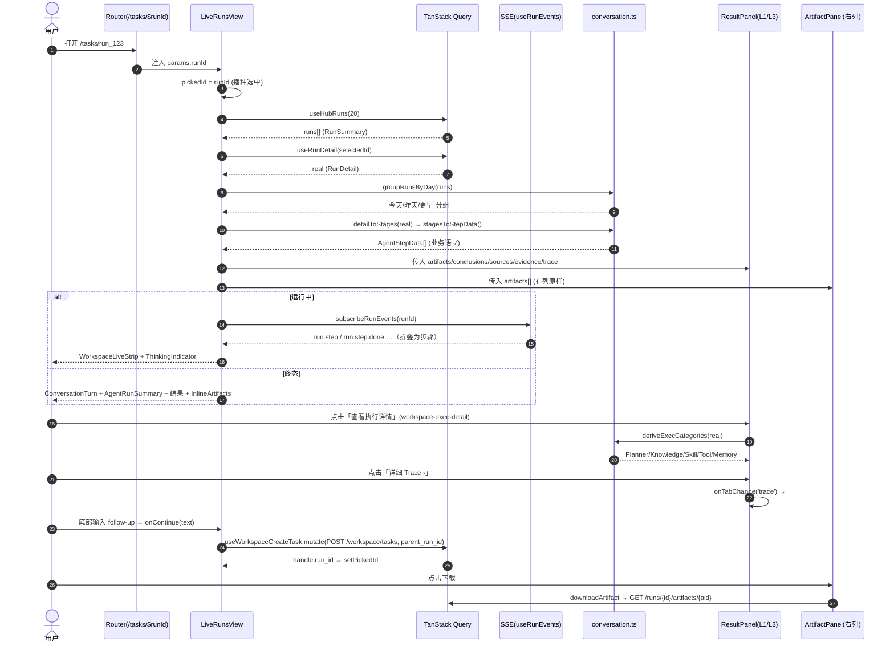
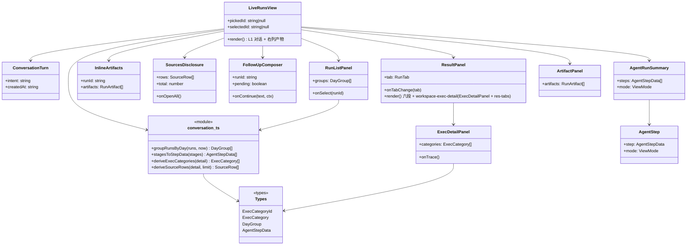

# INC36 增量设计：会话工作台「ChatGPT 式分层」

> 作者：高见远（Architect） · 轮次：INC36 · 基线提交：`efe19aa`（`origin = D:/Temp/forgeflow-remote.git`）
> 范围：**仅前端**（`ForgeFlow-main/frontend`）。后端只读；若需字段见 §6，均为 **additive 可空**建议，不在本轮强制。
> 交付物：本文件（唯一允许写出的文件）。E2E `graph`/`classDiagram` 见 §附录 A/B（**内嵌于本文件**，不另写 `.mermaid`，避免覆盖 INC26 历史文件）。

---

## 0. 结论摘要（先读这段）

本轮把 `/tasks`（`LiveRunsView`）中列从「RunHeader + 运行条 + 四 Tab 结果面板」演进为 **ChatGPT 式分层对话**，落地三档可见性：

- **L1（默认可见）** = 对话时间线：① 用户消息块 → ② AI 执行摘要（业务语 ✓ 步骤）→ ③ 自然语言结果（一句话结论 + 关键结论 + 内联 Artifact chip）→ ④ 底部 follow-up 输入框。
- **L2（按需展开）** = 「查看来源」引用展开 + 「查看执行详情」结构化字段（Planner / Knowledge Search / Skill / Tool / Memory / 详细 Trace ›）。
- **L3（更深，默认折叠）** = 既有 **四 Tab 的全部内容**（结果 / 证据 / 执行轨迹 / 成本与记忆）+ 平台原始账本 + debug 原始 JSON。**内容一字不删，只降级归属。**

**最关键的三条设计裁决（与既有 E2E 硬约束直接相关）：**

1. **三列骨架不拆、右列产物面板不删。** E2E 直接断言 `workspace-columns` / `-col-history` / `-col-conversation` / `-col-artifacts` 四者 `count=1 && visible`（`inc32_workspace.spec.ts` ①）。用户「Artifact 不要单独做成产物面板」的落地方式是 **在中列自然语言结果里内联 Artifact chip**（新 testid），**而不是删右列**——右列 `ArtifactPanel` 原样保留（保住 `artifact-empty/‑card/‑preview/‑download` 四个 testid）。
2. **`#res-panel-result` tabpanel 默认必须保持可见。** `inc29_code_entries.spec.ts` 的 `beforeEach` 断言默认态下 `code-plane` / `code-timeline` **可见**，且依赖 `#code-diff` / `#code-tests` 初始在**视口外**（点击入口后 `window.scrollY` 必须增大）。⇒ L1 的新增内容**只能加在结果面板之上/之内**，**绝不允许**把结果 tabpanel 折进 L3。
3. **内联 chip 严禁复用既有产物 testid。** `inc32_workspace.spec.ts` ⑤b 断言 `artifact-card=1`、`artifact-preview=1`、`artifact-download=1`。内联 chip 必须使用**全新 testid**（`conv-artifact-*`），否则这些 count 变成 2 → 新红。

**可证伪的总判据：** 改动后 E2E 仍为 **21 passed / 1 failed**，且唯一红仍是既有 flake `e2e/inc26_upload.spec.ts:184`；**新增失败数 = 0**。

---

## 1. 实现方案与分层规格

### 1.1 核心难点与选型（分析）

| 难点 | 处置 | 依据 |
|---|---|---|
| 「默认极简」与「保留完整能力」同时成立 | 用**渐进披露**替代「平级 Tab」：默认 L1，L2/L3 折叠。四 Tab 内容不删、只换归属。 | 用户原文；INC32 已把 Tab 导航折进 `workspace-exec-detail`（`open={tab!=='result'}`），本轮只在其内**补结构化 L2** |
| 既有 E2E 的强耦合（三列 / result-delivery / code-plane / 产物四件套） | **只增不改不删 testid**；新内容全部用新 testid；结果 tabpanel 默认可见不变 | §4 回归表 |
| 中列「用户消息 ← → 步骤 ← → 结果」无视觉分隔 | 新增 `ConversationTurn`（用户块）+ `AgentRunSummary`（AI 摘要）两个独立组件做语义分隔 | 缺口 #3 |
| 「来源：sales_q3.xlsx / Sheet / Rows」结构化 | 后端**当前无**该结构字段（`deriveSources` 只出 URL）⇒ L2 只诚实呈现已有；补字段见 §6（additive，可选） | 缺口 #4 / 诚实纪律 |
| 左列按天分组 | `groupRunsBySession` → `groupRunsByDay`（今天/昨天/更早），保留既有容器 testid | 缺口 #1 |
| 深链刷新/分享丢失会话 | 新增 `/tasks/$runId`、`/runs/$runId` 动态路由 + `LiveRunsView` 读参 | 缺口 #2 |
| 响应式被静默覆盖 | 把宽度断点**合并到各 CSS 文件末尾** + 六视口实测（不靠推断） | 缺口 #5 |
| 死代码 + 失真注释 | 删除 `ApprovalFocusCard.tsx`（全仓零引用） | 缺口 #6 |

**技术选型：** 全部复用既有栈，**不引入任何新依赖**（沿用 Vite 8 + React 19 + TS 6 + TanStack Router/Query + 手写 CSS + `tokens.css` 变量）。禁 MUI / Tailwind / vitest 不变。

**架构模式：** 既有「纯函数派生层（`realRun.ts` 家族）+ 展示组件（哑渲染）」保持不变。本轮新增的派生逻辑一律进**新的纯函数模块 `conversation.ts`**，组件只消费派生结果——保证可脱离 payload 单测、可证伪。

### 1.2 三层规格（逐项定义 + 复用符号映射）

#### L1 — 默认可见：对话时间线（中列 `workspace-col-conversation` 内，自上而下）

| 段 | 内容 | 数据/符号 | 组件 |
|---|---|---|---|
| ① 头部 | 标题（= 用户原话）+ 状态徽标 + `[⋯]` 更多 | `real.intent`→`RunHeader` `<h1>`；`runStatusMeta(real.status)`；`ModelStatus` + `ViewModeToggle` 折进 `[⋯]` | `RunHeader`（改造 actions） |
| ② 用户消息块 | `用户 · 分析这份销售数据并生成报告` + 时间 | `real.intent`、`real.created_at` | **新增** `ConversationTurn.tsx` |
| ③ AI 执行摘要 | 运行中：`WorkspaceLiveStrip`（既有）；已终态：折叠的 ✓ 业务步骤列表 | 运行中 = 既有 SSE `useRunEvents` + `buildSteps`；终态 = `detailToStages(real)` → `stagesToStepData()`（新纯函数）经 `toolLabels` 业务语化 | 运行中复用 `WorkspaceLiveStrip`；终态**新增** `AgentRunSummary.tsx`（内部复用既有 `AgentStep.tsx`） |
| ④ 自然语言结果 | 一句话结论 + 关键结论 + 关键发现 | `ResultHeadline`（`conclusions[0]`）+ `result-conclusions`（`conclusions.slice(1)`）+ `result-findings` | 复用 `ResultPanel` 的 `#res-panel-result`（**默认可见不变**） |
| ⑤ 内联 Artifact chip | `已完成分析。报告如下：📄 报告.md ／ 打开 ／ 下载` | `deriveArtifacts(real)`；下载走既有认证 `downloadArtifact` | **新增** `InlineArtifacts.tsx` |
| ⑥ 底部 follow-up | `继续告诉 AI 你想做什么…` + 提交 | 复用既有 `onContinue`（`POST /workspace/tasks` + `parent_run_id`） | **新增** `FollowUpComposer.tsx` |

> **「执行细节 / 来源 / 证据默认折叠」的落点**：L1 只放「一句话结论 + 结论 + 发现 + Artifact chip」；执行细节/来源/证据**全部**在 L2/L3，默认不出现。

#### L2 — 按需展开（默认折叠，点击才出现）

| 入口 | 展开后内容 | 数据/符号 | 组件 |
|---|---|---|---|
| **「查看来源」** `<details data-testid="conv-sources">` | `来源：<label>`（≤5 条）+「查看全部来源 ›」 | `deriveSources(real)`（URL）+ `deriveEvidenceSummary`。后端无 file/sheet/rows ⇒ 只出 URL（诚实，见 §6） | **新增** `SourcesDisclosure.tsx` |
| **「查看执行详情」**（复用既有 `<details data-testid="workspace-exec-detail">`，`summary` 文案「查看执行详情」不变） | 结构化：`Planner` / `Knowledge Search` / `Skill` / `Tool` / `Memory` 各自「存在性 + 计数 + 状态」 + `详细 Trace ›`（→ L3 trace） | **新增**纯函数 `deriveExecCategories(real)`（见 §1.3）。数据源：`real.plan`、`tool_invocations[]`、`codeplane.injected` | **新增** `ExecDetailPanel.tsx`，**挂进既有 `workspace-exec-detail` 的 `<details>` 内、`res-tabs` 之上** |
| 详细 Trace | 由 `详细 Trace ›` 触发 `onTabChange('trace')` → L3 | 既有 `ExecutionSection` + `execution-ledger` | 复用 |

> **⚠️ 设计裁决（勿违）**：`workspace-exec-detail` 是既有 testid（INC32 引入，其 `summary` 文案已是「查看执行详情」）。**不新增第二个同名入口**——把结构化字段**塞进它**，使其展开后＝「结构化字段 + 四 Tab 导航」，一个入口承载 L2 与 L3 导航。

#### L3 — 更深（默认隐藏，需要更多点击）

| 内容 | 数据/符号 | 组件 | 处置 |
|---|---|---|---|
| 四 Tab 导航条（结果 / 证据 / 执行轨迹 / 成本与记忆） | `TABS`、`tab`/`onTabChange` | `ResultPanel` | **保留**（`res-tabs` / `role=tablist` / `result-tab-*` 逐字不动） |
| 执行轨迹：`ExecutionSection` + 平台原始账本 `execution-ledger` | `tracePanel`、`ledger` | 复用 | **保留** |
| 证据 Tab：`result-evidence` + `result-sources` | `deriveEvidence`、`deriveSources` | 复用 | **保留** |
| 成本与记忆 Tab：`result-cost` / `result-cost-nomodel` / `result-experiences` | `costFacts` / `costEvidence` / `experiences` | 复用 | **保留** |
| 原始运行数据（debug 档） | `JSON.stringify(real)` | `RunHeader` 下 `run-raw` | **保留** |

> **四 Tab 内容不许删**（用户决策 #1）：它们**整体**成为 L3；`ResultPanel` 内部六段 + code-plane 实现**逐字不动**（含 `#res-panel-result` 的默认可见性，供 inc29）。

### 1.3 新增纯函数（`conversation.ts`）

```ts
/** 左列按天分组（今天 / 昨天 / 更早）。分组只依据后端真实 created_at。 */
export type DayGroup = { key: 'today' | 'yesterday' | 'earlier'; title: string; runs: RunSummary[] }
export function groupRunsByDay(runs: RunSummary[], now?: Date): DayGroup[]

/** 已终态运行的真实步骤 → AgentStepData[]（业务语 ✓ 行）。复用 detailToStages + toolLabels。 */
export function stagesToStepData(stages: RunStage[]): AgentStepData[]

/** L2「查看执行详情」六类结构化字段（存在性 + 计数 + 状态；未命中即 absent，绝不臆造）。 */
export type ExecCategoryId = 'planner' | 'knowledge' | 'skill' | 'tool' | 'memory'
export type ExecCategory = { id: ExecCategoryId; label: string; present: boolean; count: number; statuses: string[] }
export function deriveExecCategories(detail: RunDetail): ExecCategory[]

/** L2「查看来源」行（诚实：当前只有 URL；无结构化 file/sheet/rows 时不含该口径）。 */
export function deriveSourceRows(detail: RunDetail, limit?: number): { label: string; detail: string }[]
```

---

## 2. 组件职责划分

> **红线：任何单文件 ≤ 400 行**（现有 `ResultPanel` 713 行**不再变大**——只插入一个子组件引用；`LiveRunsView` 547 行，本轮控制在 ≤ 650）。

### 2.1 新增组件

| 文件 | 职责 | props 概要 | 折叠态 |
|---|---|---|---|
| `views/runs/ConversationTurn.tsx` | 渲染①用户消息块（头像「用户」+ 意图 + 时间） | `{ intent: string; createdAt: string }` | 无（恒展开） |
| `views/runs/AgentRunSummary.tsx` | 渲染③AI 执行摘要（终态：`<ol>` ✓ 步骤；复用 `AgentStep`） | `{ steps: AgentStepData[]; mode: ViewMode }` | 步骤详情在 `AgentStep` 内逐条折叠（既有） |
| `views/runs/InlineArtifacts.tsx` | 渲染⑤内联 Artifact chip（title + 打开 + 下载）；下载走认证 fetch | `{ runId: string; artifacts: RunArtifact[] }` | 无 |
| `views/runs/SourcesDisclosure.tsx` | L2「查看来源」内联展开（≤5 条 + 跳 L3 全部） | `{ rows: {label;detail}[]; total: number; onOpenAll: () => void }` | `<details>` 无 `open` |
| `views/runs/ExecDetailPanel.tsx` | L2 结构化字段（5 类存在性/计数 + 「详细 Trace ›」） | `{ categories: ExecCategory[]; onTrace: () => void }` | 由外层 `workspace-exec-detail` 的 `<details>` 承载 |
| `views/runs/FollowUpComposer.tsx` | ⑥底部 follow-up 输入 + 提交（复用 `onContinue`） | `{ runId; onContinue; pending; error }` | 无 |
| `views/runs/conversation.ts` | §1.3 纯函数（无 React、无副作用） | — | — |

### 2.2 改造组件（区分于新增）

| 文件 | 改动（只增不改语义） |
|---|---|
| `views/LiveRunsView.tsx` | 在 `workspace-col-conversation` 内、`RunHeader` 之后插入 `ConversationTurn`；`running` 时 `WorkspaceLiveStrip`（既有）else `AgentRunSummary`；在结果面板前后挂 `InlineArtifacts` / `SourcesDisclosure` / `FollowUpComposer`；读路由 `runId` 播种 `pickedId`。**不动**三列骨架与既有 `data-testid`。 |
| `views/runs/ResultPanel.tsx` | 仅在既有 `workspace-exec-detail` 的 `<details>` 内、`res-tabs` **之上**插入 `<ExecDetailPanel …/>`。其余**逐字不动**（六段、`#res-panel-result` 默认可见、`result-tab-*`）。 |
| `views/runs/RunListPanel.tsx` | `groupRunsBySession` → `groupRunsByDay`（改分组口径），容器 testid `session-group`/`session-group-title` 与空态 testid **保持**；创建表单（`新任务描述`/`run-declare-*`/`运行任务` button）**不动**。 |
| `router.tsx` | 新增 `shellChild('/tasks/$runId', LiveRunsView)` 与 `shellChild('/runs/$runId', LiveRunsView)`。既有静态路由不动。 |
| `components/AppShell.tsx` | `useActiveView` 增加 `/tasks`、`/runs` 的**前缀匹配**（使 `/tasks/<id>` 仍高亮「智能任务」）。无 testid 影响。 |
| `views/runs/workspace.css` | 新增 L1/L2 组件样式（全部走 `tokens.css` 变量）；把宽度断点块**合并并置于文件末尾**。 |
| `styles/runs.css` | 把既有 518/524 行的宽度断点**移到文件末尾**（合并为单一响应式段），消除「基础规则反杀断点」的结构性风险。 |

### 2.3 删除

| 文件 | 依据 |
|---|---|
| `views/runs/ApprovalFocusCard.tsx` | 全仓零引用（`grep -rn ApprovalFocusCard` 仅命中自身定义）；文件头注释仍写 "demo content for the demo run"（与 AC 清除 demo 的事实矛盾）。删除不触及任何 testid / E2E。 |

---

## 3. 文件清单

| # | 相对路径（`frontend/src/` 下） | 新增/改 | 一句话 |
|---|---|---|---|
| 1 | `views/runs/conversation.ts` | 新增 | §1.3 五个纯函数（分组 / 步骤映射 / 执行详情分类 / 来源行）。 |
| 2 | `views/runs/ConversationTurn.tsx` | 新增 | ①用户消息块。 |
| 3 | `views/runs/AgentRunSummary.tsx` | 新增 | ③终态 AI 执行摘要（复用 `AgentStep`）。 |
| 4 | `views/runs/InlineArtifacts.tsx` | 新增 | ⑤内联 Artifact chip（新 testid，下载走认证 fetch）。 |
| 5 | `views/runs/SourcesDisclosure.tsx` | 新增 | L2「查看来源」。 |
| 6 | `views/runs/ExecDetailPanel.tsx` | 新增 | L2「查看执行详情」结构化字段。 |
| 7 | `views/runs/FollowUpComposer.tsx` | 新增 | ⑥底部 follow-up 输入。 |
| 8 | `views/LiveRunsView.tsx` | 改 | 编排 L1 分层 + 读 `runId` 路由参数。 |
| 9 | `views/runs/ResultPanel.tsx` | 改 | 在 `workspace-exec-detail` 内插入 `ExecDetailPanel`；其余不动。 |
| 10 | `views/runs/RunListPanel.tsx` | 改 | 左列按天分组（今天/昨天/更早）。 |
| 11 | `views/runs/types.ts` | 改 | 新增 `ExecCategory`/`ExecCategoryId`/`DayGroup` 类型（additive）。 |
| 12 | `views/runs/workspace.css` | 改 | L1/L2 样式 + 断点置于末尾。 |
| 13 | `styles/runs.css` | 改 | 宽度断点合并至末尾。 |
| 14 | `router.tsx` | 改 | 新增 `/tasks/$runId`、`/runs/$runId`。 |
| 15 | `components/AppShell.tsx` | 改 | `useActiveView` 前缀匹配（深链高亮）。 |
| 16 | `views/runs/ApprovalFocusCard.tsx` | 删 | 死代码 + 失真注释。 |

（`api/client.ts`、`api/hooks.ts`、`api/sse.ts`、`realRun.ts`、`toolLabels.ts`、`AgentStep.tsx`、`WorkspaceLiveStrip.tsx`、`ThinkingIndicator.tsx`、`ArtifactPanel.tsx`、`ExecutionSection.tsx` **本轮不改**——只被复用。）

---

## 4. 不变量与回归风险表

| 既有 testid / E2E 断言 | 出处 | 本改动是否触及 | 保其不变的具体手段 |
|---|---|---|---|
| `workspace-columns` / `-col-history` / `-col-conversation` / `-col-artifacts`（各 `count=1` 且 `visible`） | inc32 ① | 是（中列内新增） | **三列骨架 DOM 结构不动**；新内容只在 `-col-conversation` 内部插入。 |
| `.runs-head h1` === `intent` | inc32 ②④a | 是（RunHeader actions 改） | `<h1>{real.intent}</h1>` **保留**；只把右侧 `ModelStatus`+`ViewModeToggle` 折进 `[⋯]`，`h1` 位置/文本不变。 |
| `.runs-head .badge`（状态标签，无 ASCII 字母） | inc32 ⑥ | 是 | `RunHeader` 的 `title-row` 内状态徽标**保留可见**（不折进 `[⋯]`）。 |
| `workspace-stop`（运行中 + `canExecute` 才在） | inc32 ③④b | 是（中列重排） | 停止行条件/位置语义不变；只在中列内移动插入点，`data-testid` 逐字保留。 |
| `workspace-live-strip`（运行中 `count=1`） | inc32 ④b | 是 | `running && <WorkspaceLiveStrip/>` **原样保留**。 |
| `result-delivery` === `delivery.label`（无 ASCII） | inc32 ③⑥ | 是 | 结果头 `.res-head` 的 `result-delivery` **保留在 L1**（默认可见）。 |
| `artifact-empty` / `artifact-card` / `artifact-preview` / `artifact-download` | inc32 ⑤a⑤b | 是（新增内联 chip） | **右列 `ArtifactPanel` 逐字不动**；内联 chip 用**新 testid** `conv-artifact-*`，**严禁**复用这四个。 |
| `code-plane` / `code-timeline`（默认 `visible`） | inc29 beforeEach | 是（L1 加在结果之上） | `#res-panel-result` **默认可见**不变；新内容只加在其结果面板**之上**。 |
| `code-entry-diff/tests/trace` + `code-diff/tests/trace` + `#code-*` 的**滚动**行为（初始视口外，点后 `scrollY` 增大） | inc29 2–4 | 是（下方内容下移） | code-plane 内部布局**不动**（距离关系不变）；新增内容在其**上方**只会让它更靠下 → 初始「视口外」更稳。**验收必须实测 inc29 全绿。** |
| `run-declare-table` / `run-declare-paths` / `运行任务` button / label `新任务描述` | inc32 ② | 是（RunListPanel） | 创建表单**不动**；只改列表分组函数。 |
| `session-group` / `session-group-title` / `session-history-empty` | inc32 T04（历史） | 是（改分组口径） | 容器 testid **保留**；仅「组标题」内容由会话名改为「今天/昨天/更早」。 |
| `resource-*`（上传/预览） | inc26 | 否 | 不触碰 `ResourcePicker` 及其样式。 |
| `result-tab-*` / `res-tabs` / `workspace-exec-detail` / `execution-layer` | 无 e2e 断言（已核） | 是 | 逐字保留；`workspace-exec-detail` 仅**内部**追加 `ExecDetailPanel`。 |
| 视觉结构：结果六段、`.res-*` 类 | 无 e2e but 内部契约 | 是 | `ResultPanel` 六段实现**逐字不动**。 |

**已知既有 flake（不修、不算新红）：** `e2e/inc26_upload.spec.ts:184`「表格预览逐字渲染」——`allTextContents()` 无重试等待的**测试自身竞态**（6 次 5 过 1 红；失败快照 DOM 正确）。**验收口径：21 passed / 1 failed，新增失败 = 0。**

---

## 5. 任务列表（有序 · 原子 · 含依赖）

> 说明：本轮为**增量演进**（非新建工程），故首任务不是「配置文件 + 入口 + 依赖」型基础设施，而是**数据/类型基础层**（等价物）。**不新增任何依赖**。

### T01 — 数据与类型基础层（P0）
- **交付文件**：`views/runs/conversation.ts`（新）、`views/runs/types.ts`（改）、`views/runs/realRun.ts`（可选：若 `deriveExecCategories` 需复用 `containsPlatformToolId` / `measuredMs`，仅**导出引用**，不改既有实现）。
- **依赖**：无。
- **完成判据（可机械验证）**：
  1. `node node_modules/typescript/bin/tsc -b` 通过（0 error）。
  2. `groupRunsByDay` 对「今天/昨天/2 天前」三个 `created_at` 分入三组；对 `[]` 返回 `[]`（边界）。
  3. `deriveExecCategories` 对「无 plan、无 invocations、空 codeplane」的 `RunDetail` 返回 5 项且 `present=false`（**不臆造**）。
  4. `stagesToStepData` 对 `detailToStages` 输出映射为 `AgentStepData[]`，`title` 不含平台工具 id 句型（复用 `isPlatformToolId`）。
  5. `git status --porcelain` 后 `git add <确切路径>`（禁 `-A`）并 push。

### T02 — L1 中列对话骨架（P0）
- **交付文件**：`views/runs/ConversationTurn.tsx`（新）、`views/runs/AgentRunSummary.tsx`（新）、`views/runs/InlineArtifacts.tsx`（新）、`views/LiveRunsView.tsx`（改）。
- **依赖**：T01。
- **完成判据**：
  1. `tsc -b` 通过；`node node_modules/vite/bin/vite.js build` 成功。
  2. 中列 DOM 顺序：`RunHeader` → `ConversationTurn` →（running ? `WorkspaceLiveStrip` : `AgentRunSummary`）→ 结果区 → `InlineArtifacts`。
  3. 内联 chip 的 testid ∈ `conv-artifact-chip|conv-artifact-open|conv-artifact-download`；**不出现** `artifact-*` 复用（`grep -c 'artifact-download' InlineArtifacts.tsx` 为 0）。
  4. 四列 testid 仍 `count=1`（跑 inc32 ①）。

### T03 — L2/L3 披露层（P0）
- **交付文件**：`views/runs/SourcesDisclosure.tsx`（新）、`views/runs/ExecDetailPanel.tsx`（新）、`views/runs/ResultPanel.tsx`（改）、`views/LiveRunsView.tsx`（改）。
- **依赖**：T01、T02。
- **完成判据**：
  1. `workspace-exec-detail` 展开后，DOM 中 `ExecDetailPanel` 在 `res-tabs` **之前**；`result-tab-*` 四个仍在。
  2. `SourcesDisclosure` 默认无 `open`；空来源时文案「本次运行未记录可展示的来源」，**不显示「0 个来源」**。
  3. `详细 Trace ›` 点击 → `#res-panel-trace` 可见（`hidden=false`）。
  4. `ResultPanel` 六段与 `#res-panel-result` 默认可见性**未变**（跑 inc29 全绿）。

### T04 — 左列按天分组 + 深链（P1）
- **交付文件**：`views/runs/RunListPanel.tsx`（改）、`router.tsx`（改）、`components/AppShell.tsx`（改）、`views/LiveRunsView.tsx`（改）。
- **依赖**：T01。
- **完成判据**：
  1. 左列出现「今天 / 昨天 / 更早」组标题（按真实 `created_at`）；空态文案不变。
  2. 直接访问 `/tasks/<真实 run_id>` 后 中列标题 = 该 run 的 `intent`（人工/或新增 e2e 用例验证，**不得**破坏既有 22 用例）。
  3. `/tasks`、`/runs`、`/tasks/<id>` 三种 URL 下导航均高亮「智能任务」。

### T05 — 样式 / 响应式 / 死代码清理（P0）
- **交付文件**：`views/runs/FollowUpComposer.tsx`（新）、`views/runs/workspace.css`（改）、`styles/runs.css`（改）、`views/LiveRunsView.tsx`（改，挂 `FollowUpComposer`）、**删除** `views/runs/ApprovalFocusCard.tsx`。
- **依赖**：T02、T03。
- **完成判据**：
  1. 所有新样式仅用 `var(--*)`（`grep -nE '#[0-9a-fA-F]{3,6}|rgb\(' views/runs/workspace.css` 命中数 = 0）。
  2. `runs.css` 宽度断点块位于文件末尾（其后无基础规则）；`workspace.css` 断点块位于末尾。
  3. 六视口（1920/1440/1280/1024/768/390）真浏览器截图，三列折叠顺序 = 历史 → 会话 → 产物；浅色 + `[data-theme="dark"]` 各一套。
  4. `grep -rn ApprovalFocusCard frontend/src` 命中 0；文件已删。
  5. **全量 E2E：21 passed / 1 failed（唯一红 = inc26_upload:184）**。

**依赖图：** 见 §附录 B。

---

## 6. 数据来源映射（L1/L2/L3 每一处 → 后端字段 / 派生函数）

| 层 | 展示项 | 数据源（后端字段 / 派生函数） | 后端是否提供？若不提供，前端显示什么 |
|---|---|---|---|
| L1 | 用户意图 | `GET /runs/{id}.intent` | 提供。空 ⇒ 「（本次运行未记录意图）」（既有 `ResultPanel` 文案）。 |
| L1 | 用户时间 | `.created_at` → `fmtTime()` | 提供。不可解析 ⇒ 「—」。 |
| L1 | AI 步骤（终态） | `detailToStages()` ← `steps[]`+`tool_invocations[]`+`llm.rounds[]`；业务名 `stageNameForTool`/`toolLabel` | 提供。无 step ⇒ `AgentRunSummary` 不渲染（诚实空）。 |
| L1 | AI 步骤（运行中） | 既有 SSE `subscribeRunEvents` → `useRunEvents` → `buildSteps` | 提供。订阅失败 ⇒ 既有 `workspace-live-degraded` 文案。 |
| L1 | 一句话结论 | `deriveConclusions(part.deliverable)[0]` | 提供（产物正文「最终答案」节）。无 ⇒ `result-headline-fallback`（状态复述，明确标注）。 |
| L1 | 关键结论/发现 | `deriveConclusions(...).slice(1)` / `deriveFindings(...)` | 提供。无 ⇒ 既有诚实空态句。 |
| L1 | 内联 Artifact chip | `deriveArtifacts(real)` = `.artifacts[]`（`title`/`format`/`content`） | 提供。无 ⇒ 内联区不渲染。 |
| L1 | 打开 / 下载 | `downloadArtifact(runId,id,filename)`（认证 fetch→Blob，既有） | 提供。「打开」= 站内预览（滚动/展开右列），非新端点。 |
| L1 | 底部 follow-up | `onContinue` → `POST /workspace/tasks`（+`parent_run_id`） | 提供。 |
| L2 | 来源行 | `deriveSources(real)`（真实非 stub 工具 payload 里的 URL） | **部分**。后端**无** `file/sheet/rows` 结构 ⇒ 只出「来源：<URL>」。**若**用户要 `sales_q3.xlsx / Sheet / Rows`，需 **additive** 字段（见下行）。 |
| L2 | 来源结构（file/sheet/rows） | **建议 additive**：`tool_invocations[].payload.source_meta{ file,sheet,rows }` 或 run 级 `sources[]{kind,label,detail}` | **当前不提供** ⇒ 前端**不显示**该口径（禁编造）。**建议**：若用户坚持该视觉，授权后端加**可空**字段；否则本轮诚实呈现 URL。 |
| L2 | Planner | `real.plan.steps[]`（`note` 业务名） | 提供（INC15）。无 plan ⇒ `present=false`。 |
| L2 | Knowledge Search | `tool_invocations[] where tool==='knowledge.search'` | 提供（条件性）。无 ⇒ absent。 |
| L2 | Skill | `codeplane.injected.skills[]` + `skill.invoke` 调用 | 提供（条件性）。无 ⇒ absent。 |
| L2 | Tool | `tool_invocations[]`（`data.query`/`research.search`/`report.render`） | 提供。无 ⇒ absent。 |
| L2 | Memory | `codeplane.injected.memory[]` + `memory.recall` 调用 | 提供（条件性）。无 ⇒ absent。 |
| L2 | 详细 Trace | → `onTabChange('trace')` → L3 | 提供。 |
| L2 | **Retry / Trace ID** | **后端不提供**（无该字段） | **前端不显示**（禁编造）。**建议**：若需要，先做后端 additive 字段；本轮**不做**。 |
| L3 | 四 Tab 全部内容 | 既有派生（`deriveEvidence`/`deriveSources`/`ExecutionSection`/`costFacts`/`costExperiences`） | 提供（逐字不变）。 |
| L3 | 平台原始账本 | `partitionArtifactBody(content).engineering` → `<pre>` | 提供。 |
| L3 | 原始 JSON（debug） | `JSON.stringify(real)` | 提供。 |

> **诚实铁律**：凡「后端不提供」项（来源 file/sheet/rows、Retry、Trace ID），一律**省略或出诚实空态**，**禁止**生成占位数字/假标签；需要时走**可空 additive** 字段（决策 #3），不动既有契约。

---

## 7. 响应式方案

### 7.1 三列折叠顺序（按宽度）

| 宽度 | 布局 | 中列（L1）要点 |
|---|---|---|
| > 1500px | `320px | 1fr | 340px` 三列 | 中列最宽，内联 chip 横排 |
| 1181–1500px | `296px | 1fr | 300px` 三列 | 同上 |
| ≤ 1180px | 单列堆叠：**历史 → 会话 → 产物**（DOM 顺序即阅读顺序，无需 `order`） | 左列限高 `46vh` 可滚动（既有） |
| ≤ 720px | 单列 + 收紧间距 | 底部 `FollowUpComposer` 全宽；`InlineArtifacts` 自动换行；`ConversationTurn` 头像上移 |

### 7.2 缺口 #5 处置（`runs.css` / `home.css` 断点位置）

**问题**：媒体查询**不增加优先级**；同特异性下**源码顺序在后**的基础规则会反杀断点块（`workspace.css:308` 已记载此陷阱并被修正过）。

**实测发现（如实声明，可证伪）**：我逐一核对了 `runs.css` 第 518/524 行断点块内的选择器——`.runs-head*`（基础规则在 23–51 行）、`.stage-head`（169）、`.stage-summary`（192）、`.ev`（440）、`.trace-node`（470）——其基础规则**均位于断点块之前**，故**当前这批选择器**未出现实际覆盖。真正的问题是**结构性脆弱**：断点块位于 518 行，而 `.res-*` 等**约 1690 行基础规则在其后**（647 起）；**本轮一旦**为 L1 新组件写任何响应式规则并误置于 518 段，就会被后面的基础规则静默反杀。

**处置（防患 + 实证）**：
1. `styles/runs.css`：把 518/524 两段宽度断点**整体移动到文件末尾**，合并为**单一响应式段**（其后不再有任何基础规则）。
2. `views/runs/workspace.css`：既有断点已在末尾（317/323）——**保持**；L1/L2 新组件的响应式规则**追加到该末尾段内**，严禁插到文件中部。
3. `styles/home.css:73`：`@media (max-width:1180px) .home` 位于 `.home.home-single`(80)/`.hero.home-hero`(83) **之前**。因后者特异性更高（双类），**当前无实际覆盖**；**首页本轮不动**，故此项**列为可选硬化**（把 1180 段移到 `.home*` 基础规则之后），**不在 T01–T05 强制。**
4. **强制实证**：六视口真浏览器截图对照（用户验收 #2）。**不以推断代替实测**。

---

## 8. 待明确事项（需主理人 / 用户裁决）

1. **右列产物面板去留**：E2E 强制 `workspace-col-artifacts` 可见且断言 `artifact-*` 四件套。用户又说「Artifact 不要单独做成产物面板」。**我的方案 = 两者并存**（右列保留以满足硬约束 + 中列 L1 内联 chip 满足新方向）。⇒ **请确认**：接受「并存」，还是要弱化右列（如把标题改「运行产物归档」，但仍保留 testid 与卡片）？
2. **「查看来源」结构化字段**：用户示例为 `来源：sales_q3.xlsx / Sheet：Sales / Rows：1-248`，但后端**无** file/sheet/rows 结构。⇒ **请裁决**：(a) 本轮接受**诚实 URL 列表**（不改后端）；(b) 授权后端加**可空 additive** 字段后再做完整视觉。**我默认按 (a) 实现**，禁编造。
3. **`[⋯]` 收纳范围**：是否同意把 `ModelStatus` + `ViewModeToggle` 折进 `[⋯]`（满足「顶部最多标题 + ⋯」）？状态徽标 `.runs-head .badge` **必须留在可见区**（inc32 ⑥），此项**不折**。
4. **follow-up 输入是否双份**：L1 底部新增 `FollowUpComposer` 后，L3「下一步动作」里既有的 `result-continue` 仍在。⇒ **请裁决**：保留两处（L1 主用、L3 归档），还是隐藏 L3 的那处？（我默认**两处并存**以零风险保 AC 语义。）
5. **Retry / Trace ID**：后端无字段 ⇒ 本轮**不显示**。确认可接受？（若需要，另立后端 additive 项。）
6. **深链形态**：采用**路径段** `/tasks/$runId`（brief 原文）而非 query。已配套改 `AppShell.useActiveView` 做前缀高亮。确认路径段方案？

---

## 附录 A — 程序调用流程（Sequence Diagram）



## 附录 B — 类图（Class Diagram）



## 附录 C — 验证命令（绕过被拦截的 npm）与基线

```bash
export PATH="/usr/bin:/bin:$PATH"
cd D:/Agentxm/Multi-Agent/ForgeFlow-main/frontend
# 类型检查
node node_modules/typescript/bin/tsc -b
# 构建
node node_modules/vite/bin/vite.js build
# E2E：先起 preview（后台），再跑
node node_modules/vite/bin/vite.js preview --port 4173 --strictPort &
node node_modules/@playwright/test/cli.js test
# 后端（若需）
# C:/Users/18769/.workbuddy/binaries/python/envs/agentflow/Scripts/python.exe -m pytest
#   （必须 cd D:/Agentxm/Multi-Agent/ForgeFlow-main，.env 相对 cwd 解析；junit 四列分开报）
```

- **E2E 基线**：4 spec / 22 用例，**21 passed / 1 failed**（红 = `e2e/inc26_upload.spec.ts:184` 既有 flake）。**本轮验收：新增失败 = 0。**
- **git 纪律**：提交前先看 `git status --porcelain`，只 `git add <确切路径>`（禁 `-A`）；禁 `git gc`/`git prune`；每个逻辑单元提交后立即 `push`。
```
