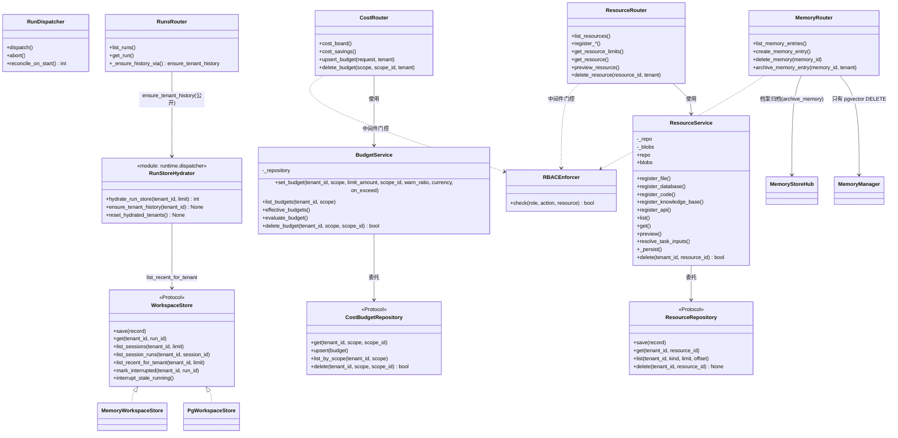
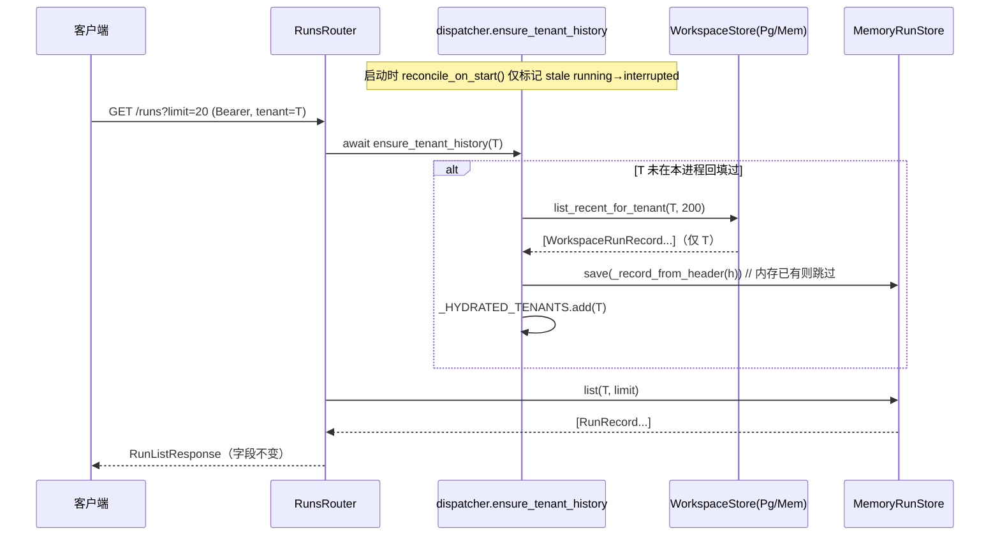
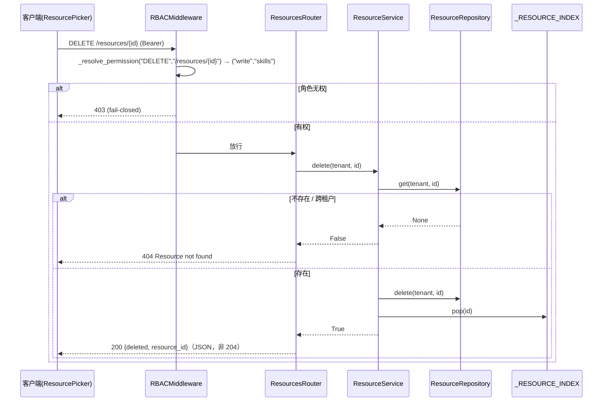
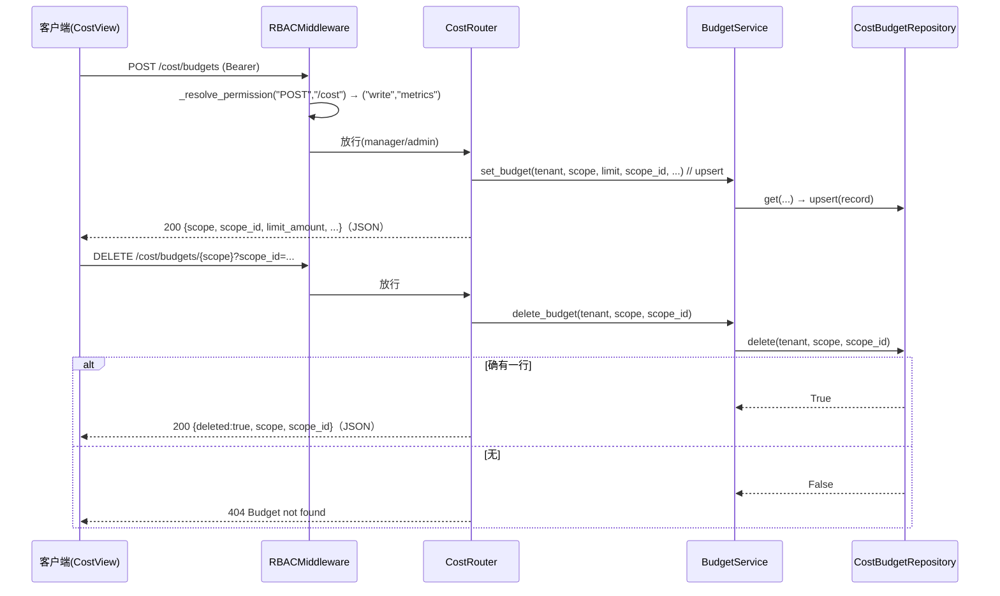
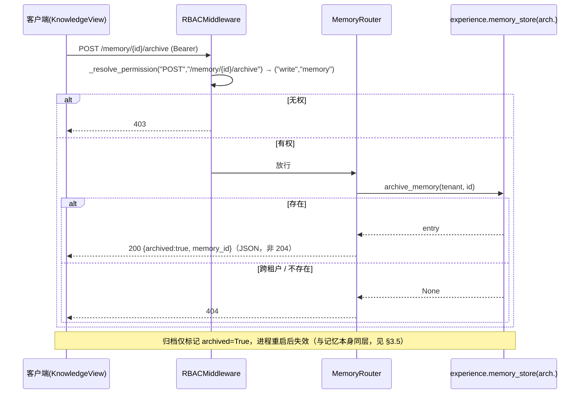
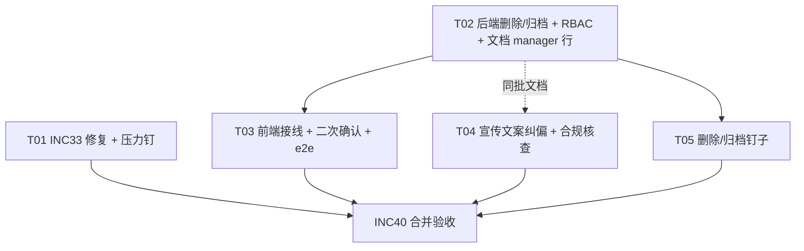

# INC40 增量设计（INC33 修复 · 删除/归档接线 · 宣传文案纠偏）

- 作者：高见远（架构师）
- 批次：INC40（承 HEAD `71bb307` 全量质量审计三条结论）
- 范围：**只做设计**，不改任何产品/测试代码；本文件是唯一产物。
- 用户已拍板口径（不可偏离）：
  1. **删除范围 = 「接线 + 前端可达」**：把**已存在**的仓储层 `delete` 接成路由 + 让前端能点到；**不新增 runs/skills 删除**、**不做合规级被遗忘权级联删除**。
  2. **宣传文案 = 「纠偏为真实能力」**：把不实承诺改成与本轮真实实现一致的口径，消除「承诺 ↔ 机制不符」。
- 主理人本批**五条口径裁决 + 六处技术更正（B1–B6）**已全部落进本文（见各节标注）。

> 引文纪律：全文一律用 `文件::符号` 定位，**不使用 `文件:行号`**（本仓库有专门的反漂移钉子测试）。

---

## 0. 主理人四条判断的独立核实（含两处更正）

主理人要求「发现我错了必须明确写 `主理人判断有误` 并给证据」。逐条核实如下。

### 0.1 四条判断的核实结果

| # | 主理人判断 | 核实结果 | 证据（`file::symbol`） |
|---|---|---|---|
| 1 | `ResourceService` 无 `delete` | ✅ **确认** | `forgeflow/resources/service.py::ResourceService` 仅定义 `register_file/register_database/register_code/register_knowledge_base/register_api/limits/list/get/preview/resolve_task_inputs/_persist`，**无 `delete`**。仓储层协议 `forgeflow/repositories/base.py::ResourceRepository.delete` 存在，但服务层未暴露。 |
| 2 | `cost.py` 无 POST | ✅ **确认** | `forgeflow/api/routers/cost.py` 仅有 `@router.get("/board")`（`cost_board`）与 `@router.get("/savings")`（`cost_savings`），**无任何 POST**。 |
| 3 | `KnowledgeView` 才是记忆列表 | ✅ **确认** | `frontend/src/views/KnowledgeView.tsx::MemorySection` 用 `useMemoryList` + `<table className="tbl">` + `frontend/src/views/KnowledgeView.tsx::MemoryRow`。`frontend/src/views/MemoryView.tsx::MemoryView` 是**检索演示页**（`useMemorySearch` + `EmbeddingScatter`/`RecallHeatmap`，含写死的 `SampleResults`）。 |
| 4 | 无资源管理页 | ✅ **确认** | `useResources` 的唯一调用方是 `frontend/src/views/runs/ResourcePicker.tsx::ResourcePicker`；其装配点仅 `frontend/src/views/HomeView.tsx`（hero 附件面板，`canExecute` 时）与 `frontend/src/views/runs/RunListPanel.tsx`。`frontend/src/router.tsx` 无资源路由。 |

### 0.2 ⚠️ 更正一：`主理人判断有误`——「memory 后端已完备，唯一缺的是前端入口」

主理人写道：`forgeflow/api/routers/memory.py::delete_memory`「后端已完备，唯一缺的是前端入口」。**这条对 `KnowledgeView` 的记忆列表不成立。**

证据（两条互不相干的记忆存储）：

- `KnowledgeView` 记忆列表的来源：`GET /memory` → `forgeflow/api/routers/memory.py::list_memory_entries` → `forgeflow/experience/memory_store.py::list_memories`，读的是**进程内** `forgeflow/experience/memory_store.py::_PER_TENANT`（键 `tenant_id or "global"`）。
- 用户写入 `KnowledgeView` 走 `POST /memory` → `forgeflow/api/routers/memory.py::create_memory_entry` → `forgeflow/experience/memory_store.py::save_memory`（同一个 `_PER_TENANT`）。
- 而 `DELETE /memory/{memory_id}` → `forgeflow/api/routers/memory.py::delete_memory`，先是 `SELECT namespace FROM memory_vectors ...`，再 `forgeflow/memory/memory_manager.py::MemoryManager.forget` → `forgeflow/memory/memory_manager.py::MemoryManager.vector.delete`，操作的是 **pgvector 的 `memory_vectors` 表**（由 `POST /memory/store` → `forgeflow/memory/memory_manager.py::MemoryManager.remember` 写入）。

⇒ **两套 store 的 id 空间不相交**。把 `KnowledgeView` 每一行接到 `DELETE /memory/{memory_id}`，对**每一条** hub 记忆都会命中 `memory_vectors` 的「查不到」分支 → **一律 404**。

补充事实：hub store **没有任何物理删除路径**，唯一的移除能力是 `forgeflow/experience/memory_store.py::archive_memory` —— 它是**标记式归档**（`_mark_archived`：`entry.archived = True`，模块 docstring 明写「nothing is ever physically deleted (INC9 §2.2.6)」），且 `GET /memory` 默认 `include_archived=False`（`list_memories`），所以归档后该行会从列表消失，但**不是删除**。

### 0.3 更正二：`set_budget` / `archive_memory`「零调用」需限定为「零**生产**调用」

- `forgeflow/cost/budget_service.py::BudgetService.set_budget`：在 `forgeflow/**` 全域**无生产调用方**（我 grep `set_budget` 仅命中定义本身）——但**测试**直接调它（`tests/unit/test_cost_degrade.py`、`tests/unit/test_cost_api.py`、`tests/unit/test_cost_producer.py`、`tests/unit/test_cost_memory_profile.py`）。故「零**生产**调用方」准确；「只有定义本身」略不精确。
- `forgeflow/experience/memory_store.py::archive_memory`：在 `forgeflow/**` 全域**无生产调用方**，但 `tests/unit/test_memory_lifecycle_wiring.py` 直接调它。

**结论**：`set_budget` 与 `archive_memory` 都属「**有实现、生产零接线**」，把它们接成 HTTP 路由属于**接线**（不改语义），而非造新能力。

### 0.4 追加事实：全局 `list_recent` 在 INC33 修复后会变死代码

`forgeflow/workspace/store.py::WorkspaceStore.list_recent`（全局版，3 处：协议 + `MemoryWorkspaceStore` + `PgWorkspaceStore`）的**唯一调用方**是 `forgeflow/runtime/dispatcher.py::hydrate_run_store`（我 grep `list_recent` 仅命中这 4 处定义 + 该调用）。⇒ 一旦把回填改成按租户（§2），全局 `list_recent` 即成为**死代码**，必须一并删除（**不允许再造死代码**）。详见 §2.2。

---

## 1. 实现路径（Implementation Approach）

### 1.1 本单的三个技术要点

1. **INC33「时间炸弹」**：`forgeflow/runtime/dispatcher.py::hydrate_run_store(limit=200)` 依赖**全局** `list_recent(200)`，把「某租户历史是否可查」交给了**其它租户的行数**——这是**非确定性**设计缺陷（随库增长自动变红）。修法是让回填**按租户**且**按需**。**不改任何请求契约**。
2. **删除能力空洞**：仓储层 `delete`（资源 / 预算）已存在但 `用户可达 = 0`；服务层缺 `delete`（资源）、路由层缺 DELETE（资源 / 预算）、前端缺入口。修法是**接线**：服务层转调、路由层暴露、前端加按钮 + 二次确认。
3. **宣传与机制不符**：`LandingPage` / `ArchitecturePage` 声称「按 trace ID 级联删除 / 被遗忘权 / GDPR 删除」，而 `forgeflow/**` 全域无 `cascade_delete|erasure|purge|forget` 机制。修法是**纠偏文案**到本轮真实能力（本批已按主理人裁决顺带核查相邻合规声明，见 §4）。

### 1.2 框架与模式

- **不引入任何新框架/新依赖**（见 §5.1 包清单：空）。
- 沿用仓库既有模式：FastAPI 路由 + `Depends(resolve_tenant)` / `Depends(get_current_user)`；`ResourceService` / `BudgetService` 服务层单一写路径；`ROUTE_PERMISSION_MAP` **fail-closed 最长前缀** RBAC；前端 React Query `useMutation` + `queryClient.invalidateQueries`。
- 前端危险操作沿既有先例：CSS 类 `.btn danger`（先例 `frontend/src/views/runs/CodeApproval.tsx`），自建弹层范式参考 `frontend/src/components/AuthControls.tsx::SignInDialog`（仓库**无**通用确认弹窗组件 ⇒ 本轮新增最小可复用件 `ConfirmDialog`）。

### 1.3 明确非目标（Non-goals，写清避免范围漂移）

- ❌ 不做合规级「被遗忘权 / trace_id 级联删除」。
- ❌ 不新增 runs / skills 的删除。
- ❌ **不删除资源 blob 文件**（§3.1.2 给出**带 `file::symbol` 证据**的理由：blob 内容寻址且**同字节去重共享同一路径**，盲删会破坏另一资源的预览；可靠引用计数无反向索引 ⇒ 若做必全量扫描、不可靠）。
- ❌ 不新增前端路由页（硬约束）。
- ❌ **不做 hub 记忆的物理删除**（只做**归档**，见 §3.5；物理删除超出「最小档」）。

---

## 2. INC33 修复设计（本单最重要决策）

### 2.1 现象与根因链（复核）

- 失败断言：`tests/integration/test_inc33_history_rehydrate.py::test_history_survives_restart_and_detail_marked[postgres]` 的 `assert rehydrated is not None, "history must survive the restart (ADR-02)"`。
- 根因（**双环**，缺一不可）：
  - **产品环**：`forgeflow/runtime/dispatcher.py::hydrate_run_store` 调 `forgeflow/workspace/store.py::PgWorkspaceStore.list_recent` 执行**无 tenant 过滤**的全局 `... ORDER BY created_at DESC LIMIT $1`。库中其它租户的更新行会把本租户挤出 top-200 窗口。
  - **测试环**：`tests/integration/test_inc33_history_rehydrate.py::_record` 把 `created_at` **写死**为 `"2026-09-30T00:00:00+00:00"`，使断言结果依赖「库里有多少行晚于该固定值」⇒ **非 hermetic**。

⇒ 「全量 0 失败」是**侥幸绿**，会随库增长自动变红，**不需要任何人改代码**。

### 2.2 产品层落点：**按需 · 按租户 · 读侧回填**（选型与否决理由）

**选定方案**：新增按租户的 recent 读取，把「回填」从启动时的一次性全局动作，改成**读侧按需、按租户**触发。

#### 2.2.1 具体落点（5 处代码）

**(a)** `forgeflow/workspace/store.py` —— 用租户版**替换**全局版：

```python
# WorkspaceStore(Protocol)
async def list_recent_for_tenant(
    self, tenant_id: str | None, limit: int = 200
) -> list[WorkspaceRunRecord]:
    """The tenant's persisted run headers, newest first (tenant-scoped)."""
    ...
```

- `MemoryWorkspaceStore.list_recent_for_tenant`：复用既有 `self.scope_key(tenant_id)` 分桶后排序截断。
- `PgWorkspaceStore.list_recent_for_tenant`：

```python
async def list_recent_for_tenant(self, tenant_id, limit=200):
    pool = await self._get_pool()
    async with pool.acquire() as conn:
        rows = await conn.fetch(
            "SELECT * FROM workspace_runs "
            "WHERE tenant_id IS NOT DISTINCT FROM $1 "
            "ORDER BY created_at DESC LIMIT $2",
            self.scope_key(tenant_id), max(limit, 0),
        )
    return [self._to_record(r) for r in rows]
```
（SQL 形状与既有 `forgeflow/workspace/store.py::PgWorkspaceStore.list_sessions` 的租户过滤完全同款，只是投影到 run 头而非 session 分组。）

- **同时删除全局 `list_recent`** 的定义（协议 + 两个实现共 3 处），因为改为按租户后它无任何调用方（§0.4）。**不保留**以免造死代码。

**(b)** `forgeflow/runtime/dispatcher.py` —— `hydrate_run_store` 改为**租户入参**（保留函数名与语义，改签名，避免死代码）：

```python
_HYDRATED_TENANTS: set[str] = set()   # 进程内「已回填过」的租户，避免重复读库（模块私有）

async def hydrate_run_store(tenant_id: str, limit: int = 200) -> int:
    """按租户把持久头灌进进程内 MemoryRunStore（INC33/INC40）。best-effort，不抛。"""
    from forgeflow.runtime.orchestrator import get_run_store
    try:
        headers = await get_workspace_store().list_recent_for_tenant(tenant_id, limit)
    except Exception as exc:                      # housekeeping 不得阻断读路径
        logger.warning("workspace run-store hydrate skipped: %s", exc)
        return 0
    store = get_run_store()
    hydrated = 0
    for header in headers:
        if not header.run_id or store.get(header.run_id) is not None:   # 内存里更厚的记录优先
            continue
        store.save(_record_from_header(header))
        hydrated += 1
    return hydrated
```

**(c)【B1 更正】`ensure_tenant_history` 与 `reset_hydrated_tenants` 定义在 `dispatcher.py` 内并公开导出**——**禁止**跨模块导入私有 `_HYDRATED_TENANTS`：

```python
# forgeflow/runtime/dispatcher.py —— 公开符号，供 runs.py 使用
def reset_hydrated_tenants() -> None:
    """清空进程内「已回填」租户集（供 reset_run_dispatcher 与测试复用）。"""
    _HYDRATED_TENANTS.clear()

async def ensure_tenant_history(tenant_id: str) -> None:
    """公开接口：本进程首次为某租户读历史时按其 recent 回填一次（幂等）。"""
    if tenant_id in _HYDRATED_TENANTS:
        return
    await hydrate_run_store(tenant_id)
    _HYDRATED_TENANTS.add(tenant_id)

__all__ = [
    ..., "hydrate_run_store", "ensure_tenant_history", "reset_hydrated_tenants",
]
```

- **B1 理由**：`_HYDRATED_TENANTS` 是 `dispatcher.py` 的**模块私有**（下划线前缀）。`runs.py` 若 `from ... import _HYDRATED_TENANTS` 即为跨模块**私有**依赖，属封装破坏；改为**只导入公开函数** `ensure_tenant_history`，读取/写入集合的语义留在其定义模块内。
- `forgeflow/runtime/dispatcher.py::reconcile_on_start` —— **只保留**「标记 stale running → interrupted」，**移除**原 `await hydrate_run_store()` 调用（回填已移到读侧）。

**(d)** `forgeflow/api/routers/runs.py` —— 读侧按需回填（**只导入公开符号**；**契约不变**）：

```python
from forgeflow.runtime.dispatcher import ensure_tenant_history   # 仅公开符号

# _load_run 改 async，并在最前面 await ensure_tenant_history(tenant)：
async def _load_run(run_id: str, tenant: str):
    await ensure_tenant_history(tenant)
    record = get_run_store().get(run_id)
    if record is None or (record.tenant_id not in (tenant, None)):
        raise HTTPException(status_code=404, detail="Run not found")
    return record
```

- `list_runs`（`forgeflow/api/routers/runs.py::list_runs`）在 `get_run_store().list(...)` 前加 `await ensure_tenant_history(tenant)`。
- 5 个 `_load_run` 调用点（`get_run` / `run_events` / `replan_run` / `abort_run` / `download_artifact`）改为 `await _load_run(...)`（均为 async，改动机械）。
- **请求契约**：`RunListResponse` / `RunSummaryResponse` / `RunDetailResponse`（`forgeflow/api/hub_schemas.py`）**字段一律不动**；仅数据来源从「启动时全局 top-200」变为「读时本租户 recent」。

**(e)【B2 更正】`reset_run_dispatcher()` 必须清 `_HYDRATED_TENANTS`**：

```python
def reset_run_dispatcher() -> None:
    # 现有：清 run dispatcher 单例
    ...
    reset_hydrated_tenants()          # B2：同时清回填集
```

- **B2 理由**：`_HYDRATED_TENANTS` 是**进程内**幂等集，跨用例不自动清空。若 `reset_run_dispatcher()` 不清它，则**第二个测试用例**会命中「`tenant in _HYDRATED_TENANTS` → 直接 return」，**跳过回填**，断言 `history must survive the restart` 的用例会**直接染红**（假回填）。凡是「清进程内 store/单例」的夹具，都必须**同步清此集**。

#### 2.2.2 为什么不是「把 200 调大」或「启动全量灌」

| 备选 | 否决理由 |
|---|---|
| 把 `limit` 从 200 调大（如 5000） | **仍是全局窗口**，只是把红线推迟；仍随库增长自动变红；非确定性缺陷未修；且对大租户爆内存。属「糊绿」，违反本仓诚实纪律。 |
| 启动时**全量**灌（无 limit） | 启动时间与内存随**全库**行数线性增长（多租户下是全部租户之和），且每次重启都重复；不解决「某租户被挤出」语义问题，只是碰巧把窗口开得足够大。 |
| **读侧按需按租户回填（选定）** | 复杂度与规模解耦：每个租户首次读历史时读**自己**的 recent（受本租户行数约束，而非全库）；进程内 `_HYDRATED_TENANTS` 保证只回填一次；重启后的第一个读请求即恢复 ADR-02。且不引入新契约字段。 |

#### 2.2.3 边界与注意

- **契约不变**：只换数据来源，`GET /runs` / `GET /runs/{id}` 响应结构（`forgeflow/api/hub_schemas.py`）零改动。
- **内存优先**：`forgeflow/runtime/dispatcher.py::_record_from_header` 生成的薄记录 `detail_retained=False`；回填遵循「进程内已有更厚的记录不被覆盖」（沿用现有 `store.get(header.run_id) is not None → skip` 规则）。
- **`test_inc32_interrupt_stale_running.py` 不受影响**：该钉子只测 `forgeflow/workspace/store.py::PgWorkspaceStore.interrupt_stale_running`（直接调 store），不经过 `reconcile_on_start` 的回填。
- **`_HYDRATED_TENANTS` 由 `reset_run_dispatcher()` 统一清空**（【B2】，见 (e)）——所有清进程内状态的夹具都复用此入口，**不**各自跨模块清私有集。

### 2.3 测试层：`test_inc33_history_rehydrate.py` 变 hermetic

**改 `tests/integration/test_inc33_history_rehydrate.py::_record`**（唯一写死时间的地方）：

```python
# 前： created_at="2026-09-30T00:00:00+00:00", completed_at="2026-09-30T00:01:00+00:00"
# 后（改用当前时间，与库中其它行无关）：
from datetime import datetime, timezone
_now = datetime.now(timezone.utc)
created_at=_now.isoformat(),
completed_at=_now.isoformat(),
```

**改断言口径**（把「断言进程内 store」升级为「断言**请求契约**」——这才是 ADR-02 的真实承诺）：

- 现状：`rehydrated = get_run_store().get(run_id)` → `assert rehydrated is not None`（**直读内部 store**）。
- 改为：先经**真实读路径**触发回填，再断言路由返回：
  ```python
  from forgeflow.api.routers.runs import get_run as get_run_route, list_runs as list_runs_route
  listing = await list_runs_route(limit=50, tenant=tenant)          # 触发 ensure_tenant_history
  assert run_id in {item.run_id for item in listing.items}
  detail = await get_run_route(run_id, tenant=tenant)
  assert detail.run_id == run_id and detail.status == "completed"
  assert detail.detail_retained is False        # 明细未随进程保留（诚实标记）
  assert detail.steps == []                     # 真没了，不是伪造轨迹
  assert [a.get("id") for a in detail.artifacts] == ["art-1"]   # 头里带的产物仍在
  ```
- `reconcile_on_start()` 仍会调用（证明「重启收尾」不报错），但**不再**承担断言靶；断言靶整体移到路由。
- 夹具 `_clean_state`：通过 `reset_run_dispatcher()`（内含 `reset_hydrated_tenants()`，【B2】）清空 `_HYDRATED_TENANTS`——**不**跨模块直接清私有集。

### 2.4 新增钉子：**多租户压力钉**（这道当初漏掉的闸）

新增到 `tests/integration/test_inc33_history_rehydrate.py`，两档参数化（`memory` / `postgres`）：

```python
@pytest.mark.parametrize("active_backend", ["memory", "postgres"], indirect=True)
async def test_tenant_history_survives_when_many_newer_other_tenant_rows(active_backend):
    """库里存在 >200 条更新的「其它租户」行时，本租户历史仍可查（INC40 新闸）。"""
    store = get_workspace_store()
    suffix = _suffix()
    tenant = f"{TENANT}-stress-{suffix}"
    other_tenant = f"t-other-{suffix}"
    run_id = f"run-inc33-stress-{suffix}"

    try:
        # 1) 本租户一条「较早」的记录（刻意用较早时间）
        old = _record(run_id, tenant)
        old.created_at = "2000-01-01T00:00:00+00:00"
        old.completed_at = "2000-01-01T00:01:00+00:00"
        await store.save(WorkspaceRunRecord.from_run_record(old))

        # 2) 其它租户 240 条「更新」的记录（>200，足以把旧全局窗口塞满）
        for i in range(240):
            other = _record(f"run-other-{suffix}-{i}", other_tenant)
            other.created_at = f"2999-01-01T00:{i % 60:02d}:00+00:00"   # 远新于 target
            await store.save(WorkspaceRunRecord.from_run_record(other))

        # 3) 重启：清空进程内 store + 回填集
        reset_run_store()
        await get_run_dispatcher().reconcile_on_start()

        # 4) 本租户历史仍可查（走真实读路径）
        listing = await list_runs_route(limit=50, tenant=tenant)
        assert run_id in {item.run_id for item in listing.items}, \
            "本租户历史被其它租户的记录挤出窗口（ADR-02 在多租户下失效）"
        detail = await get_run_route(run_id, tenant=tenant)
        assert detail.run_id == run_id
    finally:
        # 【B3】清理本用例造的行，避免污染共享 dev 库
        _purge_own_tenant_rows(tenant, other_tenant)
        reset_run_store()
        reset_run_dispatcher()
```

#### 2.4.1 【B3】压力钉必须 teardown 它造的 240 行（共享 dev 库污染）

**已核实 `tests/conftest.py::pg_purge` 的确切语义**：

- **名字/签名**：`pg_purge` 是**夹具**，返回一个 helper `_purge(*tables: str) -> None`。
- **语义**：对每个表执行 **`DELETE FROM {table}`——无 `WHERE` 子句（整表清空）**；memory 档下 `return`（no-op）；它**自开一条短命 psycopg 连接**（绝不碰模块全局 asyncpg 池），对同步/异步测试都安全。既有调用形如 `pg_purge("cost_budgets")`。

> ⚠️ **修正主理人的一个选项（新发现）**：因为 `pg_purge` 是「**整表 DELETE，无 WHERE**」，**不能**用它做本用例的定向 teardown——`pg_purge("workspace_runs")` 会**清掉整张 `workspace_runs` 表**（含其它用例/其它租户的行），在共享 dev 库上属**过钝**、有跨用例串扰风险。故本设计**不用 `pg_purge`**，改用**定向删除**（沿用 `pg_purge` 同款「自开短命 psycopg 连接」技术）：

```python
def _purge_own_tenant_rows(*tenants: str) -> None:
    """定向删除本用例造的行（memory 档 no-op）。"""
    from forgeflow.config import get_settings
    settings = get_settings()
    if settings.storage_backend.lower() != "postgres":
        return
    import psycopg
    dsn = settings.postgres_sync_url.replace("postgresql+psycopg://", "postgresql://")
    with psycopg.connect(dsn) as conn, conn.cursor() as cur:
        for t in tenants:
            cur.execute("DELETE FROM workspace_runs WHERE tenant_id = %s", (t,))
        conn.commit()
```

- 也可等价写成 `DELETE FROM workspace_runs WHERE tenant_id = ANY(%s)` 或 `... WHERE tenant_id LIKE 't-other-<suffix>%' OR tenant_id = '<TENANT>-stress-<suffix>'`；核心是**只删自造租户的行**。
- **不删全局、不删他人**；每例用 `uuid` 后缀（`_suffix()`）隔离 ⇒ 天然 hermetic，且不依赖库中既有行数。

- `postgres` 档是**判别档**（旧全局 SQL 在该档必然失败；`memory` 档因 `list_recent` 也遍历全桶、旧实现同样会把 target 挤出窗口，故 memory 档亦为有效对照）。

---

## 3. 删除 / 归档能力设计

### 3.1 后端：资源（Resource Center）

#### 3.1.1 服务层 `forgeflow/resources/service.py`

```python
async def delete(self, tenant_id: str | None, resource_id: str) -> bool:
    """删除一个已登记资源（按租户）。返回 True 当且仅当确有行被删。

    语义：
      * 从仓储移除该记录，并从进程内解引用索引 ``_RESOURCE_INDEX`` 同步剔除，
        使 ``resolve_task_inputs`` 不再能解引用到一个已删除的资源（不留悬垂引用）；
      * **不删除底层 blob**（见 §3.1.2 的共享/内容寻址证据）；
      * 仓储层 ``delete`` 本身幂等（重复删是 no-op）。
    """
    record = await self.repo.get(tenant_id, resource_id)
    if record is None:
        return False
    await self.repo.delete(tenant_id, resource_id)
    _RESOURCE_INDEX.pop(resource_id, None)
    return True
```

**【B6 已核实：`_RESOURCE_INDEX.pop` 是必需的，不是可选项】**——证据：

- `forgeflow/resources/service.py::ResourceService.resolve_task_inputs` 在解析声明资源时会 `_RESOURCE_INDEX.get(str(rid))`（见该函数体内 `record = by_id.get(str(rid)) or _RESOURCE_INDEX.get(str(rid))`）。
- `forgeflow/resources/service.py::_index` 是**唯一**写入点（`list` / `get` / `_persist` 调用）。
- ⇒ 若 `delete` 只删仓储、**不** `pop` 索引，则一个**已删除**的资源仍留在 `_RESOURCE_INDEX` 里，`resolve_task_inputs` 仍会把它解引用进规划输入 ⇒ **悬垂引用（dangling reference）**。故 `pop` 必须与仓储删除**同步**。
- 复用已存在的 `forgeflow/repositories/base.py::ResourceRepository.delete`（两后端均已实现：`forgeflow/repositories/memory/resource_repo.py::MemoryResourceRepository.delete`、`forgeflow/repositories/postgres/resource_repo.py::PgResourceRepository.delete`，均**按租户**）。
- **不新增**仓储方法、**不新增**表。

#### 3.1.2 blob 清理：本轮**明确不删**（带证据，非「待证」）

- **内容寻址（① 有支撑）**：`forgeflow/resources/storage.py::FileBlobStore.put` 计算 `digest = hashlib.sha256(data).hexdigest()`，`storage_ref = f"{digest[:2]}/{digest}"`——blob 路径是**内容摘要**，非资源 id。
- **同字节去重共享（① 有支撑）**：同函数内有 `if target.exists() and target.stat().st_size == len(data): return storage_ref`——**相同字节的两个资源共用同一 `storage_ref`**。⇒ 盲删 blob 会破坏**另一资源**的预览（`forgeflow/resources/service.py::ResourceService.preview` 依赖 `FileBlobStore.read`）。
- **可靠引用计数不存在（未核实 / known gap）**：`forgeflow/resources/storage.py::FileBlobStore` **无 `delete` 方法、无引用计数字段**；本仓库**无反向索引**（无法在不全量扫描 `resources` 的同时判断某 `storage_ref` 是否仍被引用）。⇒ 若本轮做「安全删字节」必然退化为**全量扫描**（受分页 `limit` 限制，不可靠）。
- **结论**：本轮**只删记录、不删 blob**；孤儿 blob 回收作为**已知缺口（known gap）**记录在案（`FileBlobStore` 无 `delete` 亦印证本轮不涉及物理文件删除）。

#### 3.1.3 路由层 `forgeflow/api/routers/resources.py`

```python
@router.delete("/{resource_id}", response_model=ResourceDeleteResponse)
async def delete_resource(resource_id: str, tenant: str = Depends(resolve_tenant)):
    """删除本租户的一个资源（INC40）。

    返回码语义：
      * 存在 → **200** ``{"deleted": true, "resource_id": ...}``（**返回 JSON 体，绝不 204**，见 §8）；
      * 不存在 **或** 属于其它租户 → **404**（不泄露存在性，与
        ``GET /resources/{id}`` 的 404 口径一致，同时天然满足「跨租户删除必须 404」）。

    选 404 而非「幂等 204」的理由：与既有 ``GET /resources/{id}`` 语义对齐；让前端
    能区分「删掉了」与「本就不存在/越权」，避免把越权删成「成功」的假绿。
    """
    deleted = await _service().delete(tenant, resource_id)
    if not deleted:
        raise HTTPException(status_code=404, detail="Resource not found")
    return ResourceDeleteResponse(deleted=True, resource_id=resource_id)
```

- 新增响应模型（`forgeflow/api/resource_schemas.py`）：
  ```python
  class ResourceDeleteResponse(BaseModel):
      deleted: bool
      resource_id: str
  ```
- **路由顺序**：`DELETE` 与既有 `GET/POST` 方法不同，**不会**与 `GET /resources/limits` 冲突；但为可读性，声明在 `get_resource` 附近，且**不移动** `GET /limits` 在 `GET /{resource_id}` 之前的既有约定。

### 3.2 后端：成本预算（Cost / budget）

> **取舍（主理人已裁决：采纳 POST+DELETE 成对，见 §9 开放项 1）**：只加 DELETE 会得到「删得掉、建不出」的半成品——`forgeflow/cost/budget_service.py::BudgetService.set_budget`（upsert）**生产零接线**，整个「三级预算」目前**只能读、无法经任何 API 创建**。故 **POST(upsert) + DELETE 成对**接线（两者都复用已写好的服务层，属**接线**而非造新能力）。

#### 3.2.1 服务层 `forgeflow/cost/budget_service.py`

```python
async def delete_budget(
    self, tenant_id: str | None, scope: str, scope_id: str | None = None
) -> bool:
    """删除一条预算（按租户 + 自然键）。返回 True 当且仅当确有行被删。"""
    return bool(await self.repository.delete(tenant_id, scope, scope_id))
```
- `set_budget` **原样复用**（已是 upsert）。
- `forgeflow/repositories/base.py::CostBudgetRepository` 协议**缺 `delete` 声明**（两个实现 `forgeflow/repositories/{memory,postgres}/cost_repo.py::*CostBudgetRepository.delete` 都已存在）⇒ **补声明**（协议补 `delete`，签名与实现一致，返回 `bool`）。
- **【B6 正向副作用】**：本单接线后，两个仓储 `delete` 从「**零生产调用方**」变为「**有真实闭环**」——`delete_budget` → `repository.delete`，且 `set_budget`（upsert）经 `POST /cost/budgets` 在生产首次可达 ⇒ 预算域「**建→读→删**」端到端闭环，不再是「有实现、零接线」的空壳。

#### 3.2.2 路由层 `forgeflow/api/routers/cost.py`

```python
from fastapi import APIRouter, Depends, HTTPException, Query, Request
from pydantic import BaseModel, Field

class BudgetUpsertRequest(BaseModel):
    scope: str = Field(..., description="tenant | team | task")
    scope_id: str | None = None
    limit_amount: float = Field(..., ge=0)
    warn_ratio: float | None = None
    currency: str | None = None
    on_exceed: list[str] | None = None

@router.post("/budgets")
async def upsert_budget(request: BudgetUpsertRequest, tenant: str = Depends(resolve_tenant)):
    if request.scope not in ("tenant", "team", "task"):
        raise HTTPException(status_code=422, detail="scope 必须为 tenant | team | task")
    if request.scope != "tenant" and not request.scope_id:
        raise HTTPException(status_code=422, detail="team/task 级别必须提供 scope_id")
    record = await BudgetService().set_budget(
        tenant, request.scope, request.limit_amount,
        scope_id=request.scope_id, warn_ratio=request.warn_ratio,
        currency=request.currency, on_exceed=request.on_exceed,
    )
    return _budget_row(record)      # 见下：只回真实字段，不发明；**返回 JSON，不 204**

@router.delete("/budgets/{scope}")
async def delete_budget(
    scope: str,
    scope_id: str | None = Query(None),
    tenant: str = Depends(resolve_tenant),
):
    if scope not in ("tenant", "team", "task"):
        raise HTTPException(status_code=422, detail="scope 必须为 tenant | team | task")
    removed = await BudgetService().delete_budget(tenant, scope, scope_id)
    if not removed:
        raise HTTPException(status_code=404, detail="Budget not found")
    return {"deleted": True, "scope": scope, "scope_id": scope_id}   # JSON 体，非 204
```

- `_budget_row(record)`：只序列化 `CostBudgetRecord` 自身字段（`scope/scope_id/limit_amount/warn_ratio/currency/on_exceed/id/created_at`），**不**发明 `spent/level`（那要台账，POST 时不需要）。
- **tenant 级用 `scope_id=null`**：DELETE 用**查询参数** `?scope_id=`（缺省即 `None`）表达 tenant 级，避免路由路径表达 null 的歧义。
- 现有 `("GET","/cost")` 读取契约**不动**。
- 注意：`forgeflow/api/routers/cost.py` 的模块 docstring 承诺「Importing this module never opens a connection and never imports asyncpg」——新增 `pydantic`/`HTTPException`/`Query` 导入不违反该承诺。

### 3.3 RBAC（`forgeflow/rbac/policies.py`）

#### 3.3.1 `ROUTE_PERMISSION_MAP` 新增条目

```python
("DELETE", "/resources"): ("write", "skills"),    # 复用 skills 权限族（与既有 GET/POST /resources 同口径）
("POST",   "/cost"):      ("write", "metrics"),   # 新增
("DELETE", "/cost"):      ("write", "metrics"),   # 新增
```
- 资源复用 `write:skills`：与既有 `("POST","/resources")` 完全同族，`manager` 已持有 `write:skills` ⇒ 无需改 `ROLE_PERMISSIONS`。
- 预算域用 `write:metrics`（语义正确：metrics 资源族的写动作）。

#### 3.3.2 `ROLE_PERMISSIONS` 需要动一处

**主理人裁决：采纳**。`manager` 当前**没有** `write:metrics`（仅 `read:metrics`）。⇒ 给 `manager` 增加 `"write:metrics"`（与既有 INC6/INC27「有意授予 manager」的先例一致；`admin` 是 `*:*` 不受影响）。

- 这样 `manager` 能在 `/analytics`（`frontend/src/router.tsx` 里 `guardedShellChild('/analytics', CostView, 'manager')`）上真正管理预算。
- 备选（不做）：把 `("write","metrics")` 放进 `tests/unit/test_fact_source_alignment.py::_ADMIN_ONLY_GATES` ⇒ 只有 admin 能建/删预算，但 manager 能**看**看板却不能**管**，属能力倒挂，不取。

#### 3.3.3 是否打破 `tests/unit/test_fact_source_alignment.py`（该钉子）——**逐条判定**

我读了该钉子后结论：**不会打破**。

| 钉子断言 | 判定 | 依据 |
|---|---|---|
| `test_no_phantom_route_permission_entries` | ✅ 不破 | 新增的 `("DELETE","/resources")`、`("POST","/cost")`、`("DELETE","/cost")` 都**会**有真实路由（同批落地，见任务 T02），故非 phantom。 |
| `test_every_mapped_permission_has_a_non_admin_holder` | ✅ 不破 | 新值 `("write","skills")`（manager 持有）、`("write","metrics")`（**本单授予 manager**）⇒ 均有非 admin 持有者。 |
| `test_docs_role_tables_are_complete` | ✅ 不破 | 该测试对每个 perm 仅要求 role 行**同时包含 action 与 resource 子串**。`docs/auth.md` 与 `docs/api-reference.md` 的 `manager` 行**已同时含 `write` 与 `metrics`**（行内含「read/**write** skills」「read workflows/**metrics**」）⇒ 加 `write:metrics` 后仍通过。**无需改断言**。 |

#### 3.3.4 【B5 更正】文档 manager 行更新由「可选」**升级为硬性要求**

- **主理人裁决**：文档更新**不是**可选，属本单**硬性交付**。
- 目标文件：`docs/auth.md`、`docs/api-reference.md`（各一行 manager 行）。**逐字 after-text 见 §4.3**。
- 理由：本单**真的**把 `write:metrics` 授予了 `manager`（§3.3.2），若文档仍写「read metrics」，即为新造的「能力 ↔ 文档不符」——正是本单要消灭的病。子串判定仍通过（§3.3.3）。

### 3.4 前端：删除接线

#### 3.4.1 `frontend/src/api/client.ts`

```ts
// 资源删除（真实 DELETE /resources/{id}）
export async function deleteResource(
  id: string,
): Promise<{ deleted: boolean; resource_id: string }> {
  return request<{ deleted: boolean; resource_id: string }>(
    `/resources/${encodeURIComponent(id)}`,
    { method: 'DELETE' },
  )
}
```
`hubApi`/`api` 对象内新增预算两项（`request<T>` 已自动带 Bearer、401 清 token、非 2xx 抛 `ApiError`）：
```ts
upsertBudget: (body: {
  scope: 'tenant' | 'team' | 'task'; scope_id?: string | null;
  limit_amount: number; warn_ratio?: number | null; currency?: string | null;
  on_exceed?: string[] | null;
}) => request<BudgetRow>('/cost/budgets', { method: 'POST', body: JSON.stringify(body) }),

deleteBudget: ({ scope, scopeId }: { scope: string; scopeId?: string | null }) =>
  request<{ deleted: boolean; scope: string; scope_id: string | null }>(
    `/cost/budgets/${encodeURIComponent(scope)}${scopeId ? `?scope_id=${encodeURIComponent(scopeId)}` : ''}`,
    { method: 'DELETE' },
  ),
```
> 现状全文 `DELETE` 出现次数 = 0；本单是**首次**引入 DELETE 调用（走既有 `request<T>` 封装，风格一致）。

#### 3.4.2 `frontend/src/api/hooks.ts`

```ts
export function useDeleteResource() {
  const qc = useQueryClient()
  return useMutation({
    mutationFn: (id: string) => deleteResource(id),
    onSuccess: () => qc.invalidateQueries({ queryKey: ['resources'] }),
  })
}

export function useUpsertBudget() {
  const qc = useQueryClient()
  return useMutation({
    mutationFn: (body: BudgetUpsertInput) => hubApi.upsertBudget(body),   // 或 api.upsertBudget
    onSuccess: () => qc.invalidateQueries({ queryKey: ['cost', 'board'] }),
  })
}

export function useDeleteBudget() {
  const qc = useQueryClient()
  return useMutation({
    mutationFn: (v: { scope: string; scopeId?: string | null }) => hubApi.deleteBudget(v),
    onSuccess: () => qc.invalidateQueries({ queryKey: ['cost', 'board'] }),
  })
}
```

#### 3.4.3 二次确认：新增最小可复用件 `frontend/src/components/ConfirmDialog.tsx`

- 仓库**无**通用确认弹窗；先例是 `frontend/src/components/AuthControls.tsx::SignInDialog`（自建 overlay + `Escape` 关闭 + `useEffect` 聚焦）。
- 新增 `ConfirmDialog`，props：
  ```ts
  { open: boolean; title: string; body: string;
    confirmLabel?: string; cancelLabel?: string; danger?: boolean; busy?: boolean;
    onConfirm: () => void; onCancel: () => void }
  ```
- `data-testid`（**只增**）：`confirm-dialog`、`confirm-dialog-ok`、`confirm-dialog-cancel`。
- 确认按钮用既有 `.btn danger`（先例 `frontend/src/views/runs/CodeApproval.tsx`）。

#### 3.4.4 UI 挂点

- **资源删除：挂在 `frontend/src/views/runs/ResourcePicker.tsx`**。
  - 理由：它是资源清单的**唯一**渲染点（`useResources` 唯一调用方），在每张 `resource-card` 旁加「删除」按钮是纯增量，**不新增路由/页面、不重复造列表渲染**（符合硬约束）。
  - 破坏性操作放进「选择器语境」的 UX 顾虑，用两道闸抵消：**(i) 二次确认弹窗**；**(ii) 按钮仅对具备 `write:skills` 的角色显示**（`roleAtLeast(getSession()?.role, 'manager')`）——因 `sales_rep` 也能 `canExecute` 到达 `HomeView` 的附件面板，若不隐藏，会点出 403（丑）。隐藏后，`sales_rep`/`viewer` 看不到删除，`manager`/`admin` 可见并可用。
  - `data-testid`（只增）：每卡 `resource-delete`；确认框用 `ConfirmDialog` 的 testid。
- **预算建/删：挂在 `frontend/src/views/CostView.tsx::BudgetPanel`**。
  - 增加「新建/更新预算」小表单（`scope` 选择 + `scope_id` + `limit_amount` + 可选 `warn_ratio`）与每行「删除」按钮（`BudgetItem` 内），二次确认复用 `ConfirmDialog`。
  - `CostView` 由 `guardedShellChild('/analytics', CostView, 'manager')` 与 `guardedShellChild('/cost', CostView, 'admin')` 双门控 ⇒ 可见者即 `manager`/`admin`，与 `write:metrics` 授权口径一致。
  - `data-testid`（只增）：`budget-form`、`budget-scope`、`budget-scope-id`、`budget-limit`、`budget-submit`、`budget-delete`。
- **记忆归档：挂在 `frontend/src/views/KnowledgeView.tsx::MemoryRow`**（见 §3.5）。
  - 每行加「归档」按钮（**文案用「归档」，绝不用「删除」**），二次确认复用 `ConfirmDialog`。
  - `data-testid`（只增）：`memory-archive`。

#### 3.4.5 中文文案（界面全中文，`frontend/src/i18n/labels.ts` 纪律）

| 场景 | 文案 |
|---|---|
| 资源删除按钮 | 删除 |
| 资源删除确认标题 | 删除该资源？ |
| 资源删除确认正文 | 删除后该资源将从列表与所有详情中移除，且不可恢复。已登记的任务不会因此改变。 |
| 确认/取消 | 删除 / 取消 |
| 删除失败提示 | 删除失败：{后端真实原因}（`humanizeError`） |
| 预算删除确认标题 | 删除该预算？ |
| 预算删除确认正文 | 删除后该层级预算不再生效，看板将不再显示该行。 |
| 新建/更新预算 | 保存预算 / 保存中… |
| **记忆归档按钮** | **归档**（**不是**「删除」） |
| **记忆归档确认标题** | **归档该条记忆？** |
| **记忆归档确认正文** | **归档后该条记忆将从默认列表隐藏，平台不会物理删除它（可后续调整）。** |

> 认不出的后端取值一律给中文兜底，**绝不回退英文原文**（`frontend/src/i18n/labels.ts` 纪律）。

### 3.5 记忆（memory）：**归档接线（主理人裁决：纳入，选项 (i)）**

- 事实（§0.2）：`DELETE /memory/{id}` 打的是 pgvector `memory_vectors`，而 `KnowledgeView` 列表来自进程内 hub store；两 store id 不相交 ⇒ **无法把 `DELETE /memory/{id}` 直接挂到 `KnowledgeView`**（每行都会 404）。pgvector 记忆目前**无任何列表 UI**（`frontend/src/views/MemoryView.tsx` 只有检索框 + 写死示例；pgvector 记忆由 `frontend/src/views/runs/useArtifactEdit.ts::useStoreMemory` 的「存入知识库」`POST /memory/store` 产生）。
- **裁决：接线已存在的 hub 归档能力** `forgeflow/experience/memory_store.py::archive_memory`，暴露为 `POST /memory/{memory_id}/archive`（RBAC 由既有 `("POST","/memory")` → 最长前缀覆盖，**无需新增权限**；该映射已有真实调用方 `create_memory_entry`），前端在 `KnowledgeView` 记忆表加「**归档**」按钮（**标注为「归档」而非「删除」**，因为平台从不物理删除记忆，inc9 §2.2.6）。
  - 路由顺序注意：`POST /memory/{memory_id}/archive` 与既有 `POST /memory/lifecycle/sweep` 段数相同，**必须**把字面量 `/lifecycle/sweep` 声明在参数化 `/{memory_id}/archive` **之前**（沿用 `forgeflow/api/routers/memory.py` 现有排序纪律）。
  - 跨租户 ⇒ `archive_memory` 只在 `_PER_TENANT[tenant]` 查，查不到返回 `None` ⇒ 路由 404（不泄露存在性）。
  - **返回 JSON 体**（`{"archived": true, "memory_id": ...}`），**绝不 204**（§8 / B4）。
- **诚实标注（本批新增，必须写进文档与界面说明）**：
  - hub store 是**进程内**（`forgeflow/experience/memory_store.py::_PER_TENANT`），**无持久化表**，**进程重启即清空**。
  - ⇒「**归档不持久**」与「**记忆本身也不持久**」是**同一层**的事实（都在进程内存里）——本单**不修**这一层；归档的价值仅在**当前进程生命周期内**把该条从默认列表移除。
  - 该限制**必须如实写进 `KnowledgeView` 的归档确认文案/帮助提示**，不得暗示「已永久归档」。
- **pgvector `DELETE /memory/{id}` 维持前端不可达** ⇒ 记为**已知缺口（known gap）**，候选 **INC41**（与 §10 同）。
- **不做**：本单**不**为 hub 记忆新增物理删除（超出「最小档」，用户口径排除合规级删除）。

---

## 4. 宣传文案纠偏（逐字 before/after，含相邻合规声明同批核查）

> 用户口径：把「本轮没实现的能力」改成与本轮真实实现一致。
> **主理人裁决（开放项 3）**：相邻合规声明（不可篡改/仅追加/兼容 WORM/WORM·7 年/S3 冷存储/独立状态·不可篡改审计）**同批核查**（不接受「另开」）。
> 我读了 `forgeflow/middleware/audit.py`、`forgeflow/api/routers/audit.py`、`alembic/versions/003_audit_rbac.py`，逐条判定如下。

### 4.0 相邻合规声明逐条判定（① 有支撑→保留 / ② 无支撑→纠正 / ③ 无法判定→保留+未核实）

| 声明 | 出现位置 | 判定 | 依据（`file::symbol`）与处置 |
|---|---|---|---|
| **不可篡改日志 / 仅追加** | `frontend/src/views/LandingPage.tsx::TrustItem title="审计与留存"` body & badge | **① 有支撑（应用层）** | `forgeflow/middleware/audit.py::write_audit_entry` **只做 `INSERT INTO audit_log`**（无 UPDATE/DELETE）；`forgeflow/api/routers/audit.py` 仅有 `@router.get("/search")`、`@router.get("/stats")`、`@router.get("/export")`（**全只读**）；全域无改写审计行的代码路径。⇒ **保留**。附注：DB 级强制（trigger/REVOKE/不可变表）在迁移中**未发现** ⇒「不可篡改」应理解为**应用不提供改写路径**，「物理不可改」未核实。 |
| **按租户与按天分区** | 同上 body | **② 不准确 → 纠正** | `alembic/versions/003_audit_rbac.py::upgrade`：`CREATE TABLE audit_log (...) PARTITION BY RANGE (timestamp)`，分区 `audit_log_2025` / `audit_log_2026`（`FOR VALUES FROM ('2025-01-01') TO ('2026-01-01')` …）**按年**（该迁移 docstring 写「partitioned by month」，实际按年）。`workspace_id`/租户是**普通列**，**非分区键**。⇒ 双重不准（非按租户；非按天）。after-text 见 §4.1。 |
| **兼容 WORM** | 同上 badge | **② 无支撑 → 纠正** | 全 `forgeflow/**` grep `WORM\|ObjectLock\|object_lock\|glacier\|冷存储\|S3` 仅命中 `forgeflow/workflows/finance_recon/pipeline.py` 里一句**注释示例**（`S3 drop?`）——**无任何 WORM/Object-Lock/保留锁机制**。⇒ 移除该徽章，改有支撑的「仅追加」。after-text 见 §4.1。 |
| **S3 冷存储 · WORM · 7 年** | `frontend/src/views/ArchitecturePage.tsx` `<Sink ... name="S3 冷存储" sub="WORM · 7 年" />` | **② 无支撑 → 纠正** | 全 `forgeflow/**` **无 S3 导出 / object-lock / 7 年保留期**实现（同上 grep）。「S3 冷存储 + WORM·7 年」是**具体机制承诺**，代码无对应 ⇒ 纠正。after-text 见 §4.2。 |
| **独立状态 · 不可篡改审计** | `frontend/src/views/ArchitecturePage.tsx` 气隙区 `RegionRow` | **③ 保留 + 未核实（部分①）** | 「不可篡改审计」与应用层仅追加一致（①，同 `write_audit_entry`）；「独立状态（气隙区）」是**部署示意**——该页头部已声明「参考架构…数字/节点数为示意」。气隙部署本仓库**无法核实** ⇒ 保留 + 标注未核实（不强行改写这行）。 |

> 结论：本单**纠正**「按天分区 / 兼容 WORM / S3 冷存储·WORM·7 年」三处无支撑表述；**保留**「不可篡改日志 / 仅追加」（有支撑）；**保留并标注未核实**「独立状态·不可篡改审计」（气隙示意）。被点名的主假承诺「被遗忘权 / trace ID 级联删除 / GDPR 删除」按 §4.1/§4.2 删除。

### 4.1 `frontend/src/views/LandingPage.tsx`（`TrustItem title="审计与留存"`）

**改前（整行）**
```tsx
<TrustItem title="审计与留存" body="不可篡改的仅追加审计日志，按租户与按天分区。通过按 trace ID 级联删除实现被遗忘权。" badges={['不可篡改日志', '兼容 WORM', 'GDPR 删除']} />
```

**改后（整行）**
```tsx
<TrustItem title="审计与留存" body="不可篡改的仅追加审计日志，按时间分区，提供只读检索与导出。资源与预算的删除按租户隔离：越权删除一律拒绝，删除后不再出现在任何列表或详情中。" badges={['不可篡改日志', '仅追加', '按租户隔离删除']} />
```

- 删除：「通过按 trace ID 级联删除实现被遗忘权。」（`forgeflow/**` 全域无此机制）。
- 纠正「按租户与按天分区」→「**按时间分区**」（证据：迁移 `PARTITION BY RANGE (timestamp)`，按年；tenant 非分区键）。
- 徽章：删 `兼容 WORM`（② 无支撑）→ 换 `仅追加`（① 有支撑）；删 `GDPR 删除` → 换 `按租户隔离删除`。
- **保留** `不可篡改日志`（① 有支撑，见 §4.0）。

### 4.2 `frontend/src/views/ArchitecturePage.tsx`

**(1) 规格表行**

**改前**
```tsx
['被遗忘权', '按轨迹 ID（trace_id）级联删除'],
```

**改后**
```tsx
['删除与留存', '按租户删除资源/预算 · 越权拒绝'],
```

**(2) 拓扑 Sink（S3 冷存储 / WORM · 7 年）**

**改前**
```tsx
<Sink x={1080} y={60} accent="accent-amber" name="S3 冷存储" sub="WORM · 7 年" />
```

**改后（移除无支撑的 WORM/7 年机制承诺；`/audit/export` 真实存在，故写「审计导出」）**
```tsx
<Sink x={1080} y={60} accent="accent-amber" name="审计导出" sub="只读 · 目标拓扑" />
```

**(3) 气隙区 `RegionRow`（`body="独立状态 · 不可篡改审计"`）**

- **保留不改**（③ 见图风险：属部署示意，页头已声明示意）。若要极致诚实，可在同页统一加一句「保留下述机制在代码中未见实现」，但**本单不改此行**（避免过度改写示意页），记入 §10「未核实」。

### 4.3 【B5】文档 manager 行（**硬性要求**，逐字 after-text）

**(1) `docs/auth.md`（manager 行）**

**改前**
```
| `manager` | **execute** workflows, read workflows/metrics/audit/proposals/leads/agents/memory/workspaces, **approve** proposals, **send** agents, read/**write** skills/policies/marketplace, **run**/**approve** code, `manage:self` |
```

**改后**（把 `metrics` 从只读清单移出，单列 `read/**write** metrics`）
```
| `manager` | **execute** workflows, read workflows/audit/proposals/leads/agents/memory/workspaces, read/**write** metrics, **approve** proposals, **send** agents, read/**write** skills/policies/marketplace, **run**/**approve** code, `manage:self` |
```

**(2) `docs/api-reference.md`（manager 行）**

**改前**
```
| `manager` | **execute** workflows, read workflows/metrics/audit/proposals/leads/agents/memory/workspaces, **approve** proposals, **send** agents, read/**write** skills/policies/marketplace, **run**/**approve** code, `manage:self` (MFA self-service) |
```

**改后**
```
| `manager` | **execute** workflows, read workflows/audit/proposals/leads/agents/memory/workspaces, read/**write** metrics, **approve** proposals, **send** agents, read/**write** skills/policies/marketplace, **run**/**approve** code, `manage:self` (MFA self-service) |
```

> 两行改后仍**同时含 `write` 与 `metrics` 子串** ⇒ `tests/unit/test_fact_source_alignment.py::test_docs_role_tables_are_complete` 仍通过（§3.3.3）。此为**硬性交付**，非可选。

---

## 5. Part A：系统设计（结构 / 接口 / 调用流）

### 5.1 涉及文件清单（相对路径）

**后端（改）**
- `forgeflow/workspace/store.py`
- `forgeflow/runtime/dispatcher.py`
- `forgeflow/api/routers/runs.py`
- `forgeflow/api/routers/resources.py`
- `forgeflow/resources/service.py`
- `forgeflow/api/resource_schemas.py`
- `forgeflow/api/routers/cost.py`
- `forgeflow/cost/budget_service.py`
- `forgeflow/repositories/base.py`
- `forgeflow/rbac/policies.py`
- `forgeflow/api/routers/memory.py`（**归档接线，已纳入本单**）
- `docs/auth.md`、`docs/api-reference.md`（**硬性**，各一行 manager 行，见 §4.3）

**前端（改/增）**
- `frontend/src/api/client.ts`
- `frontend/src/api/hooks.ts`
- `frontend/src/views/runs/ResourcePicker.tsx`
- `frontend/src/views/CostView.tsx`
- `frontend/src/views/KnowledgeView.tsx`（**归档按钮，已纳入本单**）
- `frontend/src/views/LandingPage.tsx`
- `frontend/src/views/ArchitecturePage.tsx`
- `frontend/src/components/ConfirmDialog.tsx`（**新增**）
- `frontend/src/styles/*`（确认弹窗样式，**增量**）
- `frontend/e2e/inc40_delete.spec.ts`（**新增**，见 §6 T03 / §7）

**测试（改/增）**
- `tests/integration/test_inc33_history_rehydrate.py`（改 + 压力钉）
- `tests/integration/test_inc40_resource_delete.py`（**新增**）
- `tests/unit/test_inc40_cost_budget_api.py`（**新增**）
- `tests/unit/test_inc40_delete_rbac.py`（**新增**）
- `tests/unit/test_inc40_memory_archive.py`（**新增**，已纳入本单）

**第三方依赖（`package.json` / `pyproject.toml`）**：**空**（不引入任何新依赖）。

### 5.2 类图（`classDiagram`）



### 5.3 调用流（`sequenceDiagram`）

**(A) 重启后按租户读历史（INC33 修复）**



**(B) 删除资源（资源）**



**(C) 建/删预算（成本）**



**(D) 归档记忆（hub store）**



---

## 6. Part B：任务分解（有序 · 依赖 · 批次）

> 硬约束：**≤5 个任务**；每任务 ≥3 个相关文件；按模块/层次分组，不按单文件拆；配置文件不分散。
> 依赖链尽量短：仅 **T03←T02**、**T05←T02** 两条边；T01 / T04 独立。

### T01 ｜ INC33 修复（后端按租户回填 + 测试 hermetic 化 + 多租户压力钉）
- **源文件**：`forgeflow/workspace/store.py`、`forgeflow/runtime/dispatcher.py`、`forgeflow/api/routers/runs.py`、`tests/integration/test_inc33_history_rehydrate.py`
- **动作**：
  1. `WorkspaceStore` 协议 + 两个实现：**新增** `list_recent_for_tenant`，**删除**全局 `list_recent`（3 处）。
  2. `hydrate_run_store` 改签名为 `(tenant_id, limit=200)`，读 `list_recent_for_tenant`，加 `_HYDRATED_TENANTS` 幂等集。
  3. `reconcile_on_start` 移除回填调用；**`reset_run_dispatcher` 调 `reset_hydrated_tenants()` 清 `_HYDRATED_TENANTS`【B2】**。
  4. **【B1】** `ensure_tenant_history` 与 `reset_hydrated_tenants` **定义在 `dispatcher.py` 内并 `__all__` 导出**；`runs.py` **只导入公开符号** `ensure_tenant_history`（不跨模块导私有集）。
  5. `runs.py`：`_load_run` 改 async 并前置 `ensure_tenant_history`；`list_runs` 加同调用；5 处调用点 `await`。
  6. 测试：`_record` 用 `datetime.now(timezone.utc)`；断言改为走 `list_runs_route`/`get_run_route`；新增压力钉；**【B3】** 压力钉 `finally` 用**定向删除**清理自造租户行（**不用 `pg_purge`**，因其为整表 DELETE）。
- **依赖**：无
- **优先级**：P0（红灯清零）
- **验收**：`test_inc33_history_rehydrate.py` 双档绿；压力钉双档绿（PG 档为判别档）；`test_inc32_interrupt_stale_running.py` 仍绿；`GET /runs` / `GET /runs/{id}` 契约字段不变；共享 dev 库无残留自造行。

### T02 ｜ 后端删除/归档能力 + RBAC 接线（资源 + 预算 + 记忆归档）
- **源文件**：`forgeflow/resources/service.py`、`forgeflow/api/routers/resources.py`、`forgeflow/api/resource_schemas.py`、`forgeflow/cost/budget_service.py`、`forgeflow/api/routers/cost.py`、`forgeflow/repositories/base.py`、`forgeflow/rbac/policies.py`、`forgeflow/api/routers/memory.py`、`docs/auth.md`、`docs/api-reference.md`
- **动作**：`ResourceService.delete`（含 `_RESOURCE_INDEX.pop`【B6】）；`DELETE /resources/{id}`；`ResourceDeleteResponse`；`BudgetService.delete_budget`；`CostBudgetRepository` 协议补 `delete`；`POST /cost/budgets` + `DELETE /cost/budgets/{scope}`；**`POST /memory/{memory_id}/archive`**（归档，路由置于 `/lifecycle/sweep` 之后/之前遵守既有排序纪律）；`ROUTE_PERMISSION_MAP` 三条新增；`ROLE_PERMISSIONS["manager"] += "write:metrics"`；**【B5】`docs/auth.md` 与 `docs/api-reference.md` manager 行按 §4.3 硬性改写**。
- **依赖**：无（**路由与 RBAC 必须同批**，否则 `test_no_phantom_route_permission_entries` 会红）
- **优先级**：P0
- **验收**：`tests/unit/test_fact_source_alignment.py` 全绿（**不新增、不改其断言**）；`tests/unit/test_route_permissions.py` 绿；`tests/unit/test_cost_*` 绿；`/cost/board` 契约不变；所有新写端点返回 **JSON 体**（非 204）。

### T03 ｜ 前端删除/归档接线（client + hooks + UI + 二次确认 + e2e）
- **源文件**：`frontend/src/api/client.ts`、`frontend/src/api/hooks.ts`、`frontend/src/components/ConfirmDialog.tsx`（新增）、`frontend/src/views/runs/ResourcePicker.tsx`、`frontend/src/views/CostView.tsx`、`frontend/src/views/KnowledgeView.tsx`、`frontend/src/styles/*`、**`frontend/e2e/inc40_delete.spec.ts`（新增）**
- **动作**：`deleteResource` + `upsertBudget`/`deleteBudget` + `archiveMemory`；`useDeleteResource`/`useUpsertBudget`/`useDeleteBudget`/`useArchiveMemory`；`ConfirmDialog`；`ResourcePicker` 每卡「删除」（仅 manager+ 可见）+ 确认；`CostView::BudgetPanel` 预算表单 + 每行删除 + 确认；`KnowledgeView::MemoryRow`「**归档**」按钮 + 确认；testid 只增；**【开放项 5】新增 e2e `frontend/e2e/inc40_delete.spec.ts`**（覆盖：资源卡删除按钮 manager 可见 / viewer 隐藏；点击 → 确认 → 真实发出 `DELETE /api/resources/{id}`；列表刷新后该卡消失）。
- **依赖**：T02
- **优先级**：P1
- **验收**：e2e 可删资源、可建删预算、可归档记忆；删除有二次确认；越权角色看不到删除按钮；**e2e 基线由 63 更新为 63+N**（N 为本 spec 新增用例数，须同步改门禁基线）。
- **【开放项 5，主理人已推翻「非强制」】**：e2e **必须**新增；不得再以「避免挪动 63 基线」为由省略。

### T04 ｜ 宣传文案纠偏（含相邻合规声明同批核查）
- **源文件（扩大到 4 个；均已在本单内）**：`frontend/src/views/LandingPage.tsx`、`frontend/src/views/ArchitecturePage.tsx`、`docs/auth.md`、`docs/api-reference.md`
- **动作**：按 §4.1 / §4.2 / §4.3 **逐字替换**：
  1. `LandingPage` `TrustItem`「审计与留存」整行（删 GDPR/被遗忘权；改「按时间分区」；徽章 `兼容 WORM`→`仅追加`、`GDPR 删除`→`按租户隔离删除`）。
  2. `ArchitecturePage` 规格表行 `['被遗忘权', ...]` → `['删除与留存', ...]`。
  3. `ArchitecturePage` `<Sink name="S3 冷存储" sub="WORM · 7 年" />` → `<Sink name="审计导出" sub="只读 · 目标拓扑" />`。
  4. `docs/auth.md` + `docs/api-reference.md` manager 行（【B5】，硬性；与 T02 同批落地，此处列明文案）。
- **依赖**：无（但 §4.3 的两处文档改写与 T02 属同批文件，落地时需与 T02 协调，避免相互覆盖）
- **优先级**：P1
- **验收**：全文不再出现「被遗忘权 / trace ID 级联删除 / GDPR 删除 / 按租户与按天分区 / 兼容 WORM / WORM · 7 年」；替换文案与本轮真实能力一致（§4.0 判定表可追溯）。

### T05 ｜ 删除/归档能力钉子测试（资源 / 预算 / 记忆 / RBAC fail-closed）
- **源文件**：`tests/integration/test_inc40_resource_delete.py`（新增）、`tests/unit/test_inc40_cost_budget_api.py`（新增）、`tests/unit/test_inc40_delete_rbac.py`（新增）、`tests/unit/test_inc40_memory_archive.py`（新增）
- **动作**：见 §7 钉子清单；**所有钉子断言必须经前端封装 `request<T>` 语义等价路径**（后端级用真实路由函数；跨层用 e2e 走 `request<T>`）。
- **依赖**：T02
- **优先级**：P0
- **验收**：四个文件双档/单测全绿；跨租户删除 404；未授权 403；归档后 `GET /memory` 不含该条。

**建议同批一起写的分组**：{T02 + T05} 必须同批（路由 + RBAC + 钉子，`test_no_phantom`/`test_every_mapped_permission_has_a_non_admin_holder` 才能连续绿）；{T02 + T04(§4.3)} 的两处文档改写须同批协调；{T03} 在 T02 之后；{T01}、{T04(前端文案)} 可并行。

### 任务依赖图（`graph`）



---

## 7. 新增钉子清单（本单必须新增）

| 钉子 | 文件 | 断言要点 | 判别档 |
|---|---|---|---|
| **多租户历史保活** | `tests/integration/test_inc33_history_rehydrate.py` | 库中 >200 条更新的**其它租户**行时，本租户 `GET /runs` / `GET /runs/{id}` 仍返回该 run；**finally 定向清理自造行**（【B3】） | `postgres`（判别）+ `memory` |
| **资源删除：200 + 不在列表** | `tests/integration/test_inc40_resource_delete.py` | `DELETE /resources/{id}` → 200 `{deleted:true}`（**JSON 体**）；随后 `GET /resources/{id}` → 404；`GET /resources` 列表不含该 id | 双档 |
| **资源删除：跨租户 404** | 同上 | 租户 A 注册、租户 B `DELETE` → 404；A 的资源仍存在 | 双档 |
| **资源删除：无悬垂引用** | 同上 | 删除后 `resolve_task_inputs` **不再**解引用该 id（证 `_RESOURCE_INDEX.pop` 生效，【B6】） | 单测 |
| **删除 RBAC：fail-closed 未破** | `tests/unit/test_inc40_delete_rbac.py` | `viewer`/`sales_rep` 对 `DELETE /resources/{id}` → **403**；`manager`/`admin` → 放行；`POST/DELETE /cost/budgets` 对 `viewer` → 403；`POST /memory/{id}/archive` 对无 `write:memory` 者 → 403 | 单测（RBACMiddleware） |
| **预算建删闭环** | `tests/unit/test_inc40_cost_budget_api.py` | `POST /cost/budgets` 后 `GET /cost/board` 含该行且 `has_data`；`DELETE` → 200；再删 → 404；跨租户删 → 404 | 单测（memory 档；PG 档可选） |
| **记忆归档** | `tests/unit/test_inc40_memory_archive.py` | `POST /memory/{id}/archive` → 200（**JSON 体**）；随后 `GET /memory` 不含该条；跨租户 → 404 | 单测 |
| **e2e：前端可达删除** | `frontend/e2e/inc40_delete.spec.ts` | 资源卡删除按钮 manager 可见 / viewer 隐藏；点击 → 确认 → 真实发出 `DELETE /api/resources/{id}`；列表刷新后卡片消失（**经 `request<T>`**） | e2e（浏览器） |

**现有钉子必须保持绿（不得修改其断言）**：`tests/unit/test_fact_source_alignment.py`、`tests/unit/test_route_permissions.py`、`tests/integration/test_inc32_interrupt_stale_running.py`、`tests/unit/test_cost_degrade.py`、`tests/unit/test_cost_api.py`、`tests/unit/test_memory_lifecycle_wiring.py`。

**门禁基线**：e2e 现基线 9 spec / **63** test；本单新增 `inc40_delete.spec.ts` 后基线更新为 **63 + N**（N 为新 spec 用例数）。

---

## 8. 跨文件共享约定（Shared Knowledge）

1. **HTTP 返回码与响应体契约**
   - 删除/归档成功 → **200** + **JSON 体**（`{"deleted": true, ...}` / `{"archived": true, ...}`，与既有 `forgeflow/api/routers/memory.py::delete_memory` 的 `{"deleted": True, "memory_id": ...}` 同风格）。
   - 不存在 **或** 跨租户 → **404**（不泄露存在性；同时满足跨租户钉子）。
   - 校验失败（scope 非法等）→ **422**。
   - RBAC 未授权 → **403**（中间件，fail-closed）；无 token → **401**。
2. **【B4】写端点一律返回 JSON 体，绝不返回 204/空体（硬约定）**
   - **理由（已核实）**：前端封装 `frontend/src/api/client.ts::request<T>` 在拿到 2xx 响应后会调 `res.json()`；若后端返回 **204 或空体**，`res.json()` 会抛 `SyntaxError`（`Unexpected end of JSON input`），使前端把成功当失败。
   - **规则**：本单所有新写端点（`DELETE /resources/{id}`、`POST /cost/budgets`、`DELETE /cost/budgets/{scope}`、`POST /memory/{memory_id}/archive`）**必须**返回 JSON 体；**禁止** 204 / 空体 / 仅状态码。
   - **钉子约束**：钉子断言必须**经 `request<T>`**（或语义等价）走封装，**不得**绕过封装裸 `fetch`——否则会漏掉「204 → 前端崩」这一真实缺陷。
3. **租户隔离**：所有新读/写第一参数是 `tenant_id`（`forgeflow/repositories/base.py` 家规）；SQL 一律 `tenant_id IS NOT DISTINCT FROM $1`；跨租户一律表现为 404。
4. **testid 纪律（铁律）**：`data-testid` **只增、不改、不删**；退役 testid 不得复活。本单**新增**：`confirm-dialog` / `confirm-dialog-ok` / `confirm-dialog-cancel` / `resource-delete` / `budget-form` / `budget-scope` / `budget-scope-id` / `budget-limit` / `budget-submit` / `budget-delete` / `memory-archive`。
5. **中文文案**：界面**全中文**；枚举/标识符经 `frontend/src/i18n/labels.ts` 转译，未知值给**中文兜底**，**绝不回退英文**。记忆「归档」**绝不写成「删除」**。
6. **错误处理风格**：后端逐字诚实（`HTTPException(detail=...)`，中文原因）；前端用 `humanizeError`（见 `frontend/src/api/errors.ts`）原样呈现，**不吞错、不假装成功**。
7. **前端请求**：一律走 `frontend/src/api/client.ts::request<T>`（自动 Bearer / 401 清 token / 非 2xx 抛 `ApiError` / 2xx 走 `res.json()`）；**不得**绕过封装裸 `fetch`（历史例外 `storeMemory`/multipart 是既有技术债，本单不新增）。
8. **诚实纪律（贯穿）**：不为绿而绿；空即「—/暂无」，绝不补 0/造假；`None`（未测量）与真值 `0` 区分；「归档」不得暗示「永久删除/永久留存」。
9. **反漂移引用**：文档/注释中引用代码一律 `file::symbol`，**禁止** `file:行号`。
10. **契约冻结**：`GET /runs` / `GET /runs/{id}` / `GET /cost/board` / `GET /cost/savings` 的响应结构**零改动**。
11. **进程内状态清理**：凡清进程内 store/单例的夹具，必须**经 `forgeflow/runtime/dispatcher.py::reset_run_dispatcher()`**（其内含 `reset_hydrated_tenants()`）——**禁止**跨模块直接清私有集（【B1/B2】）。

---

## 9. 待明确事项（主理人裁决结果）

1. **成本预算是否成对接线（POST upsert + DELETE）** —— **【主理人裁决：采纳】POST + DELETE 成对**。
   - 依据：`BudgetService.set_budget` 生产零接线 ⇒「三级预算」端到端只能读、无法建；只加 DELETE 是「删得掉、建不出」的半成品。两者都复用已写好的服务层，属**接线**。⇒ 落进 §3.2 / T02。
2. **记忆删除/归档是否纳入本单** —— **【主理人裁决：纳入，选项 (i) 归档】**。
   - 接线 hub `archive_memory` 为 `POST /memory/{id}/archive` + `KnowledgeView`「**归档**」按钮（**标注「归档」，绝不写「删除」**）。
   - **诚实标注（新增）**：hub store **进程内、无持久化表、重启即清空** ⇒「归档不持久」与「记忆本身不持久」**同层**；本单不修，必须如实写进界面说明。
   - pgvector `DELETE /memory/{id}` 维持前端不可达 ⇒ **known gap，候选 INC41**。
   - 落进 §3.5 / T02 / T03 / T05。
3. **相邻合规声明是否同批核查** —— **【主理人裁决：同批核查】**。
   - 已读 `forgeflow/middleware/audit.py` + `forgeflow/api/routers/audit.py` + `alembic/versions/003_audit_rbac.py`，逐条判定见 §4.0：**① 保留** 不可篡改日志/仅追加；**② 纠正** 按天分区（实为按时间/按年）、兼容 WORM（无机制）、S3 冷存储·WORM·7 年（无机制）；**③ 保留+未核实** 独立状态·不可篡改审计（气隙示意）。落进 §4 / T04。
4. **资源删除后 blob 是否回收** —— **【主理人裁决：本轮不回收，但理由必须带证据】**。
   - 已补 `file::symbol` 证据：`forgeflow/resources/storage.py::FileBlobStore.put` 的内容寻址 + 同字节去重分支（§3.1.2）⇒「同字节共享同一路径」**有支撑**；「可靠引用计数」**无实现（known gap）**。落进 §3.1.2 / §1.3。
5. **e2e 是否新增用例** —— **【主理人裁决：推翻「非强制」，e2e 必须新增】**。
   - 新增 `frontend/e2e/inc40_delete.spec.ts`；门禁基线 **63 → 63 + N**，须同步更新 `frontend/test-results/.last-run.json` 判定基线。落进 §6 T03 / §7。

---

## 10. 未核实项（明确标注，绝不猜）

- **DB 级审计不可篡改性（trigger/REVOKE/不可变表）**：**未核实**——迁移 `003_audit_rbac.py` 未见强制机制；当前「不可篡改」仅在**应用层**成立（`write_audit_entry` 只 INSERT、路由只读）。若要声称「物理不可改」，须另开核查。
- **气隙区「独立状态」部署**：**未核实**——属 `ArchitecturePage` 部署示意（页头已声明示意），本仓库无法核实其真实部署形态。
- **`PG（:5433）` / `Ollama（:11434）` 本机存活、`alembic upgrade head` 幂等、`tests/realstack/*` 14 例**：**未核实**（主理人所述；属引擎/验收阶段事项，非本设计判断）。
- **`tests/conftest.py::force_memory_backend` 对双档区分度的影响**（1476 中 182 例无区分度）：**未核实**（主理人所述；与 T01 压力钉的「判别档」结论相关的量化，需在 T05 实测时复核）。
- **hub 记忆归档的跨重启持久化**：**已知缺口（known gap）**——hub store 进程内无持久化表（§3.5），候选 **INC41**。
- **pgvector `DELETE /memory/{id}` 前端不可达**：**已知缺口（known gap）**，候选 **INC41**。
